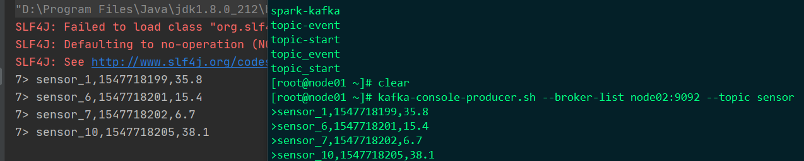

# 流处理API

Flink流处理流程：首先创建环境（类似于spark里的上下文SparkContext）；其次，添加数据来源Source；再次，对数据进行Transform处理；最后，添加输出Sink


## Enviroment

### getExecutionEnvironment

​      创建一个执行环境，表示当前执行程序的上下文。 如果程序是独立调用的，则此方法返回本地执行环境；如果从命令行客户端调用程序以提交到集群，则此方法返回此集群的执行环境，也就是说，getExecutionEnvironment会根据查询运行的方式决定返回什么样的运行环境，是最常用的一种创建执行环境的方式。

```scala
val env = ExecutionEnvironment.getExecutionEnvironment(1)
```

如果没有设置并行度，会以flink-conf.yaml中的配置为准，默认是1。

### createLocalEnvironment

返回本地执行环境，需要在调用时指定默认的并行度。

```scala
val env = StreamExecutionEnvironment.createLocalEnvironment(1)
```

### createRemoteEnvironment

 返回集群执行环境，将Jar提交到远程服务器。需要在调用时指定JobManager的IP和端口号，并指定要在集群中运行的Jar包。

```scala
val env = ExecutionEnvironment.createRemoteEnvironment("jobmanager-hostname", 6123, "jarpath")
```

 这里的端口号6123是JobManager的端口号。

## Source

```scala
package com.stanlong.api

import java.util.Properties

import org.apache.flink.api.common.serialization.SimpleStringSchema
import org.apache.flink.streaming.api.functions.source.SourceFunction
import org.apache.flink.streaming.api.scala._
import org.apache.flink.streaming.connectors.kafka.FlinkKafkaConsumer011

import scala.util.Random

/**
 * Source数据源
 * 1. 从集合中读取数据源
 * 2. 从文件中读取数据
 * 3. 从kafka中读取数据
 * 4. 自定义Source
 */
object SourceTest {
    def main(args: Array[String]): Unit = {
        // 创建执行环境
        val env = StreamExecutionEnvironment.getExecutionEnvironment

        // env.setParallelism(1) // 全局并行度设置成1，解决乱序问题

        // 1. 从集合中读取数据源
        // val dataList = List(
        //    SensorReading("sensor_1", 1547718199, 35.8),
        //     SensorReading("sensor_6", 1547718201, 15.4),
        //     SensorReading("sensor_7", 1547718202, 6.7),
        //     SensorReading("sensor_10", 1547718205, 38.1),
        // )

        // val stream1 = env.fromCollection(dataList)
        // stream1.print()


        // 2.从文件中读取数据
        // val inputPath = "D:\\StanLong\\git_repository\\Framework\\01Flink\\Flink\\src\\main\\resources\\sensor.txt"
        // val stream2 = env.readTextFile(inputPath)
        // stream2.print()

        // 3. 从kafka中读取数据
        //  需要引入kafka连接器的依赖
        // val properties = new Properties()
        // properties.setProperty("bootstrap.servers", "node01:9092, node02:9092, node03:9092, node04:9092")
        // properties.setProperty("group.id", "consumer-group")

        // val stream3 = env.addSource(new FlinkKafkaConsumer011[String]("sensor", new SimpleStringSchema(), properties))
        // stream3.print()

        // 4. 自定义Source
        val stream4 = env.addSource(new MySensorSource())
        stream4.print()

        // 执行
        env.execute("source test")
    }
}

// 定义样例类，温度传感器
case class SensorReading(id:String, timestamp:Long, temperature:Double)

// 自定义Source
class MySensorSource() extends SourceFunction[SensorReading]{

    // 定义一个flag，用来表示数据源是否正常运行发出数据
    var running = true

    // 定义一个随机数发生器
    val rand = new Random()

    // 随机生成一组（10个） 传感器的初始温度
    var currentTemp = 1.to(10).map(i => ("sensor_" + i, rand.nextDouble() * 100))

    override def run(sourceContext: SourceFunction.SourceContext[SensorReading]): Unit = {
        // 定义无限循环，不停的产生数据，除非被cancel
        while (running){
            // 在上次数据基础上微调更新温度值
            currentTemp = currentTemp.map(
                data => (data._1, data._2 + rand.nextGaussian())
            )

            // 获取当前时间戳，加入到数据中
            val currentTime = System.currentTimeMillis()
            currentTemp.foreach(
                data => sourceContext.collect(SensorReading(data._1, currentTime, data._2))
            )
            // 间隔100ms
            Thread.sleep(100)
        }

    }

    override def cancel(): Unit = {
        running = false
    }
}
```

kafka连接器的依赖

```xml
<dependency>
    <groupId>org.apache.flink</groupId>
    <artifactId>flink-connector-kafka-0.11_2.12</artifactId>
    <version>1.10.1</version>
</dependency>
```

kafka数据源测试截图



## Transform

### 滚动聚合算子

这些算子可以针对KeyedStream的每一个支流做聚合

```scala
package com.stanlong.api

import org.apache.flink.streaming.api.scala._

/**
 * 滚动聚合算子
 * sum()
 * min()
 * max()
 * minBy()
 * maxBy()
 */
object TransformTest {
    def main(args: Array[String]): Unit = {
        val env = StreamExecutionEnvironment.getExecutionEnvironment
        env.setParallelism(1)
        val inputPath = "D:\\StanLong\\git_repository\\Framework\\01Flink\\Flink\\src\\main\\resources\\sensor.txt"
        val inputStream = env.readTextFile(inputPath)


        // 先转换成样例类类型
        val dataStream = inputStream.map(
            data => {
                val arr = data.split(",")
                SensorReading(arr(0), arr(1).toLong, arr(2).toDouble)
            }
        )

        // 根据id分组聚合, 输出每个传感器当前最小值
        val aggStream = dataStream.keyBy("id").minBy("temperature")

        // 输出当前最小的温度值，以及最新的时间戳，要用reduce
        val resultStream = dataStream.keyBy("id")
          .reduce(
              (curState, newData) => {
                  SensorReading(curState.id, newData.timestamp, curState.temperature.min(newData.temperature))
              }
          )

        // aggStream.print()

        resultStream.print()

        env.execute("transform test")

    }
}
```

### reduce

代码见上