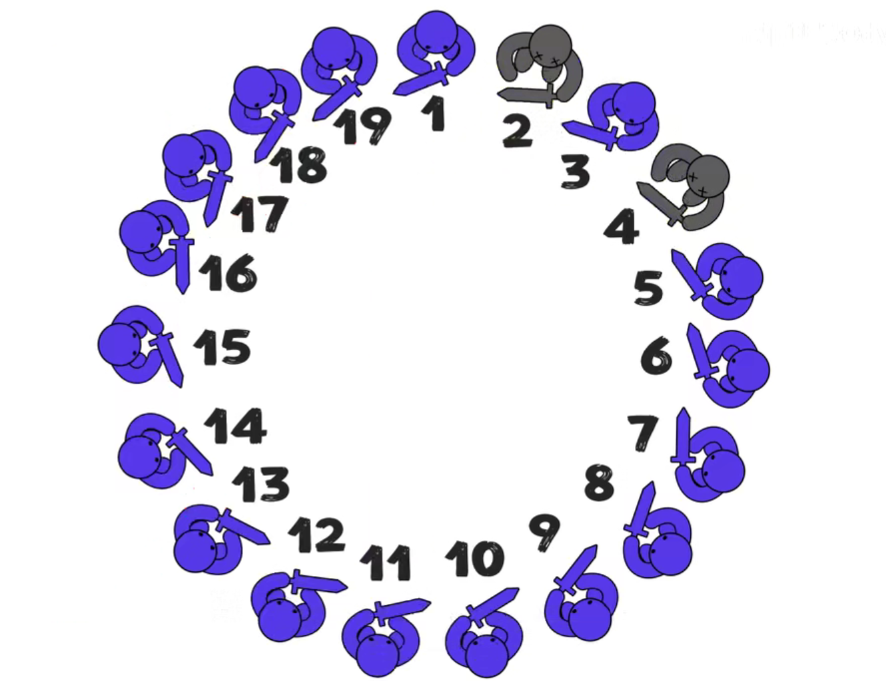

# 约瑟夫问题

在罗马人占领乔塔帕特后，39 个犹太人与Josephus及他的朋友躲到一个洞中，39个犹太人决定宁愿死也不要被敌人抓到，于是决定了一个自杀方式，41个人排成一个圆圈，由第1个人开始报数，每报数到第3人该人就必须自杀，然后再由下一个重新报数，直到所有人都自杀身亡为止。然而Josephus 和他的朋友并不想遵从。首先从一个人开始，越过k-2个人（因为第一个人已经被越过），并杀掉第*k*个人。接着，再越过k-1个人，并杀掉第*k*个人。这个过程沿着圆圈一直进行，直到最终只剩下一个人留下，这个人就可以继续活着。问题是，给定了和，一开始要站在什么地方才能避免被处决。Josephus要他的朋友先假装遵从，他将朋友与自己安排在第16个与第31个位置，于是逃过了这场死亡游戏。





视频地址：https://www.bilibili.com/video/BV1KM4y1V7tQ， 当k=2时

分析规律得：如果士兵总人数是2的n次方的情况下，最后存活下来的一定是士兵1。

总结数学公式为：
$$
\begin{cases}

x=a+2^n \\

y=2a+1 \\

\end{cases}
$$
当士兵总人数x=41, 带入以上公式得 a =9, y=19。 所以约瑟夫站在19号位置，最后活了下来。 

问题模型简化：

设编号，1、2、3...n的n个人围坐一圈，约定编号为k(1<=k<=n)的人，开始从1报数，数到m的那个人出列，它的下一位又开始从1报数，数到m的那个人又出列，依次类推，直到所有人出列为止。由此产生一个出对编号序列。

输入 n=5 , k=1, m=2. (表示又5个人，从第1个人开始报数， 数到2的人出列)

1->2->3->4->5->1

输出:

2-->4->1->5->3

## java版

```java
package com.stanlong;

/**
 * 约瑟夫环
 */
public class DataStructure {

    public static void main(String[] args) throws Exception {
        CircleSingleLinkedList csld = new CircleSingleLinkedList();
        csld.add(5);
        csld.show();
        csld.out(1,2,5);

    }
}

// 模拟内存中的节点
class Node{
    private int data; // 数据域
    private Node next; // 指针域（指向下一个节点）


    public Node(int data){
        this.data = data;
    }

    public int getData() {
        return data;
    }

    public void setData(int data) {
        this.data = data;
    }

    public Node getNext() {
        return next;
    }

    public void setNext(Node next) {
        this.next = next;
    }
}
/**
 * 构建一个单向环形链表的思路
 * 1. 先创建第一个节点，让first指向该节点，并形成环形
 * 2. 后面每创建一个新的节点，就把该节点加入到以有的环形链表中即可
 *
 * 遍历环形链表的思路
 * 1. 先定义一个辅助指针 temp，指向first节点
 * 2. 然后通过while循环遍历该环形链表，当 temp.next == first 时，遍历结束。
 */

class CircleSingleLinkedList{
    // 创建头节点，作为引入环形链表的引子
    Node headNode = null;

    /**
     * 新增
     * @param nums 加入的节点个数
     */
    public void add(int nums){ // nums 表示加入节点的数量
        if(nums < 1){
            System.out.println("节点个数不能少于1");
        }
        Node temp = null; // 辅助指针，用来帮助构建环形链表
        for(int i = 1; i<=nums; i++){
            Node node = new Node(i);
            if(i==1){ // 第一个节点自己构成环
                headNode = node;
                headNode.setNext(headNode);
                temp = headNode;
            }else{
                temp.setNext(node);
                node.setNext(headNode);
                temp = node;
            }
        }
    }

    // 展示
    public void show(){
        if(headNode==null){
            System.out.println("环形链表是空的");
            return;
        }
        Node temp = headNode;
        System.out.println("入环顺序：");
        while (true){
            System.out.printf("%d -> ", temp.getData());
            if(temp.getNext() == headNode){
                break;
            }
            temp = temp.getNext();
        }
        System.out.println();
    }

    /**
     * 出环形链表
     * @param startNo 从第几个开始数
     * @param countNum 数几下
     * @param nums 链表中节点的个数
     */
    public void out(int startNo, int countNum, int nums){
        if(headNode == null || startNo < 1 || startNo > nums){
            System.out.println("非法输入");
            return;
        }
        Node temp = headNode; // 辅助遍历指针

        // temp 指针紧跟在 headNode 后面
        while (true){
            if(temp.getNext() == headNode){
                break;
            }
            temp = temp.getNext();
        }

        // 将 temp 和 headNode 移动到 startNo 个位置。
        // 注意从 temp 和 headNode 开始数，因此移动的次数时 startNo-1
        for(int i=0; i < startNo-1; i++){
            headNode = headNode.getNext();
            temp = temp.getNext();
        }

        // 移动到 startNo 这个位置后，就可以准备将节点出环形队列了
        System.out.println("出环顺序：");
        while (true){
            if(temp == headNode){ // 只剩一个节点了
                break;
            }
            for(int j=0; j<countNum-1; j++){
                headNode = headNode.getNext();
                temp = temp.getNext();
            }
            System.out.printf("%d -> ", headNode.getData());
            headNode = headNode.getNext();
            temp.setNext(headNode);
        }
        System.out.println();
        System.out.printf("环中最后一个节点是 %d \n", headNode.getData());

    }
}

// 输出结果
入环顺序：
1 -> 2 -> 3 -> 4 -> 5
出环顺序：
2 -> 4 -> 1 -> 5
环中最后一个节点是 3 
```

## Scala版

```scala
package com.stanlong.scala

import scala.util.control.Breaks.{break, breakable}

/**
 * 约瑟夫环
 */
object ForDemo {
    def main(args: Array[String]): Unit = {
        val csll = new CircleSingleLinkedList
        csll.add(5)
        csll.show()
        csll.out(1,2,5)
    }

    // 模拟内存中的节点
    class Node(in_data:Int){
        var data = this.in_data
        var next:Node = null

        override def toString: String = "Node[" + "data=" + data + "]"
    }

    // 双向链表
    class CircleSingleLinkedList{
        var headNode:Node = null // 定义头指针作为环形链表的引子
        // 新增
        def add(nums: Int): Unit ={
            var temp:Node = null // 定义赋值指针，帮助遍历
            for(i <- 1 to nums){
                var node = new Node(i)
                if(i==1){
                    headNode = node
                    headNode.next = headNode
                    temp = headNode
                }else{
                    temp.next = node
                    node.next = headNode
                    temp = node
                }
            }
        }

        // 查看
        def show(): Unit ={
            if(headNode == null){
                println("环形链表是空的")
                return
            }
            var temp:Node = headNode

            breakable{
                while (true){
                    printf("入环节点 %d \n", temp.data)
                    if(temp.next == headNode){
                        break()
                    }
                    temp = temp.next
                }

            }
        }

        /**
         * 出环
         * @param startNo 从第几个位置开始数
         * @param countNo 数几下
         * @param nums 节点个数
         */
        def out(startNo:Int, countNo:Int, nums:Int): Unit ={
            if(headNode == null || startNo < 1 || startNo>nums){
                println("参数不合法")
                return
            }

            var temp = headNode // 定义辅助节点帮助遍历环形链表

            // 1. 辅助指针紧跟在 headNode 后面
            breakable{
                while (true){
                    if(temp.next == headNode){
                        break()
                    }
                    temp = temp.next
                }
            }

            // 2. 移动两个指针到 startNo 位置
            for(i <- 1 until  startNo){
                temp = temp.next
                headNode = headNode.next
            }

            // 3. 在 startNo 处开始数 countNo 下，出环
            breakable{
                while (true){
                    if(temp == headNode){ // 当最后只剩下一个节点时，出环结束
                        break()
                    }
                    for(j <- 1 until countNo){
                        temp = temp.next
                        headNode = headNode.next
                    }
                    printf("出环节点 %d \n", headNode.data)
                    headNode = headNode.next
                    temp.next = headNode
                }
            }
            printf("最后留在环中的节点 %d " , headNode.data)
        }
    }
}
```

## python版

```python
# 约瑟夫环

# 模拟内存中的节点
class Node:
    def __init__(self, data):
        self.data = data
        self.next = None

    def __str__(self):
        return "Node[" + "data=" + str(self.data) + "]";

class CircleSingleLinkedList:
    headNode = None

    # 新增
    def add(self, nums):
        temp = None
        for i in range(1, nums+1):
            node = Node(i)
            if i==1:
                self.headNode = node
                self.headNode.next = self.headNode
                temp = self.headNode
            else:
                temp.next = node
                node.next = self.headNode
                temp = node

    # 展示
    def show(self):
        if self.headNode == None:
            print("环形链表是空的")
            return
        temp = self.headNode
        while True:
            print("入环节点 %s " %temp.data)
            if temp.next == self.headNode:
                break
            temp = temp.next
    # 出环
    def out(self, startNo, countNum , nums):
        if self.headNode == None or startNo < 1 or startNo > nums:
            print("参数不合法")
            return

        temp = self.headNode # 定义辅助指针帮助遍历

        # 1. 辅助指针紧跟在 headNode 后面
        while True:
            if temp.next == self.headNode:
                break
            temp = temp.next

        # 2. 两个指针移动到 startNo 的位置
        for i in range(1, startNo):
            self.headNode = self.headNode.next
            temp = temp.next

        # 3. 从 startNo 开始数 countNum 个数，开始出环
        while True:
            if(temp == self.headNode): # 只剩一个节点时退出循环
                break
            for j in range(1, countNum):
                self.headNode = self.headNode.next
                temp = temp.next
            print("出环节点 %s " %self.headNode.data)

            self.headNode = self.headNode.next
            temp.next = self.headNode
        print("环中最后一个节点 %s " % self.headNode.data)

if __name__ == '__main__':
    csll = CircleSingleLinkedList()
    csll.add(5)
    csll.show()
    csll.out(1,2,5)
```


