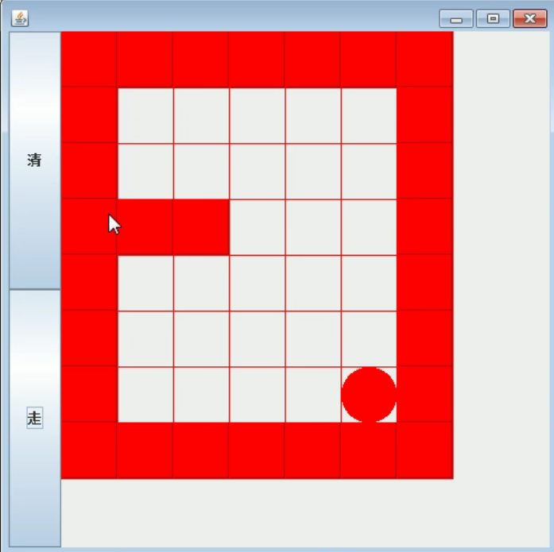

 # 迷宫问题

```
用二维数组模拟迷宫 , 1 表示墙.
从给定的初始位置开始查找到目标位置的路径

查找策略如下:
如果map[i][j]=0, 表示这个点没有走过
如果map[i][j]=1, 表示这个点是墙
如果map[i][j]=2, 表示这个点可以走
如果map[i][j]=3, 表示这个点已经走过，但是走不通
走迷宫策略 下 -> 右 -> 上 -> 左
```



## Java版

```java
package com.stanlong;

/**
 * 迷宫问题
 */
public class DataStructure {

    public static void main(String[] args) throws Exception {

        // 用二维数组模拟迷宫 , 1 表示墙
        int[][] map= new int[8][7];

        // 设置左右围墙
        for (int i=0; i<8 ; i++){
            map[i][0] = 1;
            map[i][6] = 1;
        }

        // 设置上下围墙
        for (int i=0; i<7; i++){
            map[0][i] = 1;
            map[7][i] = 1;
        }

        // 设置挡板
        map[3][1] = 1;
        map[3][2] = 1;

        // 输出地图
        System.out.println("地图情况");
        for(int i=0; i<8; i++){
            for(int j=0; j<7; j++){
                System.out.print(map[i][j] + " ");
            }
            System.out.println();
        }

        // 开始查找
        findWay(map, 1, 1);

        // 输出查找路径
        System.out.println("查找路径");
        for(int i=0; i<8; i++){
            for(int j=0; j<7; j++){
                System.out.print(map[i][j] + " ");
            }
            System.out.println();
        }

    }

    /**
     * 从初始位置开始查找到 map[6][5] 的路径
     * @param map 地图
     * @param i 初始位置
     * @param j 初始位置
     * @return true 表示路可以走， false 表示不能走
     */
    public static boolean findWay(int[][] map, int i, int j){
        if(map[6][5]==2){ // 如果走到目标点，则退出
            return true;
        }else {
            if(map[i][j]==0){ // 如果这个点没有走过
                map[i][j] = 2; // 标记这个点可以走
                // 如果这个点往下，往右，往上，往左 能走通
                if(findWay(map, i+1, j) || findWay(map, i, j+1) || findWay(map, i-1, j) ||findWay(map, i, j-1)){ // 往下走能走通，则返回true
                    return true;
                }else{
                    map[i][j] = 3; // 上下左右都走不通，说明这个点被围起来了，返回 false
                    return false;
                }
            }else{  // 如果当前位置不能走，返回false
                return false;
            }
        }
    }
}
```

```
地图情况
1 1 1 1 1 1 1 
1 0 0 0 0 0 1 
1 0 0 0 0 0 1 
1 1 1 0 0 0 1 
1 0 0 0 0 0 1 
1 0 0 0 0 0 1 
1 0 0 0 0 0 1 
1 1 1 1 1 1 1 
查找路径
1 1 1 1 1 1 1 
1 2 0 0 0 0 1 
1 2 2 2 0 0 1 
1 1 1 2 0 0 1 
1 0 0 2 0 0 1 
1 0 0 2 0 0 1 
1 0 0 2 2 2 1 
1 1 1 1 1 1 1 
```

## Python版

```python
# 迷宫问题

def findWay(lst, i, j):
    if lst[6][5] == 2:
        return True
    else:
        if lst[i][j] == 0:
            lst[i][j] = 2
            if findWay(lst, i+1, j) or findWay(lst, i, j+1) or findWay(lst, i-1, j) or findWay(lst, i, j-1):
                return True
            else:
                lst[i][j] = 3
                return False
        else:
            return False


if __name__ == '__main__':
    # 定义一个二维数组
    lst = [([0] * 7 ) for i in range(8)]

    # 上下墙
    for i in range(8):
        lst[i][0] = 1
        lst[i][6] = 1

    # 左右墙
    for i in range(6):
        lst[0][i] = 1
        lst[7][i] = 1

    # 设置挡板
    lst[3][1] = 1
    lst[3][2] = 1

    # 遍历地图
    print("地图".center(15, "-"))
    for row in lst:
        for data in row:
            print(data, end=" ")
        print()

    findWay(lst, 1, 1)

    # 遍历地图
    print("查找路径".center(15, "-"))
    for row in lst:
        for data in row:
            print(data, end=" ")
        print()
```

## Scala 版

```scala
package com.stanlong.scala

/**
 * 迷宫问题
 */
object ForDemo {

    def main(args: Array[String]): Unit = {
        var array = Array.ofDim[Int](8, 7)

        println("-----地图-----")

        // 左右墙
        for(i <- 0 until(8)){
            array(i)(0) = 1
            array(i)(6) = 1
        }

        // 上下墙
        for (i <- 0 until(7)){
            array(0)(i) = 1
            array(7)(i) = 1
        }

        // 设置挡板
        array(3)(1) = 1
        array(3)(2) = 1

        println("----地图----")
        for(i <- array.indices; j <- array(i).indices){
            print(array(i)(j) + " ")
            if(j == array(i).length - 1){
                println()
            }
        }

        findWay(array, 1 ,1)

        println("----遍历路径----")
        for(i <- array.indices; j <- array(i).indices){
            print(array(i)(j) + " ")
            if(j == array(i).length - 1){
                println()
            }
        }
    }

    /**
     *
     * @param array 地图
     * @param i 初始位置
     * @param j 初始位置
     * @return true 表示路可以走， false 表示不能走
     */
    def findWay(array: Array[Array[Int]], i:Int, j:Int): Boolean ={
        if(array(6)(5) == 2){ // array(6)(5) 为目标位置
            true
        }else{
            if(array(i)(j) == 0){
                array(i)(j) = 2
                if(findWay(array, i+1, j) || findWay(array, i, j+1) || findWay(array, i-1, j) || findWay(array, i , j-1)){
                    true
                }else{
                    array(i)(j) = 3
                    false
                }
            } else {
                false
            }
        }
    }
}
```

