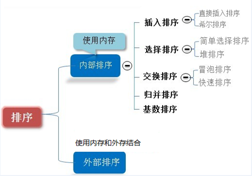
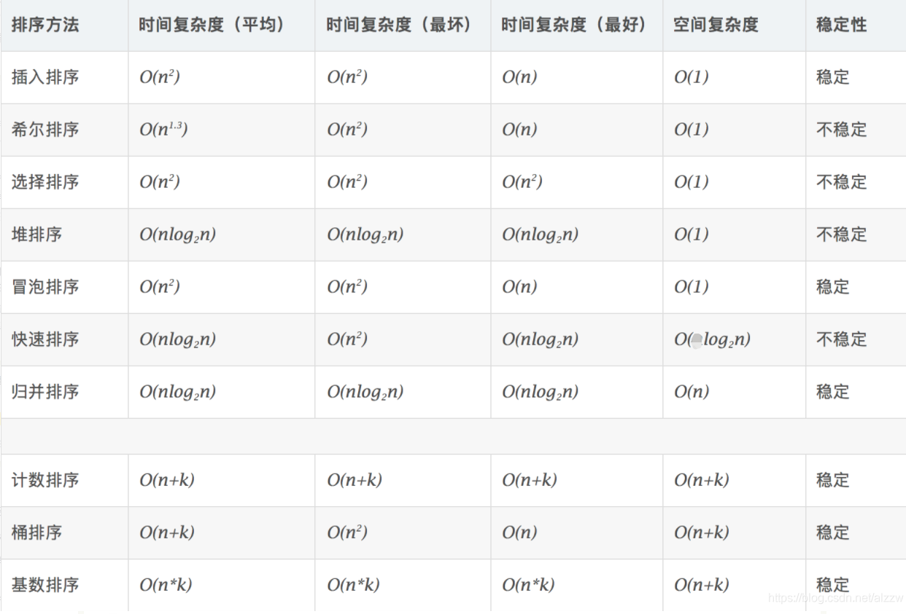

# 排序算法介绍

排序也称排序算法 (Sort Algorithm)，排序是将一 组数据，依指定的顺序进行排列 的过程。

## 排序的分类

- 内部排序: 指将需要处理的所有数据都加载 到内部存储器中进行排序。
- 外部排序法：数据量过大，无法全部加载到内存中，需要借助外部存储进行排序。

## 常见的排序算法分类



## 算法的时间复杂度

1. 一般情况下，算法中的基本操作语句的重复执行次数是问题规模n的某个函数，用$T(n)$表示，若有某个辅助函数$f(n)$，使得当$n$ 趋近于无穷大时，$T(n) / f(n)$ 的极限值为不等于零的常数，则称$f(n)$是$T(n)$的同数量级函数。记作 $T(n)=Ｏ( f(n) )$，称$Ｏ( f(n) )$ 为算法的渐进时间复杂度，简称时间复杂度。
2. $T(n)$ 不同，但时间复杂度可能相同。 如：$T(n)=n²+7n+6$ 与 $ T(n)=3n²+2n+2 $ 它们的T(n) 不同，但时间复杂度相同，都为$O(n²)$。
3. 计算时间复杂度的方法：
   - 用常数1代替运行时间中的所有加法常数 $ T(n)=n²+7n+6 => T(n)=n²+7n+1$
   - 修改后的运行次数函数中，只保留最高阶项 $ T(n)=n²+7n+1 => T(n) = n²$ 
   - 去除最高阶项的系数 $ T(n) = n² => T(n) = n² => O(n²)$ 

## 常见的时间复杂度

| 复杂度     | 数学式               |
| ---------- | -------------------- |
| 常数阶     | O(1)                 |
| 对数阶     | O(log<sub>2</sub>n)  |
| 线性阶     | O(n)                 |
| 线性对数阶 | O(nlog<sub>2</sub>n) |
| 平方阶     | O(n<sup>2</sup>)     |
| 立方阶     | O(n<sup>3</sup>)     |
| k次方阶    | O(n<sup>k</sup>)     |
| 指数阶     | O(2<sup>n</sup>)     |

说明：常见的算法时间复杂度由小到大依次为：

Ο(1)＜O(log<sub>2</sub>n)＜Ο(n)＜O(nlog<sub>2</sub>n)＜O(n<sup>2</sup>)＜O(n<sup>3</sup>)＜O(n<sup>k</sup>) ＜O(2<sup>n</sup>) 

随着问题规模n的不断增大，上述时间复杂度不断增大，算法的执行效率越低

### 常数阶O(1)

无论代码执行了多少行，只要是没有循环等复杂结构，那这个代码的时间复杂度就都是O(1)

### 对数阶O(log<sub>2</sub>n)

```java
int i = 1;
while(i<n){
    i = i * 2
}
```

说明：在while循环里面，每次都将 i 乘以 2，乘完之后，i 距离 n 就越来越近了。假设循环x次之后，i 就大于 2 了，此时这个循环就退出了，也就是说 2 的 x 次方等于 n，那么 x = log<sub>2</sub>n也就是说当循环log<sub>2</sub>n 次以后，这个代码就结束了。因此这个代码的时间复杂度为：O(log<sub>2</sub>n)  。 O(log<sub>2</sub>n) 的这个2 时间上是根据代码变化的，i = i * 3 ，则是 O(log<sub>3</sub>n) .

### 线性阶O(n)

```java
for(i=1; i<=n;++i){
    j = i;
    j++;
}
```

说明：这段代码，for循环里面的代码会执行n遍，因此它消耗的时间是随着n的变化而变化的，因此这类代码都可以用O(n)来表示它的时间复杂度

### 线性对数阶O(nlogN)

```java
for(int m=1; m<n; m++){
    i = 1;
    while(i<n){
        i = i*2;
    }
}
```

说明：线性对数阶O(nlogN) 其实非常容易理解，将时间复杂度为O(logn)的代码循环N遍的话，那么它的时间复杂度就是 n * O(logN)，也就是了O(nlogN)

### 平方阶O(n²)

```java
for(int x = 1; i<n; i++){
    for(int i = 1; i<=n; i++){
        j = i;
        j++;
    }
}
```

说明：平方阶O(n²) 就更容易理解了，如果把 O(n) 的代码再嵌套循环一遍，它的时间复杂度就是 O(n²)，这段代码其实就是嵌套了2层n循环，它的时间复杂度就是 O(n*n)，即 O(n²) 如果将其中一层循环的n改成m，那它的时间复杂度就变成了 O(m*n)

立方阶O(n³)、K次方阶O(n<sup>k</sup>), 参考上面的O(n²) 理解，O(n³)相当于三层n循环，其它的类似

## 平均时间复杂度和最坏时间复杂度

1. **平均时间复杂度**是指所有可能的输入实例均以等概率出现的情况下，该算法的运行时间。
2. 最坏情况下的时间复杂度称**最坏时间复杂度**。一般讨论的时间复杂度均是最坏情况下的时间复杂度。 这样做的原因是：最坏情况下的时间复杂度是算法在任何输入实例上运行时间的界限，这就保证了算法的运行时间不会比最坏情况更长。



## 空间复杂度

1. 类似于时间复杂度的讨论，一个算法的空间复杂度(Space Complexity)定义为该算法所耗费的存储空间，它也是问题规模n的函数。
2. 空间复杂度(Space Complexity)是对一个算法在运行过程中临时占用存储空间大小的量度。有的算法需要占用的临时工作单元数与解决问题的规模n有关，它随着n的增大而增大，当n较大时，将占用较多的存储单元，例如快速排序和归并排序算法就属于这种情况
3. 在做算法分析时，**主要讨论的是时间复杂度**。从用户使用体验上看，更看重的程序执行的速度。一些缓存产品(redis, memcache)和算法(基数排序)本质就是用空间换时间.