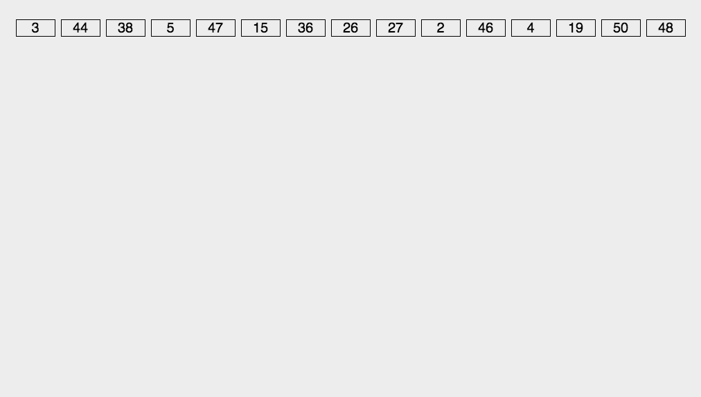

# 基数排序

https://blog.csdn.net/bjweimengshu/article/details/102908292



基本思想: 将所有待比较数值统一为同样的数位长度，数位较短的数前面补零（如果是对字母排序就需要在后面补0了）。然后把排序工作拆分成多个阶段，每一个阶段只根据一个字符进行计数排序，一共排序k轮(k数位的最大值)。

基数排序既可以从高位优先进行排序（Most Significant Digit first，简称**MSD**），也可以从低位优先进行排序（Least Significant Digit first，简称**LSD**）

## Java版

### 字符串排序

```java
package com.stanlong;

import java.util.Arrays;

/**
 * 基数排序
 * 对字符串进行排序
 */
public class DataStructure {

    // ascii 码的取值范围
    public static final int ASCII_RANGE = 128;

    public static void main(String[] args) throws Exception {
        String[] array = {"qd","abc","az","qwe", "hhh", "a", "cws", "ope"};
        String[] result = radixSort(array);
        System.out.println(Arrays.toString(result));
    }

    /**
     * 基数排序
     * @param array 待排序数组
     */
    public static String[] radixSort(String[] array){
        // 用于保存排序结果
        String[] result = new String[array.length];
        // 获取 array 中的最长数位值
        int maxLength = getLength(array);

        for(int k=maxLength-1; k>=0; k--){
            // 1. 创建辅助排序的统计数组
            int[] count = new int[ASCII_RANGE]; // 这里直接用计数数组
            for(int i=0; i< array.length;i++){
                int index = getCharIndex(array[i], k);
                count[index]++;
            }

            // 2. 统计数组变形， 后面元素的值等于前面元素值的和
            for(int i=1; i < count.length; i++){
                count[i] = count[i] + count[i-1];
            }

            // 3. 倒序遍历原始数组
            for(int i=array.length-1; i>=0; i--){
                int index = getCharIndex(array[i], k);
                int sortedIndex = count[index] - 1;
                result[sortedIndex] = array[i];
                count[index]--;
            }
            array = result.clone();
        }
        return array;

    }

    /**
     * 获取字符串第K位字符所对应的 ascii码 序号
     * @param str 待排序数组的第i个字符串
     * @param k 字符串的第k个字符
     * @return
     */
    private static int getCharIndex(String str, int k){
        if(str.length() < k+1){
            return 0;
        }
        return str.charAt(k);
    }

    // 获取 array 中的最长数位值
    private static int getLength(String[] array){
        int max = Integer.MIN_VALUE;
        for(String data : array){
            int strLen = data.length();
            max = Math.max(max, strLen);
        }
        return max;
    }
}
```

### 数值排序


