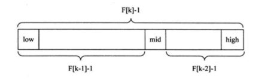

# 斐波那契查找

斐波那契查找与二分查找和插入查找原理非常相似，仅仅改变了中间节点（mid）的位置，mid不在是中间或者是插值得到，而是位于黄金分割点附近，即 $mid=low=F(k-1)-1$ (F代表斐波那契数列)。

对 $ F(k-1)-1$ 的理解：



1. 通过斐波那契 数列 $F[k]=F[k-1]+F[k-2]$  的性质，可以得到$(F[k]-1)=(F[k-1]-1)+(F[k-2]-1)+1$

   该式说明：只要顺序表的长度为 $F[k]-1$ ,则可以将表分为长度为 $F[k-1]-1$ 和 $F[k-2]-1$ 的两端。从而中间位置为 $mid=low + F(k-1)-1$

2. 类似的每个子段也可以使用相同的方式分割

3. 但是顺序表的长度n不一定刚好等于 $F[k]-1$ ,所以需要将原来的顺序表长度n增加至 $F[k]-1$ 。这里的k值只要能 使得 $F[k]-1$恰好大于或等于n即可

## Java版

```java
package com.stanlong;

import java.util.Arrays;

/**
 * 斐波那契查找
 * 先构建一个斐波那契数列
 */
public class DataStructure {

    // 斐波那契数列的长度
    public static int maxSize = 20;

    public static void main(String[] args) throws Exception {
        int[] array = {2, 3, 4, 5, 15, 19, 26, 27, 36, 38, 44, 46, 47, 48, 50};
        int target = 500;
        int result = fbiSearch(array, target);
        if(result == -1){
            System.out.println("没有找到目标值");
        }else{
            System.out.println("目标值的索引是: " + result);
        }
    }

    /**
     * 使用非递归的方式生成一个斐波那契数列，最长20
     * @return 长度位20的斐波那契数列
     */
    public static int[] fib(){
        int[] f = new int[maxSize];
        f[0] = 1;
        f[1] = 1;
        for(int i=2; i<maxSize; i++){
            f[i] = f[i-1] + f[i-2];
        }
        // [1, 1, 2, 3, 5, 8, 13, 21, 34, 55, 89, 144, 233, 377, 610, 987, 1597, 2584, 4181, 6765]
        return f;
    }

    /**
     * 斐波那契查找
     * @param array 待查找数组
     * @param target 目标值
     * @return 目标值的下标
     */
    public static int fbiSearch(int[] array, int target){
        int left = 0;
        int right = array.length - 1;
        int k = 0; // 表示斐波那契分割数的下标值
        int mid = 0;
        int fib[] = fib();

        // 获取斐波那契分割数值的下标
        while (right>fib[k]-1){
            k++;
        }

        // Arrays.copyOf(array, fib[k]); 参数一：要复制的数组， 参数二：复制的长度
        // 因为f[k]值可能大于a的长度，不足的部分 Arrays.copyOf 方法会使用0补齐
        int[] temp = Arrays.copyOf(array, fib[k]);

        // 这里不用0，使用array数组的最后一个数来填充不足的部分
        for(int i=right+1; i< temp.length; i++){
            temp[i] = array[right];
        }

        while (left <= right){
            mid = left + fib[k-1] -1;
            if(target<temp[mid]){ // 向左边找
                right = mid-1;
                k = k-1;
                /**
                 * 对k--进行理解
                 * 1.全部元素=前面的元素+后面的元素
                 * 2.f[k]=k[k-1]+f[k-2]
                 * 因为前面有k-1个元素没所以可以继续分为f[k-1]=f[k-2]+f[k-3]
                 * 即在f[k-1]的前面继续查找k--
                 * 即下次循环,mid=f[k-1-1]-1
                 */
            }else if(target > temp[mid]){ // 向右边找
                left = mid + 1;
                k = k-2;
                /**
                 * 对k-=2理解
                 * 1.全部元素=前面的元素+后面的元素
                 * 2.f[k]=k[k-1]+f[k-2]
                 * 3.因为后面有k-2个元素，所以可以继续拆分f[k-2]=f[k-3]+f[k-4]
                 * 4.即在f[k-2]前面进行查找k-=2
                 * 5.即在下次循环mid=[k-1-2]-1
                 */
            }else{
                if(mid<=right){
                    return mid;
                }else {
                    return right;
                }
            }
        }
        return -1;
    }
}
```

