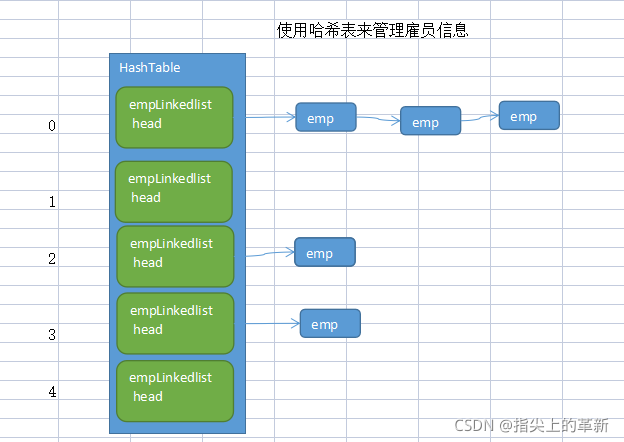

# 哈希表

散列表（Hash table，也叫哈希表），是根据关键码值(Key value)而直接进行访问的[数据结构]。也就是说，它通过把关键码值映射到表中一个位置来访问记录，以加快查找的速度。这个映射函数叫做散列函数，存放记录的数组叫做散列表

## 上机题

有一个公司,当有新的员工来报道时,要求将该员工的信息加入(id,性别,年龄,名字,住址..),当输入该员工的id时,要求查找到该员工的所有信息.

## Java版