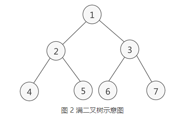
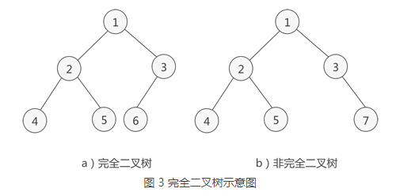

# 二叉树

## 相关概念

**二叉树**（binary tree）是指树中节点**最多有两个子节点**的**有序**树。


**满二叉树**: 二叉树的所有叶子节点都在最后一层，并且中节点数=2<sup>n</sup> -1, n 为层数



**完全二叉树**: 二叉树的所有叶子节点都在最后一层或者倒数第二层，而且最后一层的叶子节点在左边连续，倒数第二层的叶子节点在右边连续



## 遍历

```java
package com.stanlong;


import lombok.*;

/**
 * 二叉树遍历
 * 前序遍历 + 中序遍历 + 后续遍历
 */
public class DataStructure {

    public static void main(String[] args) throws Exception {
        // 创建一颗二叉树
        BinaryTree bt = new BinaryTree();

        // 创建需要的节点
        Node root = new Node(1);
        Node node2 = new Node(2);
        Node node3 = new Node(3);
        Node node4 = new Node(4);
        Node node5 = new Node(5);
        Node node6 = new Node(6);
        Node node7 = new Node(7);

        // 这里创建一颗满二叉树
        bt.setRoot(root); // 设置树的根节点
        root.setLeft(node2);
        root.setRight(node3);
        node2.setLeft(node4);
        node2.setRight(node5);
        node3.setLeft(node6);
        node3.setRight(node7);

        System.out.println("==============前序遍历==============");
        bt.preOrder();

        System.out.println("==============中序遍历==============");
        bt.infixOrder();

        System.out.println("==============后序遍历==============");
        bt.postOrder();
        
    }
}

// 创建节点
// 可以类级别生成 Getter 和 Setter 方法， 也可以字段级别生成Getter 和 Setter 方法
// @ToString： 辅助参数  exclude 和 of
//      exclude 不生成{}中字段的 toString 方法
//      of 只生成{}中字段的 toString 方法
// RequiredArgsConstructor：对 final 修饰的字段 和加了 @NonNull 注解的字段生成有参构造函数
@Getter
@Setter
@ToString(exclude = {"left", "right"})
@RequiredArgsConstructor
class Node{
    @NonNull
    private int id; // 数据域
    private Node left; // 左指针
    private Node right;  // 右指针

    // 前序遍历
    public void preOrder(){
        System.out.println(this); // 先输出父节点
        // 递归向左子树前序遍历
        if(this.left != null){
            this.left.preOrder();
        }
        // 递归向右子树前序遍历
        if(this.right != null){
            this.right.preOrder();
        }
    }

    // 中序遍历
    public void infixOrder(){
        // 递归向左子树中序遍历
        if(this.left != null){
            this.left.infixOrder();
        }
        // 输出父节点
        System.out.println(this);

        // 递归向右子树中序遍历
        if(this.right != null){
            this.right.infixOrder();
        }
    }

    // 后续遍历
    public void postOrder(){
        if(this.left != null){
            this.left.postOrder();
        }
        if(this.right != null){
            this.right.postOrder();
        }
        System.out.println(this);
    }
}

// 创建一个二叉树
class BinaryTree{
    @Setter
    private Node root; // 声明二叉树的根节点


    // 前序遍历
    public void preOrder(){
        if(this.root != null){
            this.root.preOrder();
        }else{
            System.out.println("二叉树为空，无法遍历");
        }
    }

    // 中序遍历
    public void infixOrder(){
        if(this.root != null){
            this.root.infixOrder();
        }else {
            System.out.println("二叉树为空，无法遍历");
        }
    }

    // 后续遍历
    public void postOrder(){
        if(this.root != null){
            this.root.postOrder();
        }else {
            System.out.println("二叉树为空，无法遍历");
        }
    }
}

-------------------------------------------------------
==============前序遍历==============
Node(id=1)
Node(id=2)
Node(id=4)
Node(id=5)
Node(id=3)
Node(id=6)
Node(id=7)
==============中序遍历==============
Node(id=4)
Node(id=2)
Node(id=5)
Node(id=1)
Node(id=6)
Node(id=3)
Node(id=7)
==============后序遍历==============
Node(id=4)
Node(id=5)
Node(id=2)
Node(id=6)
Node(id=7)
Node(id=3)
Node(id=1)
```

## 查找

```java
package com.stanlong;

import lombok.*;

/**
 * 查找二叉树节点
 */
public class DataStructure {

    public static void main(String[] args) throws Exception {
        // 创建一颗二叉树
        BinaryTree bt = new BinaryTree();

        // 创建需要的节点
        Node root = new Node(1);
        Node node2 = new Node(2);
        Node node3 = new Node(3);
        Node node4 = new Node(4);
        Node node5 = new Node(5);
        Node node6 = new Node(6);
        Node node7 = new Node(7);

        // 把节点挂到树上
        bt.setRoot(root); // 设置树的根节点
        root.setLeft(node2);
        root.setRight(node3);
        node2.setLeft(node4);
        node2.setRight(node5);
        node3.setLeft(node6);
        node3.setRight(node7);

        Node preResult = bt.preOrderSearch(5);
        System.out.println("前序遍历查找结果: " + preResult.getId());

        Node infixResult = bt.infixOrderSearch(5);
        System.out.println("中序遍历查找结果: " + infixResult.getId());

        Node postNode = bt.postOrderSearch(5);
        System.out.println("后序序遍历查找结果: " + postNode.getId());

    }
}

@Getter
@Setter
@ToString(exclude = {"left", "right"})
@RequiredArgsConstructor
class Node{
    @NonNull
    private int id; // 数据域
    private Node left; // 左指针
    private Node right;  // 右指针

    // 前序遍历查找
    public Node preOrderSearch(int id){
        Node result = null;
        if(this.id == id){
            return this;
        }
        if(this.left != null){
            result = this.left.preOrderSearch(id);
        }
        if(result != null){
            return result;
        }
        if(this.right != null){
            result = this.right.preOrderSearch(id);
        }
        return result;
    }

    // 中序遍历查找
    public Node infixOrderSearch(int id){
        Node result = null;
        if(this.left != null){
            result = this.left.infixOrderSearch(id);
        }
        if(result != null){
            return result;
        }
        if(this.id == id){
            return this;
        }
        if(this.right != null){
            result = this.right.infixOrderSearch(id);
        }
        return result;
    }

    // 后续遍历查找
    public Node postOrderSearch(int id){
        Node result = null;
        if(this.left != null){
            result = this.left.postOrderSearch(id);
        }
        if(result != null){
            return result;
        }
        if(this.right != null){
            result = this.right.postOrderSearch(id);
        }
        if(result != null){
            return result;
        }
        if(this.id == id){
            return this;
        }
        return result;
    }
}

// 创建一个二叉树
class BinaryTree{
    @Setter
    private Node root; // 声明二叉树的根节点

    // 前序遍历查找
    public Node preOrderSearch(int id){
        if(root != null){
            return root.preOrderSearch(id);
        }else{
            return null;
        }
    }

    // 中序遍历查找
    public Node infixOrderSearch(int id){
        if(root != null){
            return root.infixOrderSearch(id);
        }else {
            return null;
        }
    }

    // 后续遍历查找
    public Node postOrderSearch(int id){
        if(root != null){
            return root.postOrderSearch(id);
        }else {
            return null;
        }
    }
}
```

## 删除


