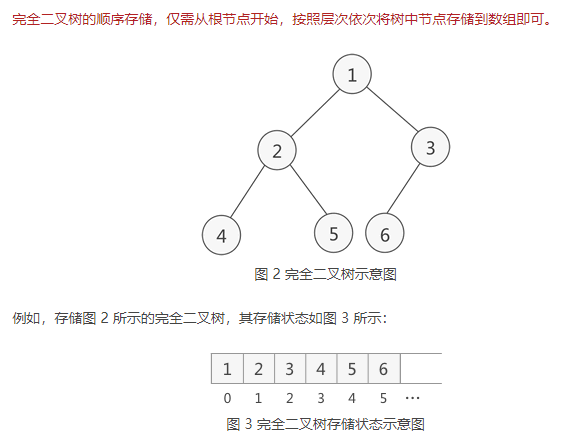

# 顺序存储二叉树

二叉树的顺序存储：指的是使用顺序表（数组）存储二叉树。需要注意的是，顺序存储只适用于完全二叉树。

满二叉树也是完全二叉树，但是完全二叉树不一定是满二叉树。



顺序存储二叉树的特点：

 1）顺序二叉树通常只考虑完全二叉树

 2）数组第n个元素的左子节点下标为 $2n+1$

 3）数组第n个元素的右子节点下标为 $2n+2$

 4）数组第n个元素的父节点下标为 $\frac{(n-1)}{2}$

```java
package com.stanlong;

import lombok.NonNull;
import lombok.RequiredArgsConstructor;

/**
 * 顺序存储二叉树
 */
public class DataStructure {

    public static void main(String[] args) throws Exception {
        int array[] = {1,2,3,4,5,6,7};
        ArrayBinaryTree arrayBinaryTree = new ArrayBinaryTree(array);
        System.out.println("--------------前序遍历顺序存储二叉树--------------");
        arrayBinaryTree.preOrder();
        System.out.println("--------------中序遍历顺序存储二叉树--------------");
        arrayBinaryTree.infixOrder();
        System.out.println("--------------后序遍历顺序存储二叉树--------------");
        arrayBinaryTree.postOrder();

    }
}


// 创建一个二叉树
@RequiredArgsConstructor
class ArrayBinaryTree{
    @NonNull
    private int[] array; // 有参构造方法

    // 重载 preOrder， 在主方法中调用时就不需要传参了
    public void preOrder(){
        this.preOrder(0);
    }

    public void infixOrder(){
        this.infixOrder(0);
    }

    public void postOrder(){
        this.postOrder(0);
    }


    // 前序遍历二叉树顺序存储结构
    public void preOrder(int index){
        if(array == null || array.length == 0){
            System.out.println("数组是空的");
            return;
        }
        // 打印当前节点
        System.out.println(array[index]);

        // 迭代左边
        if(index*2 + 1 < array.length){
            preOrder(index*2 + 1);
        }

        // 迭代右边
        if(index*2+2 < array.length){
            preOrder(index*2+2);
        }
    }

    // 中序遍历二叉树顺序存储结构
    public void infixOrder(int index){
        // 迭代左边
        if(index*2 + 1 < array.length){
            infixOrder(index*2 + 1);
        }

        // 打印当前节点
        System.out.println(array[index]);

        // 迭代右边
        if(index*2+2 < array.length){
            infixOrder(index*2+2);
        }
    }

    // 后序遍历二叉树顺序存储结构
    public void postOrder(int index){
        // 迭代左边
        if(index*2 + 1 < array.length){
            postOrder(index*2 + 1);
        }

        // 迭代右边
        if(index*2+2 < array.length){
            postOrder(index*2+2);
        }

        // 打印当前节点
        System.out.println(array[index]);
    }
}
```

