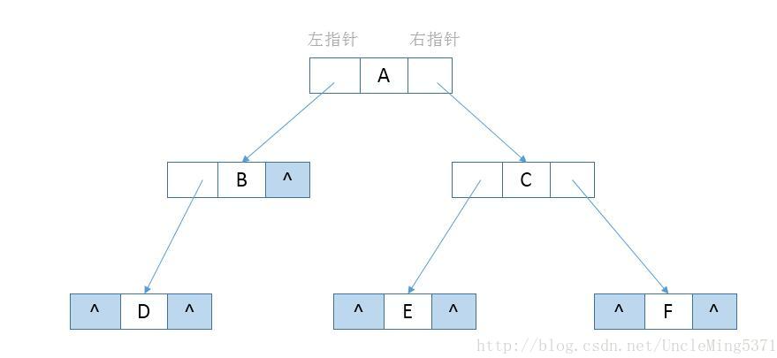
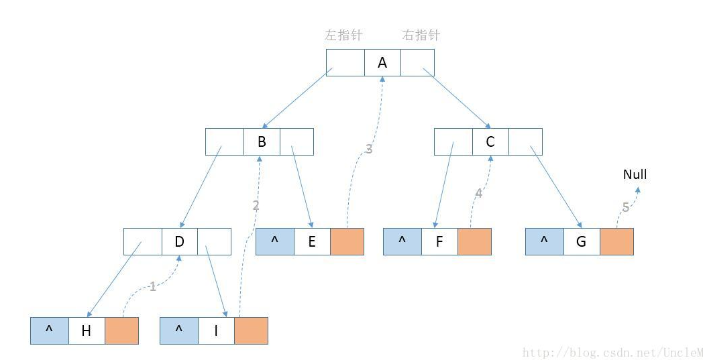
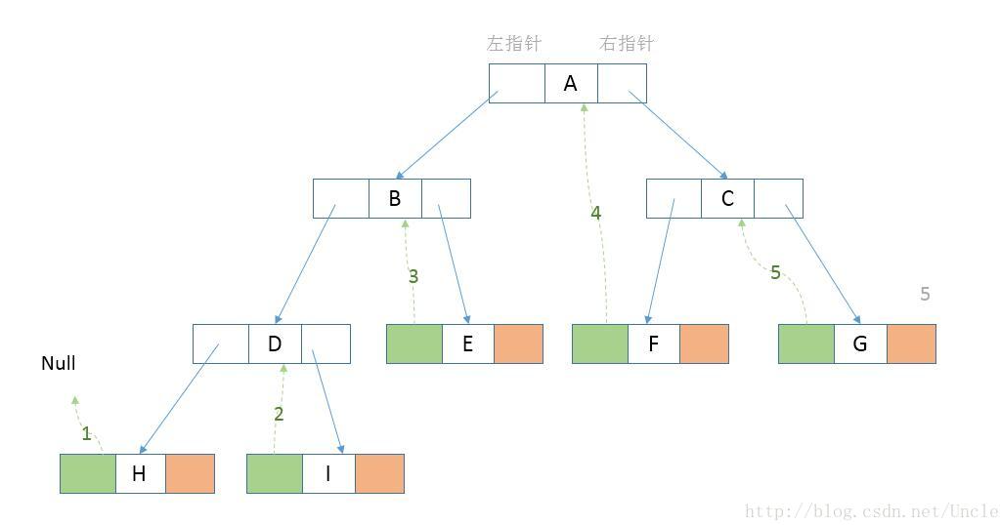
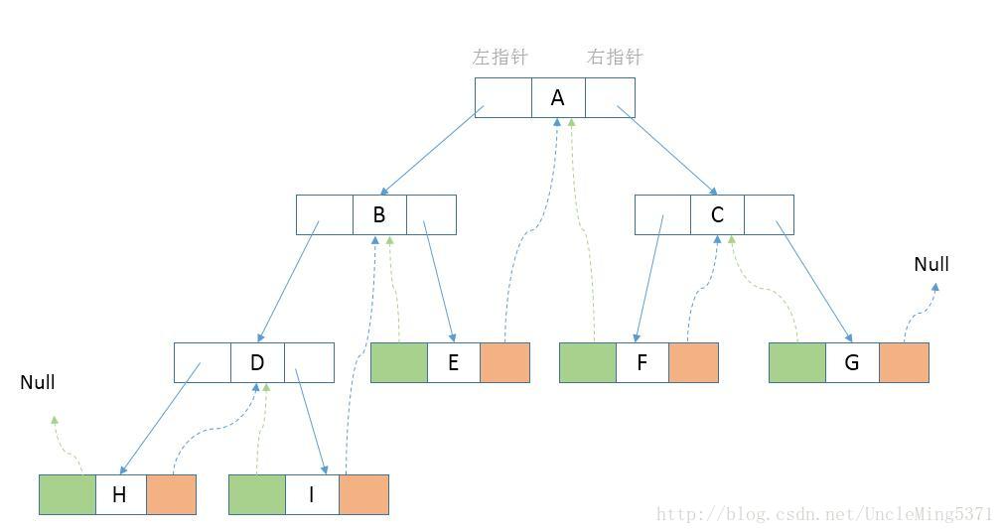
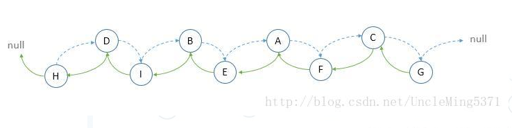
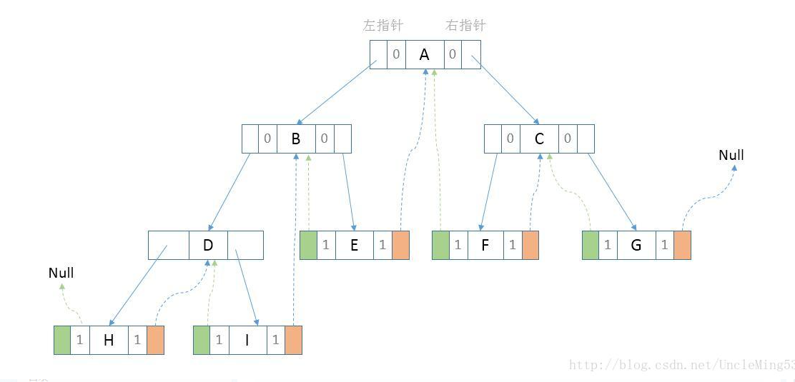

# 线索二叉树

## 引子

在使用二叉链表的存储结构的过程中，会存在大量的空指针域，为了充分利用这些空指针域，引申出了“线索二叉树”。回顾一下二叉链表存储结构，如下图：



通过观察上面的二叉链表，存在着若干个没有指向的空指针域。对于一个有n个节点的二叉链表，每个节点有指向左右节点的2个指针域，整个二叉链表存在2n个指针域。而n个节点的二叉链表有n-1条分支线，那么空指针域的个数=2n-(n-1) = n+1个空指针域，从存储空间的角度来看，这n+1个空指针域浪费了内存资源。 
   从另外一个角度来分析，如果我们想知道按中序方式遍历二叉链表时B节点的前驱节点或者后继节点时，必须要按中序方式遍历二叉链表才能够知道结果，每次需要结果时都需要进行一次遍历，是否可以考虑提前存储这种前驱和后继的关系来提高时间效率呢？ 
   综合以上两方面的分析，可以通过充分利用二叉链表中的空指针域，存放节点在某种遍历方式下的前驱和后继节点的指针。**我们把这种指向前驱和后继的指针成为线索，加上线索的二叉链表成为线索链表，对应的二叉树就成为“线索二叉树(Threaded Binary Tree)”** 。

## 构建线索二叉树过程

1. 我们对二叉树进行中序遍历，将所有的节点右子节点为空的指针域指向它的后继节点。如下图： 

   

通过中序遍历我们知道H的right指针为空，并且H的后继节点为D（如上图第1步），I的right指针为空，并且I的后继节点为B（如上图第2步），以此类推，知道G的后继节点为null，则G的right指针指向null。

2. 接下来将这颗二叉树的所有节点左指针域为空的指针域指向它的前驱节点。如下图

   

   如上图，H的left指针域指向Null（如第1步），I的前驱节点是D，则I的left指针指向D，以此类推。 通过上面两步完成了整个二叉树的线索化，最后结果如下图：

   

通过观察上图（蓝色虚线代表后继、绿色虚线代表前驱），可以看出，线索二叉树等于是把一棵二叉树转变成了一个“特殊的双向链表“(后面会解释为什么叫特殊的双向链表），这样对于我们的新增、删除、查找节点带来了方便。所以我们对二叉树以某种次序遍历使其变为线索二叉树的过程称做是线索化。如下图： 



仔细分析上面的双向链表，与线索化之后的二叉树相比，比如节点D与后继节点I，在完成线索化之后，并没有直接线索指针，而是存在父子节点的指针；节点A与节点F，在线索化完成之后，节点A并没有直接指向后继节点F的线索指针，而是通过父子节点遍历可以找到最终的节点F，前驱节点也存在同样的问题，正因为很多节点之间不存在直接的线索，所以我将此双向链表称做“特殊的双向链表”，再使用过程中根据指针是线索指针还是子节点指针来分别处理，所以在每个节点需要标明当前的左右指针是线索指针还是子节点指针，这就需要修改节点的数据结构。

```java
class Node{
    int id;         // 数据域
    Node left;      // 左指针域
    Node right;     // 右指针域
    int ltag;      // 左指针域类型 0：指向子节点   1：指向前驱
    int rtag;      // 右指针域类型 0：指向子节点   1：指向后继
}
```

最终的二叉链表修改为如下图的样子：



```java
package com.stanlong;

import lombok.*;

/**
 * 线索二叉树
 */
public class DataStructure {

    public static void main(String[] args) throws Exception {
        // 创建节点
        Node root = new Node("A");
        Node nodeB = new Node("B");
        Node nodeC = new Node("C");
        Node nodeD = new Node("D");
        Node nodeE = new Node("E");
        Node nodeF = new Node("F");
        Node nodeG = new Node("G");
        Node nodeH = new Node("H");
        Node nodeI = new Node("I");

        // 创建线索二叉树
        ThreadedBinaryTree tbt = new ThreadedBinaryTree();
        tbt.setRoot(root); // 设置树的根节点
        root.setLeft(nodeB);
        root.setRight(nodeC);
        nodeB.setLeft(nodeD);
        nodeB.setRight(nodeE);
        nodeC.setLeft(nodeF);
        nodeC.setRight(nodeG);
        nodeD.setLeft(nodeH);
        nodeD.setRight(nodeI);

        // 线索化二叉树
        tbt.threadedNodes();

        // 遍历线索化二叉树
        tbt.threadedList();
    }
}

@Getter
@Setter
@ToString(of = {"no"})
@RequiredArgsConstructor
class Node{
    @NonNull
    private String no; // 数据域
    private Node left; // 左指针域
    private Node right; // 右指针域
    private int ltag; // 0 指向左子节点， 1 指向前驱
    private int rtag; // 0 指向右子节点， 1 指向后继
}

/**
 * 线索二叉树
 */
class ThreadedBinaryTree{
    @Setter
    private Node root;

    private Node temp=null; // 辅助节点，帮助遍历线索二叉树

    // 重载 threadedNodes， 主方法调用时就不用再传参了
    public void threadedNodes(){
        this.threadedNodes(root);
    }

    /**
     * 二叉树中序线索化
     * @param node 当前节点
     */
    public void threadedNodes(Node node){
        if(node == null){ // 空节点不能线索化
            return;
        }

        // 线索化左子树
        threadedNodes(node.getLeft());

        // 线索化当前节点
        if(node.getLeft() == null){
            node.setLeft(temp);
            node.setLtag(1);
        }
        if(temp != null && temp.getRight() == null){
            temp.setRight(node);
            temp.setRtag(1);
        }
        temp = node;

        // 线索化右节点
        threadedNodes(node.getRight());
    }

    /**
     * 遍历线索二叉树
     */
    public void threadedList(){
        Node node = root;

        while (node != null){
            while ((node.getLtag() == 0)){ // 先输出二叉树中序遍历最左边的节点
                node = node.getLeft();
            }
            System.out.println(node);

            while (node.getRtag() == 1){ // 如果这个节点有后继节点
                node = node.getRight();
                System.out.println(node); // 打印后继节点
            }

            node = node.getRight();
        }

    }
}
```

