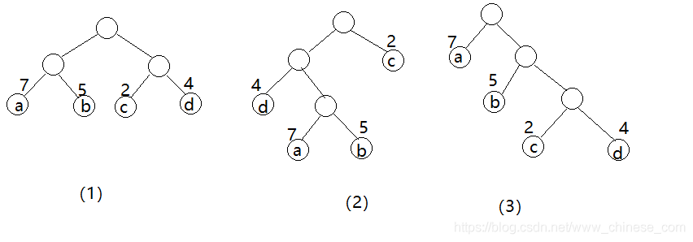
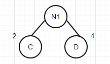
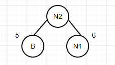
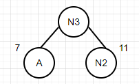
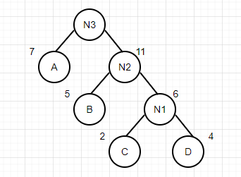

# 哈夫曼树

## 什么是哈夫曼树

要理解什么是哈夫曼树，首先要理解几个概念

**路径**：从树中一个结点到另一个结点之间的分支构成这两个结点之间的路径。

**路径长度**：路径上的分支数目。

**树的路径长度**：从树根到每一个结点的路径长度之和。（完全二叉树就是树的路径长度最短的二叉树）考虑带权的结点

**结点的带权路径长度**：从该结点到树根之间的路径长度和结点上权的乘积。

**树的带权路径长度**：树的所有结点的带权路径之和（WPL）

$$ WPL=\sum_{k=1}^nw_kl_k $$

假设有 n 个权值为{  ,  , ...} ，是构建一颗有 n 个叶子结点的二叉树，每个叶子结点带权为  ，则其中带权路径长度 WPL 最小的二叉树称为 **最优二叉树** 或 **哈夫曼树**。

假设有四个结点a、b、c、d，权值分别为 7、5、2、4



他们的带权路径分别为：

（1）WPL=7x2+5x2+2x2+4x2=36

（2）WPL=7x3+5x3+2x1+4x2=46

（3）WPL=7x1+5x2+2x3+4x3=35 

其中（3）树的 WPL 值最小。可以验证，他恰为哈夫曼树，即其带权路径长度在所有带权为 7，5，2，4 的 4 个叶子节点的二叉树中最小。

## 哈夫曼树的构造

假设{A7、B5、C2、D4}为二叉树的叶子节点

1. 将所有带权值的叶子结点按权值从小到大依次排序

   {A7、B5、C2、D4}=》{C2、D4、B5、A7}

2. 取前两个元素构成一个父节点

   

   N1 = C + D = 6

3. 把C和D在列表中去掉，用N1代替，先排序，再次按照步骤2进行操作

   

   N2 = B + N1 = 11

4. 重复以上操作

   

5. 最终构造的哈夫曼树如图

   

   WSL = 7*1 + 5 * 2 + 2 * 3 + 4 * 3 = 35

该二叉树前序遍历的结果为：{18， 7， 11， 5， 6， 2， 4}

```java
package com.stanlong;

import lombok.NonNull;
import lombok.RequiredArgsConstructor;
import lombok.ToString;

import java.util.ArrayList;
import java.util.Collections;
import java.util.List;

/**
 * 哈夫曼树
 */
public class DataStructure {

    public static void main(String[] args) throws Exception {
        int[] arr = {7, 5, 2, 4};
        // 创建哈夫曼树
        Node root = createHuffmanTree(arr);
        // 对哈夫曼树进行前序遍历
        preOrder(root);
    }

    /**
     * 把数组创建成哈夫曼树
     * @param arr 待创建数组
     */
    public static Node createHuffmanTree(int[] arr){
        List<Node> nodeList = new ArrayList<Node>();
        // 将arr中的每一个元素构造成一个Node，加入到nodeList里
        for(int value: arr){
            nodeList.add(new Node(value));
        }

        while (nodeList.size() > 1){
            // 开始排序， 从小到大
            Collections.sort(nodeList);

            // 取出根节点权值最小的两个二叉树, 单个节点也可以看成是二叉树
            Node left = nodeList.get(0);
            Node right = nodeList.get(1);

            // 构建一颗新的二叉树
            Node parent = new Node(left.id + right.id);
            parent.left = left;
            parent.right = right;

            // 从 arraylist中删除处理过的二叉树
            nodeList.remove(left);
            nodeList.remove(right);

            // 将parent加入到nodeList
            nodeList.add(parent);
        }
        // 返回哈夫曼树的root节点
        return nodeList.get(0);
    }

    public static void preOrder(Node root){
        if(root != null){
            root.preOrder();
        }else {
            System.out.println("树为空");
        }
    }
}

@RequiredArgsConstructor
@ToString(of = {"id"})
class Node implements Comparable<Node>{
    @NonNull
    int id;
    Node left;
    Node right;

    @Override
    public int compareTo(Node node){ // 继承 Comparable， 重写排序方法
        return this.id - node.id; // 从小到大排序
    }

    // 前序遍历
    public void preOrder(){
        System.out.println(this);
        if(this.left != null){
            this.left.preOrder();
        }
        if(this.right != null){
            this.right.preOrder();
        }
    }
}
```

