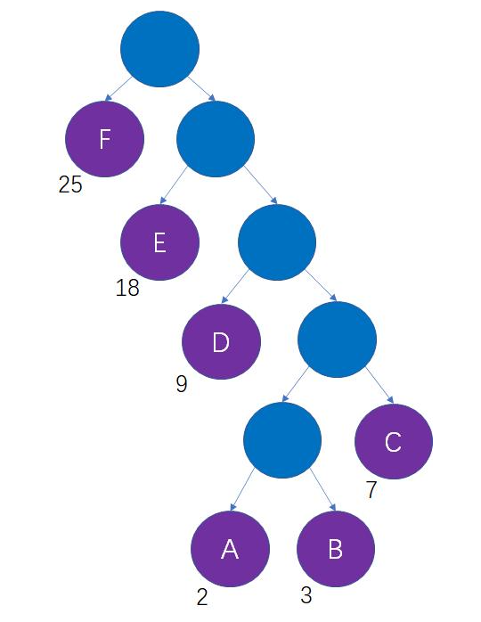
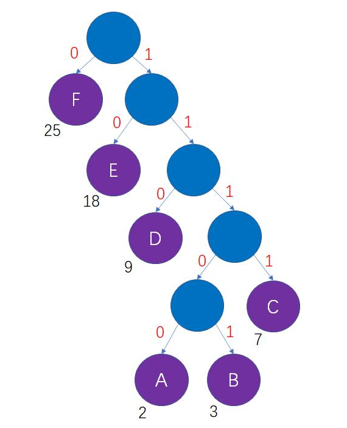
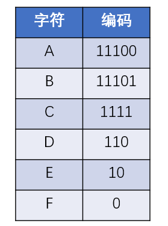

# 哈夫曼编码

哈夫曼编码(Huffman Coding)，又称霍夫曼编码，是一种编码方式，可变字长编码(VLC)的一种。Huffman于1952年提出一种编码方法，该方法完全依据字符出现概率来构造异字头的平均长度最短的码字，有时称之为最佳编码，一般就叫做Huffman编码（有时也称为霍夫曼编码）。

**哈夫曼编码，主要目的是根据使用频率来最大化节省字符（编码）的存储空间**

## 哈夫曼编码的生成过程

假如一段信息里只有A，B，C，D，E，F这6个字符，他们出现的次数依次是2次，3次，7次，9次，18次，25次，如何设计对应的编码呢？

我们不妨把这6个字符当做6个叶子结点，把字符出现次数当做结点的权重，以此来生成一颗哈夫曼树：



哈夫曼树的每一个结点包括左、右两个分支，二进制的每一位有0、1两种状态，我们可以把这两者对应起来，结点的左分支当做0，结点的右分支当做1，如下图



这样一来，从哈夫曼树的根结点到每一个叶子结点的路径，都可以等价为一段二进制编码：



上述过程借助哈夫曼树所生成的二进制编码，就是哈夫曼编码。

```java
package com.stanlong;

import lombok.Getter;
import lombok.Setter;
import lombok.ToString;

import java.util.*;

/**
 * 哈夫曼编码
 */
public class DataStructure {

    // 哈夫曼编码表, key 为字符串对应的字节， value 为 字节对应的哈夫曼树路径
    static Map<Byte, String> huffmanCodeMap = new HashMap<>();

    public static void main(String[] args) throws Exception {

        String content = "AABBBCCCCCCCDDDDDDDDDEEEEEEEEEEEEEEEEEEFFFFFFFFFFFFFFFFFFFFFFFFF";
        byte[] contentBytes = content.getBytes();

        // 压缩
        HuffmanZipData huffmanZipData = huffmanZip(contentBytes);

        // 解压
        byte[] sourceBytes = huffmanUZip(huffmanZipData);
        System.out.println("解压后的字符串: " + new String(sourceBytes));
    }

    /**
     * 哈夫曼压缩
     * @param contentBytes 原始字节数组
     * @return 哈夫曼压缩后的结果
     */
    public static HuffmanZipData huffmanZip(byte[] contentBytes){
        // 1. 将传过来的字节数组转化成节点列表
        List<Node> nodeList = getNode(contentBytes);

        // 2. 将节点列表转化成哈夫曼树
        Node huffmanTree = createHuffmanTree(nodeList);
        preOrder(huffmanTree);

        // 3. 生成哈夫曼编码
        generateHuffmanCode(huffmanTree);
        System.out.println("生成的哈夫曼编码表: " + huffmanCodeMap);

        // 4. 根据哈夫曼编码对原始的字节数组进行压缩
        return zip(contentBytes, huffmanCodeMap);
    }

    /**
     * 把字节数组转换成节点列表
     * @param bytes 接受的字节数组
     * @return 返回 nodeList
     */
    public static List<Node> getNode(byte[] bytes){
        ArrayList<Node> nodeList = new ArrayList<>();

        // 遍历bytes， 统计每一个byte出现的次数
        Map<Byte, Integer> map = new HashMap<>();
        int value=0;
        for(byte key : bytes){
            // 方式一
            value = map.getOrDefault(key, 0);
            value = value + 1;
            map.put(key, value);

            // 方式二
            // map.merge(key, 1, Integer::sum);
        }

        // 把map中的键值对装换成一个node对象， 并加入到 nodeList 里
        map.forEach((k, v) -> nodeList.add(new Node(k, v)));
        return nodeList;
    }

    /**
     * 创建一颗哈夫曼树
     * @param nodeList 节点列表
     * @return 哈夫曼树
     */
    public static Node createHuffmanTree(List<Node> nodeList){
        while (nodeList.size() > 1){
            // 排序
            Collections.sort(nodeList);

            // 取出第一颗最小的二叉树
            Node left = nodeList.get(0);
            // 取出第二颗最小的二叉树
            Node right = nodeList.get(1);

            // 创建新的二叉树， 新的二叉树没有数据，只有权值
            Node parent = new Node(null, left.getWeight() + right.getWeight());
            parent.setLeft(left);
            parent.setRight(right);

            nodeList.remove(left);
            nodeList.remove(right);
            nodeList.add(parent);
        }
        return nodeList.get(0);
    }

    /**
     * 前序遍历
     * @param root 前序遍历结果
     */
    public static void preOrder(Node root){
        if(root != null){
            root.preOrder();
        }else {
            System.out.println("哈夫曼树为空");
        }
    }

    /**
     * 根据哈夫曼树生产哈夫曼编码表
     * @param huffmanTree 哈夫曼树
     */
    public static void generateHuffmanCode(Node huffmanTree){
        if(huffmanTree == null){
            return;
        }
        encodeChar(huffmanTree, "", huffmanCodeMap);
    }

    /**
     * 根据哈夫曼树生产哈夫曼编码表
     * @param node 哈夫曼树
     * @param encoding 左路径编码：0， 右路径编码：1
     * @param huffmanCodeMap 哈夫曼编码表
     */
    private static void encodeChar(Node node, String encoding, Map<Byte, String> huffmanCodeMap) {
        // 如果是叶子节点直接返回，因为在父节点已经完成了它的编码
        if (isLeaf(node)) {
            huffmanCodeMap.put(node.getValue(), encoding);
            return;
        }
        // 左右递归编码
        encodeChar(node.getLeft(), encoding + '0', huffmanCodeMap);
        encodeChar(node.getRight(), encoding + '1', huffmanCodeMap);
    }

    /**
     * 判断当前节点是不是叶子节点
     * @param node 当前节点
     * @return 叶子节点范围true， 否则范围false
     */
    public static boolean isLeaf(Node node) {
        return node.getLeft() == null && node.getRight() == null;
    }

    /**
     * 返回对哈夫曼编码按照八位长度重新编码后的字节数组
     * @param bytes 原始字符串数组对应的字节数组
     * @param huffmanCodeMap 生成的哈夫曼编码表
     * @return 返回对哈夫曼编码按照八位长度重新编码后的字节数组 11100111(补码)-> 11100111-1 = 11100110(反码)->10011001(源码)->-25
     */
    public static HuffmanZipData zip(byte[] bytes, Map<Byte, String> huffmanCodeMap){
        // stringBuilder 拼接编码后的原字节数组
        StringBuilder stringBuilder = new StringBuilder();
        for(byte b : bytes){
            stringBuilder.append(huffmanCodeMap.get(b));
        }

        // 按长度为8位进行截取， 每8位是一个byte
        int len=0;
        if(stringBuilder.length() % 8 == 0){
            len = stringBuilder.length() / 8;
        }else {
            len = stringBuilder.length() / 8 + 1;
        }
        // 或者直接写成 int len = (stringBuilder.length()+7)/8;

        // 创建存储压缩后的byte数组
        byte[] zipBytes = new byte[len];
        int index = 0; // 记录第几个byte
        for(int i=0; i<stringBuilder.length(); i=i+8){
            String strByte = "";
            if(i + 8 > stringBuilder.length()){ // 不够8位
                strByte = stringBuilder.substring(i);
            }else{
                strByte = stringBuilder.substring(i, i+8);
            }

            // 将 strByte 转化成一个byte, 放入到 huffmanCodeBytes
            zipBytes[index] = (byte) Integer.parseInt(strByte, 2); // 按二进制转换
            index++;
        }
        return new HuffmanZipData(zipBytes, huffmanCodeMap, stringBuilder.length());
    }

    /**
     * 对压缩的数据进行解压缩
     * @param huffmanZipData 封装了数据压缩后的信息
     * @return 解压后的原字节数组
     */
    public static byte[] huffmanUZip(HuffmanZipData huffmanZipData){
        String s = bytesToString(huffmanZipData.data, huffmanZipData.originalLength);
        byte[] decode = decode(huffmanZipData.huffmanCodeMap, s);
        return decode;
    }

    /**
     * 将byte数组转成对应的二进制字符串
     * @param bytes 赫夫曼编码得到的字节数组
     * @return 原来的字符串对应的数组
     */
    private static String bytesToString(byte[] bytes, int originalLength) {
        // 先得到 bytes对应的二进制字符串
        StringBuilder stringBuilder = new StringBuilder();
        // 将byte数组转成二进制的字符串
        // 负数需要符号位，所以一定是8位
        for (int i = 0; i < bytes.length - 1; i++) {
            stringBuilder.append(byteToBitString(bytes[i]));
        }
        stringBuilder.append(byteToBitString(bytes[bytes.length - 1], originalLength));
        return stringBuilder.toString();
    }

    /**
     * 将一个byte 转成一个二进制的字符串
     * @param b 传入的byte
     * @return b对应的二进制的字符串，按照补码返回
     */
    private static String byteToBitString(byte b) {
        // 使用变量保存b
        int temp = b;
        // 如果是正数，需要进行补高位
        // 按位或 1 0000 0000 | 0000 0001 = 1 0000 0001, (256 | 1 = 257), 然后截取后面8位
        temp |= 256;
        // 返回temp对应的二进制的补码
        String s = Integer.toBinaryString(temp);
        return s.substring(s.length() - 8);
    }

    /**
     * 重载方法，处理最后一个字节
     * @param b 最后一个字节
     * @param originalLength 原字节数组对应的二进制字符串长度
     * @return 最后一个字节对应的二进制字符串
     */
    private static String byteToBitString(byte b, int originalLength) {
        // 使用变量保存b
        int temp = b;
        // 如果是正数，需要进行补高位
        // 按位或 1 0000 0000 | 0000 0001 = 1 0000 0001, (256 | 1 = 257), 然后截取后面8位
        // 如果是最后一位，并且是非负数，不需要补高位和截取后面8位，但是位数不确定需要判断
        if (b >= 0 && b <= Byte.MAX_VALUE) {
            // 计算需要补位的位数
            int endCount = originalLength % 8;
            // 如果最后也是8位的正数，也需要补齐到8位
            endCount = (endCount == 0 ? 8 : endCount);
            // 得到进行或运算的操作基数，比如补到6位就需要与 100 0000（2^6）进行或运算
            int renRadix = (int) Math.pow(2, endCount);
            temp = temp|renRadix;
            String s = Integer.toBinaryString(temp);
            return s.substring(s.length() - endCount);
        }
        temp = temp|256;
        // 返回temp对应的二进制的补码
        String s = Integer.toBinaryString(temp);
        return s.substring(s.length() - 8);
    }

    /**
     * 对字符串进行解码
     * @param huffmanCode huffman编码列表
     * @param s 二进制字符
     * @return 解码后对应的字节
     */
    private static byte[] decode(Map<Byte, String> huffmanCode, String s) {
        Map<String, Byte> map = new HashMap<>();
        // 反向赋值map
        for (Map.Entry<Byte, String> entry : huffmanCode.entrySet()) {
            map.put(entry.getValue(), entry.getKey());
        }
        List<Byte> list = new ArrayList<>();
        for (int i = 0, j = 0; i < s.length() && j <= s.length();) {
            String temp = s.substring(i, j);
            Byte tempByte = map.get(temp);
            if (tempByte == null) {
                j++;
            } else {
                list.add(tempByte);
                i = j;
            }
        }
        // 因为IO流读取文件是通过数组，所以返回要转成数组
        byte[] result = new byte[list.size()];
        for (int i = 0; i < list.size(); i++) {
            result[i] = list.get(i);
        }
        return result;
    }
}

/**
 * 节点带权值
 */
@ToString(of={"value", "weight"})
@Setter
@Getter
class Node implements Comparable<Node>{

    private Byte value; // 存放数据, byte的取值范围是-128到+127
    private int weight; // 存放数据的权值，表示数据出现的次数
    private Node left;
    private Node right;

    public Node(Byte value, int weight){
        this.value = value;
        this.weight = weight;
    }

    @Override
    public int compareTo(Node node) {
        return this.weight - node.weight; // 从小到大排序
    }

    // 前序遍历
    public void preOrder(){
        System.out.println(this);
        if(this.left != null){
            this.left.preOrder();
        }
        if(this.right != null){
            this.right.preOrder();
        }
    }
}

/**
 * 记录压缩信息
 */
class HuffmanZipData {
    // 压缩之后的字节数组数据
    byte[] data;

    // 哈夫曼编码表
    Map<Byte, String> huffmanCodeMap;

    // 原字节数组转换成二进制字符串后的长度
    int originalLength;

    public HuffmanZipData(byte[] data, Map<Byte, String> huffmanCodeMap, int originalLength) {
        this.data = data;
        this.huffmanCodeMap = huffmanCodeMap;
        this.originalLength = originalLength;
    }
}
```

```
生成的哈夫曼编码表: {65=11100, 66=11101, 67=1111, 68=110, 69=10, 70=0}
解压后的字符串: AABBBCCCCCCCDDDDDDDDDEEEEEEEEEEEEEEEEEEFFFFFFFFFFFFFFFFFFFFFFFFF
```

