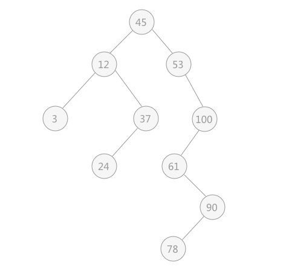

# 二叉排序树

优点：能高效的完成对数据的查询和添加。

二叉排序树要么是空二叉树，要么具有如下特点：

- 左子节点都比根节点小
- 右子节点都比根节点大
- 如果值相同，将该子节点放在左右均可

例如，下图就是一个二叉排序树：



## 创建二叉排序树

```java
package com.stanlong;

import lombok.NonNull;
import lombok.Setter;
import lombok.Getter;
import lombok.ToString;
import lombok.RequiredArgsConstructor;

/**
 * 二叉排序树
 */
public class DataStructure {

    public static void main(String[] args) throws Exception {
        int[] arr = {45, 12, 53, 3, 37, 100, 24, 61, 90, 78};
        BinarySortTree bst = new BinarySortTree();
        // 循环添加节点到二叉排序树
        for(int i=0; i< arr.length; i++){
            bst.add(new Node(arr[i]));
        }
        // 中序遍历二叉排序树
        bst.infixOrder();
    }
}

// Node 节点
@Setter
@Getter
@ToString(of={"value"})
@RequiredArgsConstructor
class Node{
    @NonNull
    private int value;
    private Node left;
    private Node right;

    /**
     * 用递归的方式添加节点
     * @param node 要添加的节点
     */
    public void add(Node node){
        if(node == null){
            return;
        }
        // 左子节点都比根节点小
        if(node.value < this.value){
            if(this.left == null){
                this.left = node;
            }else {
                this.left.add(node); // 递归往左子树添加
            }
        }
        // 右子节点都比根节点大, 如果值相同，将该子节点放在左右均可
        if(node.value >= this.value){
            if(this.right == null){
                this.right = node;
            }else {
                this.right.add(node);
            }
        }
    }

    // 中序遍历
    public void infixOrder(){
        if(this.left != null){
            this.left.infixOrder();
        }
        System.out.println(this);
        if(this.right != null){
            this.right.infixOrder();
        }
    }
}

class BinarySortTree{
    private Node root;

    public void add(Node node){
        if(root == null){
            root = node;
        }else {
            root.add(node);
        }
    }

    public void infixOrder(){
        if(root != null){
            root.infixOrder();
        }else {
            System.out.println("树为空！");
        }
    }
}
```

```
Node(value=3)
Node(value=12)
Node(value=24)
Node(value=37)
Node(value=45)
Node(value=53)
Node(value=61)
Node(value=78)
Node(value=90)
Node(value=100)
```

## 删除二叉排序树

删除二叉排序树分三种情况

1. 被删除的节点是叶子节点，则直接删除该节点
2. 被删除的节点只有左子树或者只有右子树，用其左子树或者右子树替换该节点
3. 被删除的节点既有左子树，也有右子树

```java
package com.stanlong;

import lombok.NonNull;
import lombok.Setter;
import lombok.Getter;
import lombok.ToString;
import lombok.RequiredArgsConstructor;

/**
 * 二叉排序树
 */
public class DataStructure {

    public static void main(String[] args) throws Exception {
        int[] arr = {45, 12, 53, 3, 37, 100, 24, 61, 90, 78};
        BinarySortTree bst = new BinarySortTree();
        // 循环添加节点到二叉排序树
        for(int i=0; i< arr.length; i++){
            bst.add(new Node(arr[i]));
        }
        // 中序遍历二叉排序树
        bst.infixOrder();
    }


}

// Node 节点
@Setter
@Getter
@ToString(of={"value"})
@RequiredArgsConstructor
class Node{
    @NonNull
    private int value;
    private Node left;
    private Node right;

    /**
     * 用递归的方式添加节点
     * @param node 要添加的节点
     */
    public void add(Node node){
        if(node == null){
            return;
        }
        // 左子节点都比根节点小
        if(node.value < this.value){
            if(this.left == null){
                this.left = node;
            }else {
                this.left.add(node); // 递归往左子树添加
            }
        }
        // 右子节点都比根节点大, 如果值相同，将该子节点放在左右均可
        if(node.value >= this.value){
            if(this.right == null){
                this.right = node;
            }else {
                this.right.add(node);
            }
        }
    }

    // 中序遍历
    public void infixOrder(){
        if(this.left != null){
            this.left.infixOrder();
        }
        System.out.println(this);
        if(this.right != null){
            this.right.infixOrder();
        }
    }

    // 查找节点
    public Node search(int value){
        if(value == this.value){ // 找到
            return this;
        }else if(value < this.value){ // 往左子树递归
            if(this.left != null){
                return this.left.search(value);
            }
        }else{ // 往右子树递归
            if(this.right != null){
                return this.right.search(value);
            }
        }
        return null;
    }

    // 查找父节点
    public Node searchParent(int value){
        if((this.left != null && this.left.value == value) ||
                (this.right != null && this.right.value == value)){ // 当前节点就是要删除节点的父节点
            return this;
        }else { //
            if(value < this.value && this.left != null){ // 向左子树递归
                return this.left.searchParent(value);
            }else if(value >= this.value && this.right != null){ // 向右子树递归
                return this.right.searchParent(value);
            }
        }
        return null;
    }

}

/**
 * 二叉排序树
 */
class BinarySortTree{
    private Node root;

    public void add(Node node){
        if(root == null){
            root = node;
        }else {
            root.add(node);
        }
    }

    public void infixOrder(){
        if(root != null){
            root.infixOrder();
        }else {
            System.out.println("树为空！");
        }
    }

    public Node search(int value){
        if(root == null){
            return null;
        }else {
            return root.search(value);
        }
    }

    public Node searchParent(int value){
        if(root == null){
            return null;
        }else {
            return root.searchParent(value);
        }
    }

    public void delNode(int value){
        if(root == null){
            return;
        }else {
            Node target = search(value); // 查找要删除的节点
            if(target == null){
                return;
            }
            // 如果该二叉树只有一个节点，那删除之后就是一个空树了
            if(target.getLeft() == null && target.getRight() == null){
                root = null;
                return;
            }

            // 查找该节点的父节点
            Node parent = searchParent(value);

            // 1. 如果要删除的节点是叶子节点, 则直接删除该节点
            if(target.getLeft() == null && target.getRight() == null){
                if(parent.getLeft() != null && parent.getLeft().getValue() == value){ // 要删除的节点是左子节点
                    parent.setLeft(null);
                }else if(parent.getRight() != null && parent.getRight().getValue() == value) { // 要删除的是右子节点
                    parent.setRight(null);
                }
            } else if(target.getLeft() != null && target.getRight() != null){// 3.被删除的节点既有左子树，也有右子树
                System.out.println("待完成");
            }else { // 2. 被删除的节点只有左子树或者只有右子树，用其左子树或者右子树替换该节点
                // 要删除的节点只有左子树
                if(target.getLeft() != null){
                    if(parent.getLeft().getValue() == value){ //要删除的节点是父节点左子节点
                        parent.setLeft(target.getLeft());
                    }else { // 要删除的节点是父节点的右子节点
                        parent.setRight(target.getLeft());
                    }
                }else { // 要删除的节点有右子树
                    if(parent.getLeft().getValue() == value){ //要删除的节点是父节点左子节点
                        parent.setLeft(target.getRight());
                    }else { // 要删除的节点是父节点的右子节点
                        parent.setRight(target.getRight());
                    }

                }
            }
        }
    }

    /**
     *
     * @param node
     * @return
     */
//    public int delRightMin(Node node){
//
//    }
}
```


