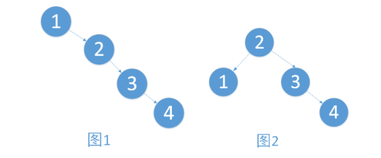
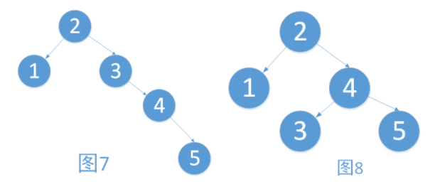
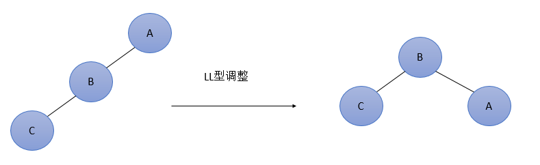
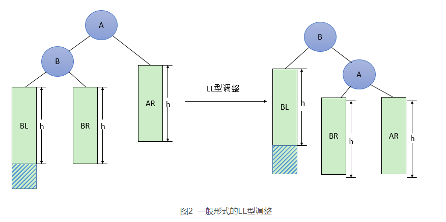
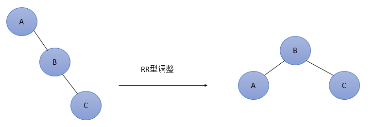
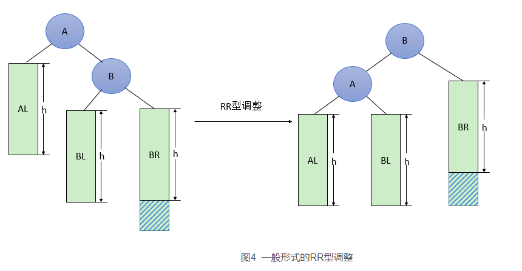
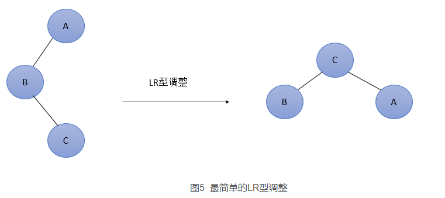
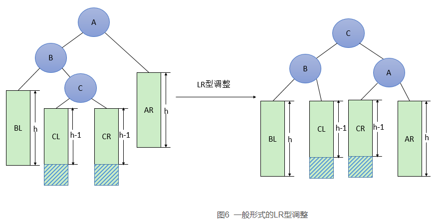
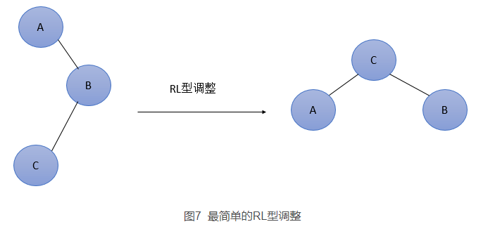
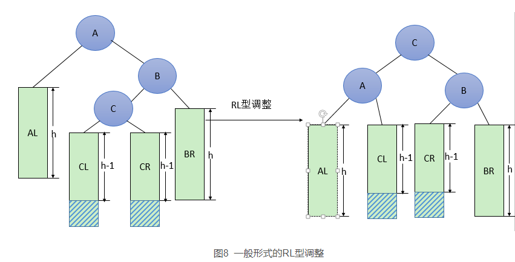

# 平衡二叉树(AVL)

## 引入

学习过了二叉查找树，想必大家有遇到一个问题。例如，将一个数组{1,2,3,4}依次插入树的时候，形成了图1的情况。有建立树与没建立树对于数据的增删改查已经没有了任何帮助，反而增添了维护的成本。而只有建立的树如图2，才能够最大地体现二叉树的优点。



在上述的例子中，图2就是一棵平衡二叉树。平衡二叉树是由前苏联的数学家Adelse-Velskil和Landis在1962年提出的高度平衡的二叉树，根据科学家的英文名也称为AVL树

## AVL的定义

它具有如下几个性质：

1. 可以是空树。
2. 假如不是空树，任何一个结点的左子树与右子树都是平衡二叉树，并且高度之差的绝对值不超过1

**平衡因子**：左子树的高度减去右子树的高度。由平衡二叉树的定义可知，平衡因子的取值只可能为0,1,-1.分别对应着左右子树等高，左子树比较高，右子树比较高。

**最小不平衡子树：** 在新插入的结点向上查找，以第一个平衡因子的绝对值超过1的结点为根的子树称为最小不平衡子树。也就是说，一棵失衡的树，是有可能有多棵子树同时失衡的，如下。而这个时候，我们只要调整最小的不平衡子树，就能够将不平衡的树调整为平衡的树。

　在图7中。2结点（左子树树高[2]-右子树树高[4]）的绝对值=2。同理，3结点的平衡因子也为(0-2)=2.此时同时存在了两棵不平衡子树，而以3为根的树是最小的不平衡子树。我们只要将其以3为中心，将最小不平衡树向左旋转，即可得到平衡二叉树，如图8。



## 平衡二叉树实现原理

平衡二叉树构建的基本思想就是在构建二叉排序树的过程中，每当插入一个节点时，先检查是否因插入而破坏了树的平衡性，若是，找出最小不平衡树。在保持二叉排序树特性的前提下，调整最小不平衡子树中各节点之间的链接关系，进行相应的旋转，使之成为新的平衡子树。

## 旋转操作

### LL型调整

由于在A的左孩子(L)的左子树(L)上插入新结点，使原来平衡二叉树变得不平衡，此时A的平衡因子由1增至2。下面图1是LL型的最简单形式。显然，按照大小关系，结点B应作为新的根结点，其余两个节点分别作为左右孩子节点才能平衡，A结点就好像是绕结点B顺时针旋转一样。



LL型调整的一般形式如下图2所示，表示在A的左孩子B的左子树BL(不一定为空)中插入结点(图中阴影部分所示)而导致不平衡( h 表示子树的深度)。这种情况调整如下：①将A的左孩子B提升为新的根结点；②将原来的根结点A降为B的右孩子；③各子树按大小关系连接(BL和AR不变，BR调整为A的左子树)。


### RR型调整

由于在A的右孩子(R)的右子树(R)上插入新结点，使原来平衡二叉树变得不平衡，此时A的平衡因子由-1变为-2。图3是RR型的最简单形式。显然，按照大小关系，结点B应作为新的根结点，其余两个节点分别作为左右孩子节点才能平衡，A结点就好像是绕结点B逆时针旋转一样。



RR型调整的一般形式如下图4所示，表示在A的右孩子B的右子树BR(不一定为空)中插入结点(图中阴影部分所示)而导致不平衡( h 表示子树的深度)。这种情况调整如下：

- 将A的右孩子B提升为新的根结点；
- 将原来的根结点A降为B的左孩子
- 各子树按大小关系连接(AL和BR不变，BL调整为A的右子树)。



### LR型调整

由于在A的左孩子(L)的右子树(R)上插入新结点，使原来平衡二叉树变得不平衡，此时A的平衡因子由1变为2。图5是LR型的最简单形式。显然，按照大小关系，结点C应作为新的根结点，其余两个节点分别作为左右孩子节点才能平衡。



LR型调整的一般形式如下图6所示，表示在A的左孩子B的右子树(根结点为C，不一定为空)中插入结点(图中两个阴影部分之一)而导致不平衡( h 表示子树的深度)。这种情况调整如下：①将B的左孩子C提升为新的根结点；②将原来的根结点A降为C的右孩子；③各子树按大小关系连接(BL和AR不变，CL和CR分别调整为B的右子树和A的左子树)。



### RL型调整

由于在A的右孩子(R)的左子树(L)上插入新结点，使原来平衡二叉树变得不平衡，此时A的平衡因子由-1变为-2。图7是RL型的最简单形式。显然，按照大小关系，结点C应作为新的根结点，其余两个节点分别作为左右孩子节点才能平衡。



RL型调整的一般形式如下图8所示，表示在A的右孩子B的左子树(根结点为C，不一定为空)中插入结点(图中两个阴影部分之一)而导致不平衡( h 表示子树的深度)。这种情况调整如下：①将B的左孩子C提升为新的根结点；②将原来的根结点A降为C的左孩子；③各子树按大小关系连接(AL和BR不变，CL和CR分别调整为A的右子树和B的左子树)。



```java
package com.stanlong;

import lombok.NonNull;
import lombok.RequiredArgsConstructor;
import lombok.ToString;

/**
 * 平衡二叉树
 */
public class DataStructure {

    public static void main(String[] args) throws Exception {
        int[] arr = {45, 12, 53, 3, 37, 100, 24, 61, 90, 78};
        // int[] arr = {45, 12, 53, 3, 2};
        AVLTree avlTree = new AVLTree();
        for(int i=0; i<arr.length; i++){
            avlTree.add(new Node(arr[i]));
        }
        System.out.println("------中序遍历------");
        avlTree.infixOrder();

        System.out.println("树的高度: " + avlTree.root.height());
        System.out.println("左子树的高度: " + avlTree.root.leftHeight());
        System.out.println("右子树的高度: " + avlTree.root.rightHeight());

    }
}

// Node 节点
@ToString(of={"value"})
@RequiredArgsConstructor
class Node<E>{
    @NonNull
    int value;
    Node parent; // 父节点，辅助树AVL树的旋转和节点的删除
    Node left;
    Node right;

    // 查找节点
    public Node search(int value){
        if(value == this.value){ // 找到
            return this;
        }else if(value < this.value){ // 往左子树递归
            if(this.left != null){
                return this.left.search(value);
            }
        }else{ // 往右子树递归
            if(this.right != null){
                return this.right.search(value);
            }
        }
        return null;
    }

    /**
     * 返回当前节点为根节点时树的高度
     * @return 树的高度
     */
    public int height(){
        return Math.max(left == null ? 0: left.height(), right == null?0:right.height()) + 1;
    }

    /**
     * 左子树的高度
     * @return 左子树的高度
     */
    public int leftHeight(){
        if(left == null){
            return 0;
        }
        return left.height();
    }

    /**
     * 右子树的高度
     * @return 右子树的高度
     */
    public int rightHeight(){
        if(right == null){
            return 0;
        }
        return right.height();
    }
}

/**
 * 平衡二叉树
 */
class AVLTree{
    Node root;
    private final int LEFT = 1;
    private final int RIGHT = -1;
    private final int MAX_LEFT = 2;
    private final int MAX_RIGHT = -2;

    public void add(Node node){
        if(root == null){
            root = node;
            return;
        }
        int t; // 与根节点的差值
        Node tempBefore; // 遍历的节点的前一个节点，相当于遍历节点的父节点
        Node temp = root;
        do {
            tempBefore = temp;
            t = node.value - temp.value;
            if(t < 0) { // 比根节点小
                temp = temp.left; // 向左递归
            }
            else if(t > 0) { // 比根节点大
                temp = temp.right; // 向右递归
            }
            else {
                // 说明是已经包含相同值，不允许插入
                return;
            }
        } while(temp != null);
        node.parent = tempBefore; // 记录节点的父节点，方便旋转和删除操作
        if(t < 0) {
            tempBefore.left = node;
        }
        else {
            tempBefore.right = node;
        }
        rebuild(tempBefore);
    }

    /**
     * 平衡二叉树的方法
     * @param node 最小不平衡树的根节点
     */
    public void rebuild(Node node) {
        // 向parent循环判断是否需要需要旋转
        while(node != null) {
            if(calcNodeBalanceValue(node) == MAX_LEFT) {
                fixAfterInsertion(node, LEFT);
            }
            else if(calcNodeBalanceValue(node) == MAX_RIGHT) {
                fixAfterInsertion(node, RIGHT);
            }
            node = node.parent;
        }
    }

    /**
     * 计算node节点的BF值
     * @param node 要计算BF的节点
     * @return node的BF值
     */
    public int calcNodeBalanceValue(Node node) {
        if(node != null) {
            return node.leftHeight() - node.rightHeight();
        }
        return 0;
    }

    /**
     * 调整树的结构
     * @param node 最小不平衡树的根节点
     * @param type 树的不平衡类型
     */
    public void fixAfterInsertion(Node node, int type) {
        if(type == LEFT) {
            Node left = node.left;
            // 右旋
            if(left.left != null) {
                rightRotation(node);
            }
            // 左右旋
            else if(left.right != null) {
                leftRotation(left);
                rightRotation(node);
            }
        }
        else if(type == RIGHT) {
            Node right = node.right;
            // 左旋
            if(right.right != null) {
                leftRotation(node);
            }
            // 右左旋
            else if(right.left != null) {
                rightRotation(right);
                leftRotation(node);
            }
        }
    }

    /**
     * 右旋
     * 这段比较难理解，注释按照文档【图2 一般形式的LL型调整】补充
     * @param node BF的绝对值大于1的节点
     * @return 旋转后的结果
     */
    public Node rightRotation(Node node) {
        if (node != null) { // 节点A不为null
            Node left = node.left; // left为A的左节点B
            node.left = left.right; // A的左节点重新指向A的左节点的右节点， 就像图里的A的左节点由B变成了B的右节点BR
            // 如果B的右子节点存在，则调整B的右子节点的父节点为A
            if (left.right != null) {
                left.right.parent = node;
            }
            left.parent = node.parent; // 调整B的位置
            if (node.parent == null) { // 如果A为原树的根节点
                this.root = left; // 调整后B为原树的新的根节点
            }
            else if (node.parent.right == node) {// 如果A是原树是右子树的节点， 即原树右子树失衡
                node.parent.right = left; // 原树右子树指向调整后的B节点
            }
            else if (node.parent.left == node) { // 如果A是原树是左子树的节点， 即原树左子树失衡
                node.parent.left = left; //  原树左子树指向调整后的B节点
            }
            left.right = node; // B的右节点指向A
            node.parent = left; // A的父节点指向B
            return left; // 返回调整后的节点B
        }
        return null;
    }

    /**
     * 左旋
     * 这段比较难理解，可参考右旋的代码注释和【图4 一般形式的RR型调整】来理解
     * @param node BF绝对值大于2的节点
     * @return 调整后的节点
     */
    public Node leftRotation(Node node) {
        if (node != null) {
            Node right = node.right;
            node.right = right.left;
            if (right.left != null) {
                right.left.parent = node;
            }
            right.parent = node.parent;
            if(node.parent == null) {
                this.root = right;
            }
            else if(node.parent.right == node) {
                node.parent.right = right;
            }
            else if(node.parent.left == node) {
                node.parent.left = right;
            }
            right.left = node;
            node.parent = right;
            return right;
        }
        return null;
    }

    /**
     * 中序遍历
     */
    public void infixOrder(){
        this.infixOrder(this.root);
    }

    /**
     * 中序遍历
     * @param node 从根节点开始遍历
     */
    public void infixOrder(Node node){
        if(node != null){
            this.infixOrder(node.left);
            System.out.println(node);
            this.infixOrder(node.right);
        }
    }

    public Node search(int value){
        if(root == null){
            return null;
        }else {
            return root.search(value);
        }
    }

    public void delNode(int value){
        if(root == null){
            return;
        }else {
            Node target = search(value); // 查找要删除的节点
            if(target == null){
                return;
            }
            // 如果该二叉树只有一个节点，那删除之后就是一个空树了
            if(root.left == null && root.right == null && root.value == value){
                root = null;
                return;
            }

            // 查找该节点的父节点
            Node parent = target.parent;

            // 1. 如果要删除的节点是叶子节点, 则直接删除该节点
            if(target.left == null && target.right == null){
                if(parent.left != null && parent.left.value == value){ // 要删除的节点是左子节点
                    parent.left = null;
                }else if(parent.right != null && parent.right.value == value) { // 要删除的是右子节点
                    parent.right = null;
                }
            } else if(target.left != null && target.right != null){// 3.被删除的节点既有左子树，也有右子树
                int minValue = delRightMin(target.right); // 删除并返回右子树节点的最小值
                target.value = minValue;  // 用右子树的最小值替换要删除的节点
            }else { // 2. 被删除的节点只有左子树或者只有右子树，用其左子树或者右子树替换该节点
                // 要删除的节点只有左子树
                if(target.left != null){
                    if(parent.left != null && parent.left.value == value){ //要删除的节点是父节点左子节点
                        parent.left = target.left;
                    }else { // 要删除的节点是父节点的右子节点
                        parent.right = target.left;
                    }
                }else { // 要删除的节点有右子树
                    if(parent.right != null && parent.right.value == value){ //要删除的节点是父节点左子节点
                        parent.right = target.right;
                    }else { // 要删除的节点是父节点的右子节点
                        parent.left = target.right;
                    }

                }
            }
        }
    }

    /**
     * 返回右子树最小值的节点，并删除该节点
     * @param node 要删除节点的右子树的第一个节点
     * @return 以node为根节点的二叉排序树的右子树最小值
     */
    public int delRightMin(Node node){
        Node target = node;
        while(target.left != null){
            target = target.left;
        }
        delNode(target.value);
        return target.value;
    }
}
```

