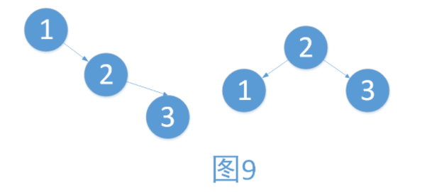
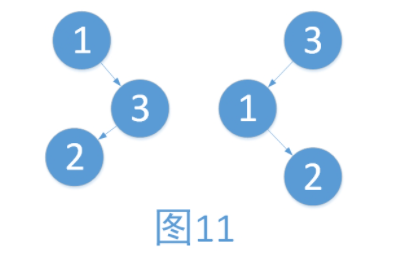

# 平衡二叉树(AVL)

## 引入

学习过了二叉查找树，想必大家有遇到一个问题。例如，将一个数组{1,2,3,4}依次插入树的时候，形成了图1的情况。有建立树与没建立树对于数据的增删改查已经没有了任何帮助，反而增添了维护的成本。而只有建立的树如图2，才能够最大地体现二叉树的优点。

在上述的例子中，图2就是一棵平衡二叉树。平衡二叉树是由前苏联的数学家Adelse-Velskil和Landis在1962年提出的高度平衡的二叉树，根据科学家的英文名也称为AVL树

## AVL的定义

它具有如下几个性质：

1. 可以是空树。
2. 假如不是空树，任何一个结点的左子树与右子树都是平衡二叉树，并且高度之差的绝对值不超过1

**平衡因子**：左子树的高度减去右子树的高度。由平衡二叉树的定义可知，平衡因子的取值只可能为0,1,-1.分别对应着左右子树等高，左子树比较高，右子树比较高。

**最小不平衡子树：** 在新插入的结点向上查找，以第一个平衡因子的绝对值超过1的结点为根的子树称为最小不平衡子树。也就是说，一棵失衡的树，是有可能有多棵子树同时失衡的，如下。而这个时候，我们只要调整最小的不平衡子树，就能够将不平衡的树调整为平衡的树。

　在图7中。2结点（左子树树高[2]-右子树树高[4]）的绝对值=2。同理，3结点的平衡因子也为(0-2)=2.此时同时存在了两棵不平衡子树，而以3为根的树是最小的不平衡子树。我们只要将其以3为中心，将最小不平衡树向左旋转，即可得到平衡二叉树，如图8。

## 平衡二叉树实现原理

平衡二叉树构建的基本思想就是在构建二叉排序树的过程中，每当插入一个节点时，先检查是否因插入而破坏了树的平衡性，若是，找出最小不平衡树。在保持二叉排序树特性的前提下，调整最小不平衡子树中各节点之间的链接关系，进行相应的旋转，使之成为新的平衡子树。

## 旋转操作

例1：右子树过高，向左旋转。步骤如下

​    i. 将2作为根结点

   ii. 将1作为2的左孩子

   iii. 将2的左孩子作为1的右孩子（维护树的有序性，只是此处为NULL而已）

例2：左子树过高，向右旋转。步骤如下

​    i.  将2作为根结点

   ii.  将3作为2的右孩子

   iii.  将2的右孩子作为3的左孩子（维护树的有序性，只是此处为NULL而已）

例3：右子树过高，向左旋转。步骤如下

   i.  将3作为根结点

   ii.  将3的左孩子作为1的右孩子

  iii.  将1作为3的左孩子

如上，我们发现，旋转之后树并没有恢复平衡。对比图9，我们发现，根的右子树不一致。

　　在上面的三个例子我们可以看出，我们对不平衡的树进行旋转的时候，不仅需要考虑需要最小失衡子树的根结点的平衡因子，还要考虑根结点较高子树的根结点的平衡因子。如图9与图11中，较高子树都为右子树，右子树不同，旋转后有着完全不同的结果。

　　为了方便讨论，我们使用连续的两个字母来表示平衡因子，以表示各种不同的情况。第一个字母表示最小不平衡子树根结点的平衡因子，第二个字母表示最小不平衡子树较高子树的根结点的平衡因子。使用L表示左子树较高，R表示右子树较高，E表示左右子树等高。如上述图11，根为的平衡因子L，较高子树的根为L，我们将这种情况表示为LL型，再如上述例子3，根为R，较高子树的根为L我们将这种情况称为RL型。