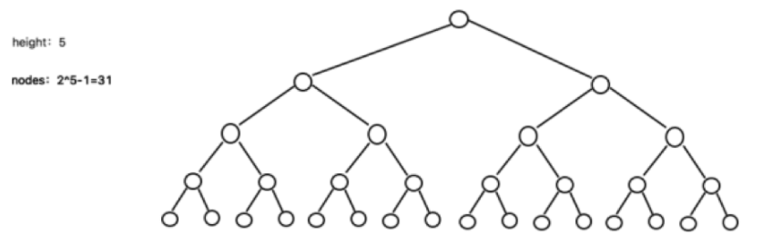
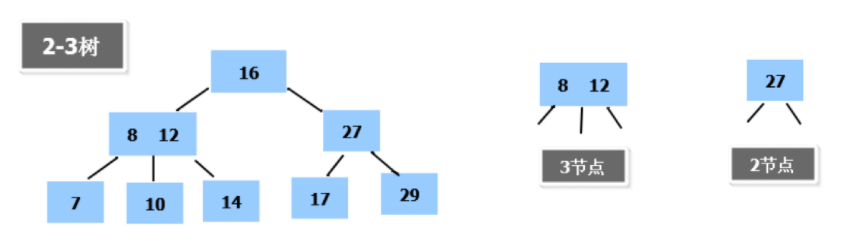
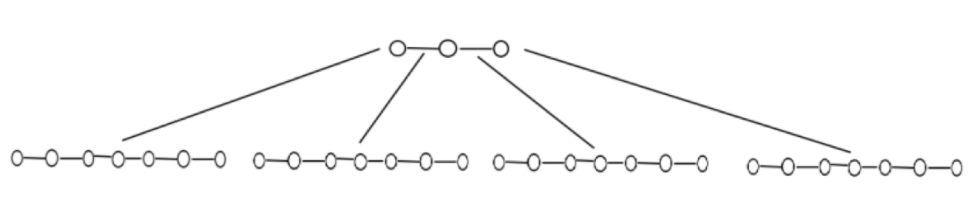

# 多路查找树

## 引入

二叉树的操作效率较高，但是也存在问题, 请看下面的二叉树：



二叉树需要加载到内存的，如果二叉树的节点少，没有什么问题，但是如果二叉树的节点很多(比如1亿)， 就存在如下问题:

- 问题1：在构建二叉树时，需要多次进行i/o操作(海量数据存在数据库或文件中)，节点海量，构建二叉树时，速度有影响
- 问题2：节点海量，也会造成二叉树的高度很大，会降低操作速度

## 二叉树与B树

### 多叉树

在二叉树中，每个节点有数据项，最多有两个子节点。如果允许每个节点可以有更多的数据项和更多的子节点，就是**多叉树**（multiway tree）。
后面我们讲解的**2-3树**，**2-3-4树**就是多叉树，多叉树通过重新组织节点，减少树的高度，能对二叉树进行优化。
举例说明(下面2-3树就是一颗多叉树)



### B树的基本介绍

B树通过重新组织节点，降低树的高度，并且减少i/o读写次数来提升效率。



​	如图B树通过重新组织节点， 降低了树的高度。
​	文件系统及数据库系统的设计者利用了磁盘预读原理，将一个节点的大小设为等于一个页(页得大小通常为4k)，这样每个节点只需要一次I/O就可以完全载入。
​	将树的度M设置为1024，在600亿个元素中最多只需要4次I/O操作就可以读取到想要的元素, B树(B+)广泛应用于文件存储系统以及数据库系统中。

### 2-3树基本介绍

2-3树是最简单的B树结构, 具有如下特点:

- 2-3树的所有叶子节点都在同一层.(只要是B树都满足这个条件)
- 有两个子节点的节点叫二节点，二节点要么没有子节点，要么有两个子节点.
- 有三个子节点的节点叫三节点，三节点要么没有子节点，要么有三个子节点.
- 2-3树是由二节点和三节点构成的树。

应用案例：

```java
package com.stanlong;

/**
 * 2-3树应用案例
 * 将数列{16, 24, 12, 32, 14, 26, 34, 10, 8, 28, 38, 20} 构建成2-3树，并保证数据插入的大小顺序
 * 
 */
public class DataStructure {

    public static void main(String[] args) throws Exception {
    }
}

```


