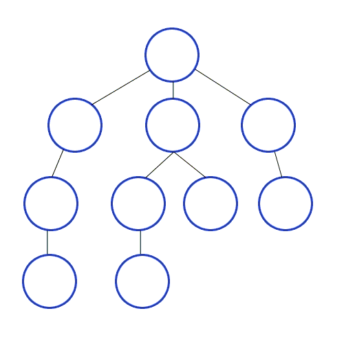

# 深度优先遍历

英文缩写为DFS即Depth First Search.其过程简要来说是对每一个可能的分支路径深入到不能再深入为止，而且每个节点只能访问一次。

> 图的深度优先搜索(Depth First Search)

- 深度优先遍历，从初始访问结点出发，初始访问结点可能有多个邻接结点，深度优先遍历的策略就是首先访问第一个邻接结点，然后再以这个被访问的邻接结点作为初始结点，访问它的第一个邻接结点， 可以这样理解：**每次都在访问完当前结点后首先访问当前结点的第一个邻接结点**
- 我们可以看到，这样的访问策略是优先往纵向挖掘深入，而不是对一个结点的所有邻接结点进行横向访问
- 深度优先搜索是一个递归的过程

> 深度优先遍历算法步骤

1. 访问初始结点v，并标记结点v为已访问
2. 查找结点v的第一个邻接结点w
3. 若w存在，则继续执行4，如果w不存在，则回到第1步，将从v的下一个结点继续
4. 若w未被访问，对w进行深度优先遍历递归（即把w当做另一个v，然后进行步骤123）
5. 查找结点v的w邻接结点的下一个邻接结点，转到步骤3

**DFS解决的是连通性的问题**。即给定两个点，一个是起始点，一个是终点，判断是不是有一条路径能从起点连接到终点。起点和终点，也可以指的是某种起始状态和最终的状态。问题的要求并不在乎路径是长还是短，只在乎有还是没有。




```java
package com.stanlong;

import java.util.ArrayList;
import java.util.Arrays;

/**
 * 图的快速入门
 * 这是一个不带权的无向图， 邻接矩阵延左上右下对称
 * 思路分析
 * 1. 使用 ArrayList 存储图的顶点
 * 2. 使用二维数组保存矩阵
 *
 */
public class DataStructure {

    public static void main(String[] args) throws Exception {
        Graph graph = new Graph(5);
        String[] vertexes = {"A","B","C","D","E"};

        // 添加节点
        for (String vertex : vertexes){
            graph.insertVertex(vertex);
        }

        // 添加边
        // A-B A-C B-C B-D B-E
        graph.insertEdges(0, 1,1);
        graph.insertEdges(0, 2,1);
        graph.insertEdges(1, 2,1);
        graph.insertEdges(1, 3,1);
        graph.insertEdges(1, 4,1);

        // 遍历
        graph.showGraph();

        // 深度遍历
        System.out.println("----深度优先----");
        graph.dfs();


    }
}

class Graph{
    private ArrayList<String> vertexList; // 存储定点
    private int[][] edges;  // 存储图对应的邻接矩阵的边
    private int numOfEdges; // 边的数目
    private boolean[] isVisited;  // 记录被访问过的节点

    // 构造器初始化
    public Graph(int n){
        edges = new int[n][n];
        vertexList = new ArrayList<String>(n);
        numOfEdges = 0;
        isVisited = new boolean[n];
    }

    // 插入顶点
    public void insertVertex(String vertex){
        vertexList.add(vertex);
    }

    /**
     * 插入边
     * @param v1 边的一个节点对应的下标
     * @param v2 边的另一个节点对应的下标
     * @param weight 权重。 1 表示有连接， 0 表示无连接
     */
    public void insertEdges(int v1, int v2, int weight){
        edges[v1][v2] = weight;
        edges[v2][v1] = weight;
        numOfEdges++;
    }

    // 返回节点的个数
    public int getVertex(){
        return vertexList.size();
    }

    // 返回边的数目
    public int getNumOfEdges(){
        return numOfEdges;
    }

    // 返回节点对应的数据
    public String getValueByIndex(int i){
        return vertexList.get(i);
    }

    // 返回V1和V2的权值
    public int getWeight(int v1, int v2){
        return edges[v1][v2];
    }

    // 返回图对应的矩阵
    public void showGraph(){
        for(int[] link : edges){
            System.out.println(Arrays.toString(link));
        }
    }

    /**
     * 获取 index 邻接节点的下标
     * @param index index节点的下标
     * @return index 邻接节点的下标
     */
    public int getFirstNeighbour(int index){
        for(int j =0; j<vertexList.size(); j++){
            if(edges[index][j]>0){
                return j;
            }
        }
        return -1;
    }

    /**
     * 根据前一个邻接节点的下标获取下一个邻接节点
     * @param v1 前一个邻接节点的下标
     * @param v2 前一个邻接节点的下标
     * @return 下一个邻接节点的下标
     */
    public int getNextNeighbour(int v1, int v2){
        for(int j = v2 + 1; j<vertexList.size(); j++){
            if(edges[v1][j] > 0){
                return j;
            }
        }
        return -1;
    }

    /**
     * 深度遍历
     * @param isVisited
     * @param i
     */
    public void dfs(boolean[] isVisited, int i){
        // 访问节点
        System.out.print(getValueByIndex(i) + "->");
        // 节点标记为已访问
        isVisited[i] = true;
        // 查找i节点的第一个邻接节点w
        int w = getFirstNeighbour(i);
        while (w != -1){
            if(!isVisited[w]){
                dfs(isVisited, w);
            }
            // 如果 w 已经被访问过， 就需要查找邻接节点的下一个节点
            w = getNextNeighbour(i, w);
        }
    }

    // 重载
    public void dfs(){
        // 遍历所有的节点进行dfs
        for(int i=0; i<getNumOfEdges(); i++){
            if(!isVisited[i]){
                dfs(isVisited, i);
            }
        }
    }
}
```

学习

```java
import lombok.AllArgsConstructor;
import lombok.Data;
import lombok.NoArgsConstructor;

import java.util.*;

/**
 * Depth-First Search(DFS)
 * <p>
 * 从根节点出发，沿着左子树方向进行纵向遍历，直到找到叶子节点为止。然后回溯到前一个节点，进行右子树节点的遍历，直到遍历完所有可达节点为止。
 * <p>
 * 数据结构：栈
 * 父节点入栈，父节点出栈，先右子节点入栈，后左子节点入栈。递归遍历全部节点即可
 *
 * @author lry
 */
public class DepthFirstSearch {

    /**
     * 树节点
     *
     * @param <V>
     */
    @Data
    @NoArgsConstructor
    @AllArgsConstructor
    public static class TreeNode<V> {
        private V value;
        private List<TreeNode<V>> childList;

        /**
         * 二叉树节点支持如下
         * @return
         */
        public TreeNode<V> getLeft() {
            if (childList == null || childList.isEmpty()) {
                return null;
            }
            return childList.get(0);
        }

        public TreeNode<V> getRight() {
            if (childList == null || childList.isEmpty()) {
                return null;
            }
            return childList.get(1);
        }
    }

    /**
     * 模型：
     * .......A
     * ...../   \
     * ....B     C
     * .../ \   /  \
     * ..D   E F    G
     * ./ \        /  \
     * H  I       J    K
     */
    public static void main(String[] args) {
        TreeNode<String> treeNodeA = new TreeNode<>("A", new ArrayList<>());
        TreeNode<String> treeNodeB = new TreeNode<>("B", new ArrayList<>());
        TreeNode<String> treeNodeC = new TreeNode<>("C", new ArrayList<>());
        TreeNode<String> treeNodeD = new TreeNode<>("D", new ArrayList<>());
        TreeNode<String> treeNodeE = new TreeNode<>("E", new ArrayList<>());
        TreeNode<String> treeNodeF = new TreeNode<>("F", new ArrayList<>());
        TreeNode<String> treeNodeG = new TreeNode<>("G", new ArrayList<>());
        TreeNode<String> treeNodeH = new TreeNode<>("H", new ArrayList<>());
        TreeNode<String> treeNodeI = new TreeNode<>("I", new ArrayList<>());
        TreeNode<String> treeNodeJ = new TreeNode<>("J", new ArrayList<>());
        TreeNode<String> treeNodeK = new TreeNode<>("K", new ArrayList<>());
        // A->B,C
        treeNodeA.getChildList().add(treeNodeB);
        treeNodeA.getChildList().add(treeNodeC);
        // B->D,E
        treeNodeB.getChildList().add(treeNodeD);
        treeNodeB.getChildList().add(treeNodeE);
        // C->F,G
        treeNodeC.getChildList().add(treeNodeF);
        treeNodeC.getChildList().add(treeNodeG);
        // D->H,I
        treeNodeD.getChildList().add(treeNodeH);
        treeNodeD.getChildList().add(treeNodeI);
        // G->J,K
        treeNodeG.getChildList().add(treeNodeJ);
        treeNodeG.getChildList().add(treeNodeK);

        System.out.println("非递归方式");
        dfsNotRecursive(treeNodeA);
        System.out.println();
        System.out.println("前续遍历");
        dfsPreOrderTraversal(treeNodeA, 0);
        System.out.println();
        System.out.println("后续遍历");
        dfsPostOrderTraversal(treeNodeA, 0);
        System.out.println();
        System.out.println("中续遍历");
        dfsInOrderTraversal(treeNodeA, 0);
    }

    /**
     * 非递归方式
     *
     * @param tree
     * @param <V>
     */
    public static <V> void dfsNotRecursive(TreeNode<V> tree) {
        if (tree != null) {
            // 次数之所以用 Map 只是为了保存节点的深度，如果没有这个需求可以改为 Stack<TreeNode<V>>
            Stack<Map<TreeNode<V>, Integer>> stack = new Stack<>();
            Map<TreeNode<V>, Integer> root = new HashMap<>();
            root.put(tree, 0);
            stack.push(root);

            while (!stack.isEmpty()) {
                Map<TreeNode<V>, Integer> item = stack.pop();
                TreeNode<V> node = item.keySet().iterator().next();
                int depth = item.get(node);

                // 打印节点值以及深度
                System.out.print("-->[" + node.getValue().toString() + "," + depth + "]");

                if (node.getChildList() != null && !node.getChildList().isEmpty()) {
                    for (TreeNode<V> treeNode : node.getChildList()) {
                        Map<TreeNode<V>, Integer> map = new HashMap<>();
                        map.put(treeNode, depth + 1);
                        stack.push(map);
                    }
                }
            }
        }
    }

    /**
     * 递归前序遍历方式
     * <p>
     * 前序遍历(Pre-Order Traversal) ：指先访问根，然后访问子树的遍历方式，二叉树则为：根->左->右
     *
     * @param tree
     * @param depth
     * @param <V>
     */
    public static <V> void dfsPreOrderTraversal(TreeNode<V> tree, int depth) {
        if (tree != null) {
            // 打印节点值以及深度
            System.out.print("-->[" + tree.getValue().toString() + "," + depth + "]");

            if (tree.getChildList() != null && !tree.getChildList().isEmpty()) {
                for (TreeNode<V> item : tree.getChildList()) {
                    dfsPreOrderTraversal(item, depth + 1);
                }
            }
        }
    }

    /**
     * 递归后序遍历方式
     * <p>
     * 后序遍历(Post-Order Traversal)：指先访问子树，然后访问根的遍历方式，二叉树则为：左->右->根
     *
     * @param tree
     * @param depth
     * @param <V>
     */
    public static <V> void dfsPostOrderTraversal(TreeNode<V> tree, int depth) {
        if (tree != null) {
            if (tree.getChildList() != null && !tree.getChildList().isEmpty()) {
                for (TreeNode<V> item : tree.getChildList()) {
                    dfsPostOrderTraversal(item, depth + 1);
                }
            }

            // 打印节点值以及深度
            System.out.print("-->[" + tree.getValue().toString() + "," + depth + "]");
        }
    }

    /**
     * 递归中序遍历方式
     * <p>
     * 中序遍历(In-Order Traversal)：指先访问左（右）子树，然后访问根，最后访问右（左）子树的遍历方式，二叉树则为：左->根->右
     *
     * @param tree
     * @param depth
     * @param <V>
     */
    public static <V> void dfsInOrderTraversal(TreeNode<V> tree, int depth) {
        if (tree.getLeft() != null) {
            dfsInOrderTraversal(tree.getLeft(), depth + 1);
        }

        // 打印节点值以及深度
        System.out.print("-->[" + tree.getValue().toString() + "," + depth + "]");

        if (tree.getRight() != null) {
            dfsInOrderTraversal(tree.getRight(), depth + 1);
        }
    }
}
```

