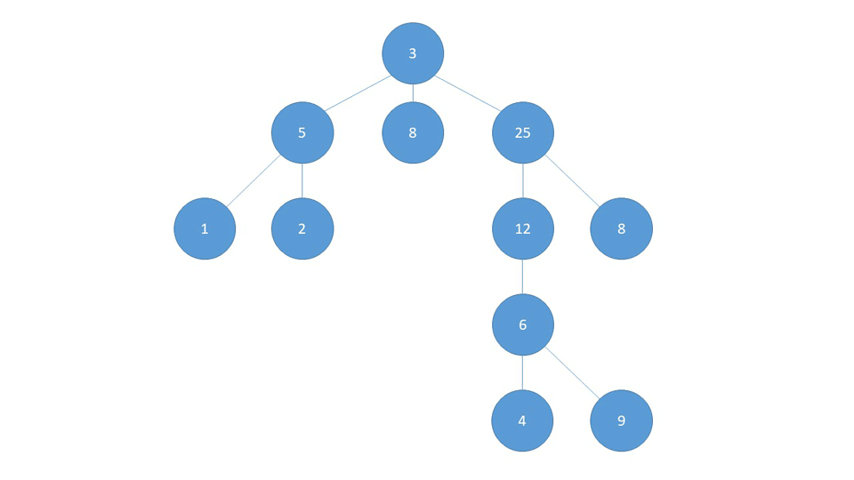

# 广度遍历

> 图的广度优先搜索(Broad First Search)

类似于一个分层搜索的过程，广度优先遍历需要使用一个队列以保持访问过的结点的顺序，以便按这个顺序来访问这些结点的邻接结点

> 广度优先遍历算法步骤

1. 访问初始结点v并标记结点v为已访问
2. 结点v入队列
3. 当队列非空时，继续执行，否则算法结束
4. 出队列，取得队头结点u
5. 查找结点u的第一个邻接结点w
6. 若结点u的邻接结点w不存在，则转到步骤3；否则循环执行以下三个步骤：
   1. 若结点w尚未被访问，则访问结点w并标记为已访问
   2. 结点w入队列
   3. 查找结点u的继w邻接结点后的下一个邻接结点w，转到步骤6

**BFS一般用来解决最短路径的问题**。和深度优先搜索不同，广度优先的搜索是从起始点出发，一层一层地进行，每层当中的点距离起始点的步数都是相同的，当找到了目的地之后就可以立即结束。广度优先的搜索可以同时从起始点和终点开始进行，称之为双端 BFS。这种算法往往可以大大地提高搜索的效率。



```java
package com.stanlong;

import java.util.ArrayList;
import java.util.Arrays;
import java.util.LinkedList;

/**
 * 广度优先遍历
 * 按文档中的动图生成图
 */
public class DataStructure {

    public static void main(String[] args) throws Exception {
        Graph graph = new Graph(11);
        String[] vertexes = {"3","5","8","25","1","2","12","8","6","4", "9"};

        // 添加节点
        for (String vertex : vertexes){
            graph.insertVertex(vertex);
        }

        // 按照文档中的图添加边
        graph.insertEdges(0, 1,1);
        graph.insertEdges(0, 2,1);
        graph.insertEdges(0, 3,1);
        graph.insertEdges(1, 4,1);
        graph.insertEdges(1, 5,1);
        graph.insertEdges(3, 6,1);
        graph.insertEdges(3, 7,1);
        graph.insertEdges(6, 8,1);
        graph.insertEdges(8, 9,1);
        graph.insertEdges(8, 10,1);

        // 遍历
        graph.showGraph();

        // 广度优先
        System.out.println("----广度优先----");
        graph.bfs();
    }
}

class Graph{
    private ArrayList<String> vertexList; // 存储定点
    private int[][] edges;  // 存储图对应的邻接矩阵的边
    private int numOfEdges; // 边的数目
    private boolean[] isVisited;  // 记录被访问过的节点

    // 构造器初始化
    public Graph(int n){
        edges = new int[n][n];
        vertexList = new ArrayList<String>(n);
        numOfEdges = 0;
        isVisited = new boolean[n];
    }

    // 插入顶点
    public void insertVertex(String vertex){
        vertexList.add(vertex);
    }

    /**
     * 插入边
     * @param v1 边的一个节点对应的下标
     * @param v2 边的另一个节点对应的下标
     * @param weight 权重。 1 表示有连接， 0 表示无连接
     */
    public void insertEdges(int v1, int v2, int weight){
        edges[v1][v2] = weight;
        edges[v2][v1] = weight;
        numOfEdges++;
    }


    // 返回边的数目
    public int getNumOfEdges(){
        return numOfEdges;
    }

    // 返回节点对应的数据
    public String getValueByIndex(int i){
        return vertexList.get(i);
    }

    // 返回节点的个数
    public int getNumOfVertex(){
        return vertexList.size();
    }

    // 返回图对应的矩阵
    public void showGraph(){
        for(int[] link : edges){
            System.out.println(Arrays.toString(link));
        }
    }

    /**
     * 获取 index 邻接节点的下标
     * @param index index节点的下标
     * @return index 邻接节点的下标
     */
    public int getFirstNeighbour(int index){
        for(int j =0; j<vertexList.size(); j++){
            if(edges[index][j]>0){
                return j;
            }
        }
        return -1;
    }

    /**
     * 根据前一个邻接节点的下标获取下一个邻接节点
     * @param v1 前一个邻接节点的下标
     * @param v2 前一个邻接节点的下标
     * @return 下一个邻接节点的下标
     */
    public int getNextNeighbour(int v1, int v2){
        for(int j = v2 + 1; j<vertexList.size(); j++){
            if(edges[v1][j] > 0){
                return j;
            }
        }
        return -1;
    }

    // 广度优先遍历
    private void bfs(boolean[] isVisited, int i){
        int u; // 队列头节点对应的下标
        int w; // 邻接节点的下标
        LinkedList queue = new LinkedList(); // 队列，记录节点的访问顺序
        // 访问节点
        System.out.print(getValueByIndex(i) + "=>");
        isVisited[i] = true; // 标记节点以访问
        queue.addLast(i); // 将访问过的节点加入队列尾部
        while (!queue.isEmpty()){
            u = (Integer)queue.removeFirst();// 取出队列的头节点下标
            w = getFirstNeighbour(u);
            while (w != -1){
                if(!isVisited[w]){
                    System.out.print(getValueByIndex(w) + "=>");
                    // 标记已经访问
                    isVisited[w] = true;
                    // 入队
                    queue.addLast(w);
                }
                // 以u为前驱点，找w后面的下一个邻接节点
                w = getNextNeighbour(u, w);
            }
        }
    }

    // 广度优先遍历
    public void bfs(){
        for(int i=0; i<getNumOfEdges(); i++){
            if(!isVisited[i]){
                bfs(isVisited, i);
            }
        }
    }
}
```

