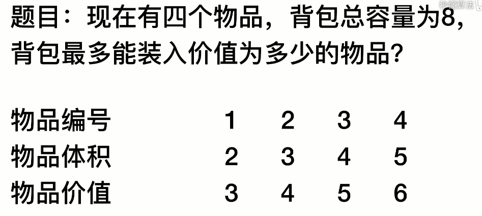
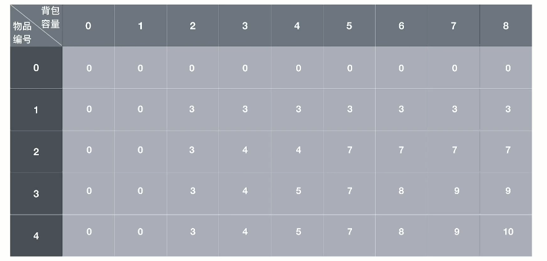

# 动态规划算法

**算法介绍**

动态规划(Dynamic Programming)算法的核心思想是：将大问题划分为小问题进行解决，从而一步步获取最优解的处理算法。动态规划算法与分治算法类似，其基本思想也是将待求解问题分解成若干个子问题，先求解子问题，然后从这些子问题的解得到原问题的解。与分治法不同的是，适合于用动态规划求解的问题，经分解得到子问题往往不是互相独立的。 ( 即下一个子阶段的求解是建立在上一个子阶段的解的基础上，进行进一步的求解 )。动态规划可以通过填表的方式来逐步推进，得到最优解.

**应用场景：背包问题**



1. 要求装入背包的总价值最大，并且体积不超出
2. 要求装入的物品不能重复

**表格演示**

横表示背包容量，纵表示物品编号，每个格子表示物品价值的最佳组合




**思路分析和图解**

- 背包问题主要是指一个给定容量的背包、和若干具有一定价值和体积的物品。如何选择物品放入背包使物品的价值最大。其中又分01背包和完全背包(完全背包指的是：每种物品都有无限件可用)
- 这里的问题属于01背包，即每个物品最多放一个。而无限背包可以转化为01背包。

**算法的主要思想**

利用动态规划来解决。每次遍历到的第`i`个物品，根据`w[i]`和`v[i]`来确定是否需要将该物品放入背包中。即对于给定的n个物品，设`v[i]`、`w[i]`分别为第`i`个物品的价值和重量，C为背包的容量。再令`v[i][j]`表示在前`i`个物品中能够装入容量为`j`的背包中的最大价值

```java
package com.stanlong;

/**
 * 动态规划算法
 * 背包问题
 */
public class DataStructure {

    public static void main(String[] args) throws Exception {
        // 准备工作，声明变量
        int[] volume = {2, 3, 4, 5}; // 物品的体积
        int[] price = {3, 4, 5, 6}; // 物品的价值
        int capacity = 8; // 背包的容量
        int n = price.length; // 物品的个数

        // 创建一个二维数组
        // v[i][j] 表示在容量 i 的背包中能装入物品 j 的最大价值
        int[][] v = new int[capacity+1][n+1];

        // 初始化二维数组第一行和第一列
        for(int i=0; i<capacity; i++){
            v[0][capacity] = 0;
        }
        for(int i=0; i<n; i++){
            v[i][0] = 0;
        }

        // 

    }
}
```


