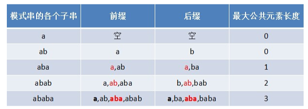

# KMP算法

## KMP算法介绍

- KMP是一个解决模式串在文本串是否出现过，如果出现过，最早出现的位置的经典算法
- Knuth-Morris-Pratt  字符串查找算法，简称为 “KMP算法”，常用于在一个文本串S内查找一个模式串P 的出现位置，这个算法由Donald Knuth、Vaughan Pratt、James H. Morris三人于1977年联合发表，故取这3人的姓氏命名此算法
- KMP方法算法就利用之前判断过信息，通过一个next数组，保存模式串中前后最长公共子序列的长度，每次回溯时，通过next数组找到，前面匹配过的位置，省去了大量的计算时间
- 参考资料：https://www.cnblogs.com/ZuoAndFutureGirl/p/9028287.html  https://www.cnblogs.com/SYCstudio/p/7194315.html

> 思路分析

前缀和后缀的概念

- 前缀：指的是字符串的子串中从原串最前面开始的子串，如abcdef的前缀有：a,ab,abc,abcd,abcde
- 后缀：指的是字符串的子串中在原串结尾处结尾的子串，如abcdef的后缀有：f,ef,def,cdef,bcdef

部分匹配值就是前缀和后缀的最长的共有元素的长度

所以KMP算法可以简单理解为：

- 先得到子串的部分匹配表
- 使用部分匹配表完成KMP匹配