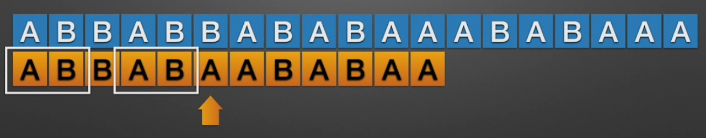
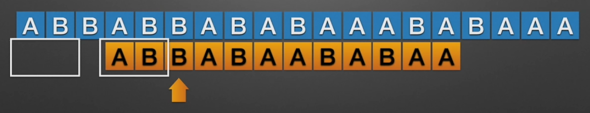

# KMP算法

## KMP算法介绍

- KMP是一个解决模式串在文本串是否出现过，如果出现过，最早出现的位置的经典算法
- Knuth-Morris-Pratt  字符串查找算法，简称为 “KMP算法”，常用于在一个文本串S内查找一个模式串P 的出现位置，这个算法由Donald Knuth、Vaughan Pratt、James H. Morris三人于1977年联合发表，故取这3人的姓氏命名此算法
- KMP方法算法就利用之前判断过信息，通过一个next数组，保存模式串中前后最长公共子序列的长度，每次回溯时，通过next数组找到，前面匹配过的位置，省去了大量的计算时间
- 参考资料：
  - https://www.cnblogs.com/ZuoAndFutureGirl/p/9028287.html  
  - https://www.cnblogs.com/SYCstudio/p/7194315.html
  - https://www.bilibili.com/video/BV1jb411V78H?spm_id_from=333.337.search-card.all.click

> 思路分析

前缀和后缀的概念

- 前缀：指的是字符串的子串中从原串最前面开始的子串，如abcdef的前缀有：a,ab,abc,abcd,abcde
- 后缀：指的是字符串的子串中在原串结尾处结尾的子串，如abcdef的后缀有：f,ef,def,cdef,bcdef

部分匹配值就是前缀和后缀的最长的共有元素的长度


所以KMP算法可以简单理解为：

- 先得到子串的部分匹配表

- 按照子串的最大公共元素长度移动前缀到后缀的位置上
  
  
  
  
  
  - 上面那段话优点抽象，看这个视频 https://www.bilibili.com/video/BV1jb411V78H?spm_id_from=333.337.search-card.all.click

```java
package com.stanlong;

/**
 * KMP算法
 */
public class DataStructure {

    public static void main(String[] args) throws Exception {
        String str1 = "abcdefghidjklkm";
        String str2 = "klk";

        // 模式串子串的部分匹配表
        int[] next = kmpNext(str2);

        // KMP 搜索
        int index = kmpSearch(str1, str2, next);

        // 返回模式串在主串中的位置
        System.out.println(index);

    }

    // KMP 搜索
    public static int kmpSearch(String str1, String str2, int[] next){
        for(int i=0, j=0;  i<str1.length(); i++){
            while (j > 0 && str1.charAt(i) != str2.charAt(j)){
                j = next[j-1];
            }
            if(str1.charAt(i) == str2.charAt(j)){
                j = j+1;
            }
            if(j == str2.length()){
                return  i-j+1; // 匹配到到的主串位置
            }
        }
        return -1;
    }

    // 获取到字符串字串的最大前后缀数组
    public static int[] kmpNext(String str){
        int[] next = new int[str.length()];
        next[0] = 0;
        for(int i=1, j=0; i<str.length(); i++){

            while (j>0 && str.charAt(i) != str.charAt(j)){
                j = next[j-1];
            }

            if(str.charAt(i) == str.charAt(j)){
                j = j+1;
            }
            next[i] = j;
        }
        return next;
    }
}
```

