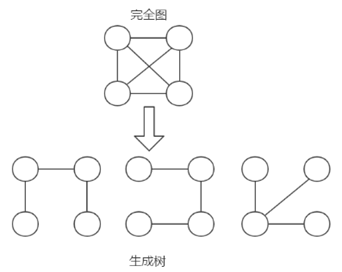
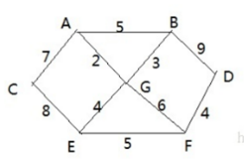

# 普里姆算法

## 介绍

普利姆(Prim)算法求最小生成树，也就是在包含n个顶点的连通图中，找出只有(n-1)条边包含所有n个顶点的连通子图，也就是所谓的极小连通子图

## 最小生成树

- 最小生成树(Minimum Cost Spanning Tree)，简称MST。
- 给定一个带权的无向连通图,如何选取一棵生成树,使树上所有边上权的总和为最小,这叫最小生成树
- N个顶点，一定有N-1条边
- 包含全部顶点
- N-1条边都在图中
- 求最小生成树的算法主要是普里姆算法和克鲁斯卡尔算法



## 修路问题



- 有胜利乡有7个村庄(A, B, C, D, E, F, G) ，现在需要修路把7个村庄连通
- 各个村庄的距离用边线表示(权) ，比如 A – B 距离 5公里
- 问：如何修路保证各个村庄都能连通，并且总的修建公路总里程最短?
- 思路: 将10条边，连接即可，但是总的里程数不是最小.
- 正确的思路，就是尽可能的选择少的路线，并且每条路线最小，保证总里程数最少.

1. 从顶点A开始处理：

   $$ A-C[7]、A-G[2]、A-B[5] $$

2. <A,G> 路线最短，将A、G 顶点和它们相邻的还没有访问的顶点进行处理：

   $$ A-C[7]、A-B[5]、G-B[3]、G-E[4]、G-F[6] $$

3. <A, G, B>路线最短，将A、G、B 顶点和它们相邻的还没有访问的顶点进行处理：

   $$ A-C[7]、G-E[4]、G-F[6]、B-D[9] $$

4. <A、G、B、E> 路线最短，将A、G、B、E顶点和它们相邻的还没有访问的顶点进行处理：

    $$ A-C[7]、E-C[8]、E-F[5]、G-F[6]、B-D[9] $$ 

5. <A、G、B、E、F>路线最短。将A、G、B、E、F顶点和它们相邻的还没有访问的顶点进行处理：

   $$ A-C[7]、E-C[8]、B-D[9]、F-D[4] $$

6. <A、G、B、E、F、D> 线路最短，将A、G、B、E、F、D顶点和它们相邻的还没有访问的顶点进行处理：

   $$ A-C[7]、E-C[8] $$

7. 最后得出最短路径 <A、G、B、E、F、D、C>

## 思路

- 设G=(V,E)是连通网，T=(U,D)是最小生成树，V,U是顶点集合，E,D是边的集合
- 若从顶点u开始构造最小生成树，则从集合V中取出顶点u放入集合U中，标记顶点v的visited[u]=1
- 若集合U中顶点ui与集合V-U中的顶点vj之间存在边，则寻找这些边中权值最小的边，但不能构成回路，将顶点vj加入集合U中，将边（ui,vj）加入集合D中，标记visited[vj]=1
- 重复步骤②，直到U与V相等，即所有顶点都被标记为访问过，此时D中有n-1条边

学习

```java
package com.stanlong;

import java.util.HashSet;
import java.util.Set;

/**
 * 普里姆算法
 */
public class DataStructure {

    public final static int MAX = 10000;

    public static void main(String[] args) throws Exception {
        // 图的顶点
        char[] chars = {'A', 'B', 'C', 'D', 'E', 'F', 'G'};

        //邻接矩阵的关系使用二维数组表示,10000这个大数，表示两个点不联通
        int[][] weight = {
                {10000, 5, 7, 10000, 10000, 10000, 2},
                {5, 10000, 10000, 9, 10000, 10000, 3},
                {7, 10000, 10000, 10000, 8, 10000, 10000},
                {10000, 9, 10000, 10000, 10000, 4, 10000},
                {10000, 10000, 8, 10000, 10000, 5, 4},
                {10000, 10000, 10000, 4, 5, 10000, 6},
                {2, 3, 10000, 10000, 4, 6, 10000}
        };
        MGraph mGraph = new MGraph(chars.length, chars, weight);
        showGraph(mGraph);
        prim(mGraph, 0);


    }

    /**
     * prim算法得到最小生成树
     * @param mGraph 图
     * @param v 表示从第一个顶点开始
     */
    public static void prim(MGraph mGraph, int v) {
        // 元素的个数
        int size = mGraph.vertx;
        // 标记节点是否访问过
        boolean[] visited = new boolean[size];
        // 把当前节点标记为已经访问
        visited[v] = true;
        // 标记访问了几个节点
        int count = 1;
        // 存储访问了的节点
        Set<Integer> set = new HashSet<Integer>();
        set.add(v);
        while (count < size) {
            // 将minWeight初始化成一个大数，后面在遍历过程中，会被替换
            int minWeight = MAX;
            int minRow = -1;
            int minCol = -1;
            for (Integer next : set) {
                for (int i = 0; i < size; i++) {
                    if (!visited[i]) {
                        if (mGraph.weight[next][i] < minWeight) {
                            minWeight = mGraph.weight[next][i];
                            minRow = next;
                            minCol = i;
                        }
                    }
                }
            }
            if (minRow == -1 || minCol == -1) {
                System.err.println(" => 无法连通！！！");
                return;
            }
            System.out.println("<" + mGraph.data[minRow] + "," + mGraph.data[minCol] + ">, 权值：" + minWeight);
            count++;
            visited[minCol] = true;
            set.add(minCol);
        }
    }

    /**
     * 打印图
     * @param mGraph 图
     */
    public static void showGraph(MGraph mGraph) {
        for (int[] link : mGraph.weight) {
            for (int x : link) {
                System.out.printf("%5s\t", x);
            }
            System.out.println();
        }
    }
}

class MGraph {

    // 节点个数
    int vertx;

    // 存放节点数据
    char[] data;

    // 存放边的权值
    int[][] weight;

    private MGraph(int vertx) {
        this.vertx = vertx;
        data = new char[vertx];
        weight = new int[vertx][vertx];
    }

    /**
     * 创建图
     * @param vertx 图对应的顶点个数
     * @param data 图的各个顶点的值
     * @param weight 两个顶点之间的权重
     */
    public MGraph(int vertx, char[] data, int[][] weight) {
        this(vertx);
        int i, j;
        for (i = 0; i < vertx; i++) {
            this.data[i] = data[i];
            for (j = 0; j < vertx; j++) {
                this.weight[i][j] = weight[i][j];
            }
        }
    }
}
```

