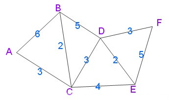

# 迪杰斯特拉算法

迪杰斯特拉(Dijkstra)算法是典型最短路径算法，用于计算一个节点到其他节点的最短路径。 它的主要特点是以起始点为中心向外层层扩展(广度优先搜索思想)，直到扩展到终点为止。

**基本思想**

   通过Dijkstra计算图G中的最短路径时，需要指定起点s(即从顶点s开始计算)。

   此外，引进两个集合S和U。S的作用是记录已求出最短路径的顶点(以及相应的最短路径长度)，而U则是记录还未求出最短路径的顶点(以及该顶点到起点s的距离)。

   初始时，S中只有起点s；U中是除s之外的顶点，并且U中顶点的路径是"起点s到该顶点的路径"。然后，从U中找出路径最短的顶点，并将其加入到S中；接着，更新U中的顶点和顶点对应的路径。 然后，再从U中找出路径最短的顶点，并将其加入到S中；接着，更新U中的顶点和顶点对应的路径。 ... 重复该操作，直到遍历完所有顶点。

**操作步骤**

**(1)** 初始时，S只包含起点s；U包含除s外的其他顶点，且U中顶点的距离为"起点s到该顶点的距离"[例如，U中顶点v的距离为(s,v)的长度，然后s和v不相邻，则v的距离为∞]。

**(2)** 从U中选出"距离最短的顶点k"，并将顶点k加入到S中；同时，从U中移除顶点k。

**(3)** 更新U中各个顶点到起点s的距离。之所以更新U中顶点的距离，是由于上一步中确定了k是求出最短路径的顶点，从而可以利用k来更新其它顶点的距离；例如，(s,v)的距离可能大于(s,k)+(k,v)的距离。

**(4)** 重复步骤(2)和(3)，直到遍历完所有顶点。

单纯的看上面的理论可能比较难以理解，下面通过实例来对该算法进行说明。



以上图G4为例，来对迪杰斯特拉进行算法演示(以第4个顶点D为起点)：


学习

```java
/**
 * @author wuyou
 */
public class DijkstraAlgorithm {
    private final static int N = 10000;

    private static class Graph {
        /**
         * 顶点数组
         */
        char[] vertex;
        /**
         * 邻接矩阵
         */
        int[][] matrix;

        public Graph(char[] vertex, int[][] matrix) {
            this.vertex = vertex.clone();
            this.matrix = matrix.clone();
        }

    }

    public static void showGraph(Graph graph) {
        for (int[] link : graph.matrix) {
            for (int x : link) {
                System.out.printf("%5s\t", x);
            }
            System.out.println();
        }
    }

    /**
     * dij算法
     * @param graph
     * @param start
     * @return
     */
    public static int[] dij(Graph graph, int start) {
        // 权值数组
        int[][] weight = graph.matrix.clone();
        // 顶点数组
        char[] names = graph.vertex;
        // 顶点个数
        int n = names.length;
        // 标记当前顶点的最短路径是否已经求出，1表示已经求出
        int[] visited = new int[n];
        // 保存start到其他各点的最短路径
        int[] shortPath = new int[n];

        // 保存start到其他各点最短路径的字符串表示
        String[] path = new String[n];
        for (int i = 0; i < n; i++) {
            path[i] = names[start] + " => " + names[i];
        }

        // 初始化第一个顶点
        shortPath[start] = 0;
        visited[start] = 1;

        // 加入剩下的节点
        for (int count = 1; count < n; count++) {
            // 标记距离初始顶点start最近的未标记的节点
            int minIndex = -1;
            int minWeight = Integer.MAX_VALUE;
            for (int i = 0; i < n; i++) {
                if (visited[i] == 0 && weight[start][i] <= minWeight) {
                    minIndex = i;
                    minWeight = weight[start][i];
                }
            }

            // 将新选出的顶点标记为已求出最短路径，且到start 最短路径就是minWeight
            visited[minIndex] = 1;
            shortPath[minIndex] = minWeight;

            // 以k为中间点，修正从start到未访问各点的距离
            for (int i = 0; i < n; i++) {
                // 代码核心！！！
                // 如果'起始点到当前点距离' + '当前点到某点距离' < '起始点到某点距离', 则更新
                if (visited[i] ==0 && weight[start][minIndex] + weight[minIndex][i] < weight[start][i]) {
                    weight[start][i] = weight[start][minIndex] + weight[minIndex][i];
                    path[i] = path[minIndex] + " => " + names[i];
                }
            }
        }
        for (int i = 0; i < n; i++) {
            System.out.println("从" + names[start] + "出发到" + names[i] + "的最短路径为：" + path[i]);
        }
        return shortPath;
    }

    public static void main(String[] args) {
        char[] vertex = {'A', 'B', 'C', 'D', 'E', 'F', 'G'};
        int[][] weight = {
                     /*A*B*C*D*E*F*G*/
                /*A*/ {N,5,7,N,N,N,2},
                /*B*/ {5,N,N,9,N,N,3},
                /*C*/ {7,N,N,N,8,N,N},
                /*D*/ {N,9,N,N,N,4,N},
                /*E*/ {N,N,8,N,N,5,4},
                /*F*/ {N,N,N,4,5,N,6},
                /*G*/ {2,3,N,N,4,6,N}};
        Graph graph = new Graph(vertex, weight);
        showGraph(graph);
        int start = 0;
        int[] dij = dij(graph, 0);
        for (int i = 0; i < dij.length; i++) {
            System.out.println("从" + graph.vertex[start] + "出发到" + graph.vertex[i] + "的最短距离为：" + dij[i]);
        }
    }
}
```

