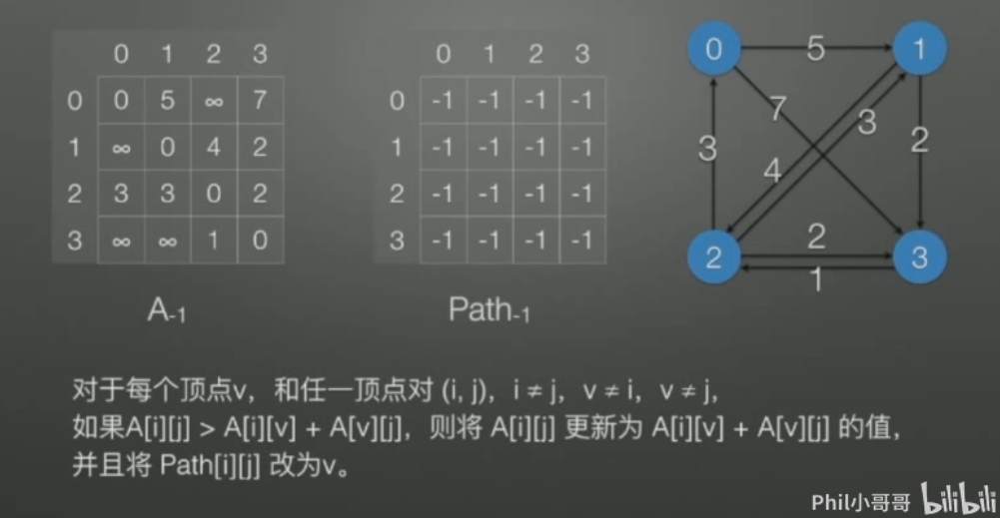
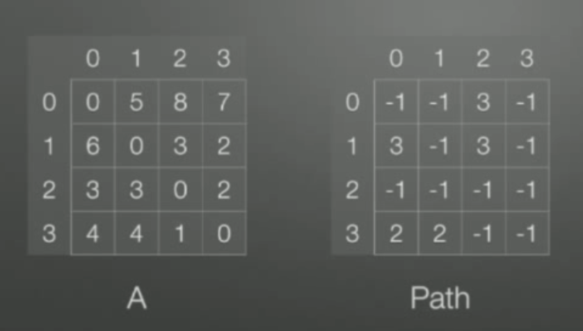

# 弗洛伊德算法

## 介绍

- 和Dijkstra算法一样，弗洛伊德(Floyd)算法也是一种用于寻找给定的加权图中顶点间最短路径的算法。该算法名称以创始人之一、1978年图灵奖获得者、斯坦福大学计算机科学系教授**罗伯特·弗洛伊德**命名
- 弗洛伊德算法(Floyd)计算图中各个顶点之间的最短路径
- 迪杰斯特拉算法用于计算图中某一个顶点到其他顶点的最短路径。
- 弗洛伊德算法 VS 迪杰斯特拉算法：迪杰斯特拉算法通过选定的被访问顶点，求出从出发访问顶点到其他顶点的最短路径；**弗洛伊德算法中每一个顶点都是出发访问点，所以需要将每一个顶点看做被访问顶点，求出从每一个顶点到其他顶点的最短路径**

## 图示

准备两个二维数组，A， Path。 A 存储了任意两个顶点间的长度。 Path 存储了任意两个顶点在最短路径上的中间点。中间点初始为-1。



算法执行结果



```java
package com.stanlong;

import java.util.Arrays;

/**
 * 弗洛伊德算法
 */
public class DataStructure {

    private final static int N = 65535;

    public static void main(String[] args) {
        char[] vertex = {'0', '1', '2', '3'};
        int[][] weight = {
                /*0*1*2*3*/
                /*0*/{0,5,N,7},
                /*1*/{N,0,4,2},
                /*2*/{3,3,0,2},
                /*3*/{N,N,1,0}};
        Graph graph = new Graph(vertex, weight);
        showGraph(graph);
        floyd(graph);
        System.out.println();
        showGraph(graph);
    }

    public static void showGraph(Graph graph) {
        for (int i = 0; i < graph.vertex.length; i++) {
            System.out.printf("%8s", graph.vertex[i] + "的前驱节点为：");
            for (int j = 0; j < graph.vertex.length; j++) {
                System.out.printf("%5s\t", graph.pre[i][j]);
            }
            System.out.println();
            System.out.printf("%8s", graph.vertex[i] + "的各点权值为：");
            for (int j = 0; j < graph.vertex.length; j++) {
                System.out.printf("%5s\t", graph.dis[i][j]);
            }
            System.out.println();
        }
    }

    /**
     * 弗洛伊德算法
     * @param graph
     */
    public static void floyd(Graph graph) {
        int length = graph.vertex.length;
        int[][] dis = graph.dis;
        int[][] pre = graph.pre;
        // 变量保存距离
        int len = 0;
        // 对中间顶点进行遍历，i就是中间顶点的下标
        for (int i = 0; i < length; i++) { // 中间顶点
            // 从j顶点出发
            for (int j = 0; j < length; j++) { // 起点
                for (int k = 0; k < length; k++) { // 终点
                    // 从j顶点出发，经过中间顶点i，到达k
                    len = dis[j][i] + dis[i][k];
                    if (len < dis[j][k]) {
                        // 更新距离
                        dis[j][k] = len;
                        // 更新前驱
                        pre[j][k] = pre[i][k];
                    }
                }
            }
        }
    }


}

class Graph {
    // 存放顶点的数组
    char[] vertex;

    // 保存从各个顶点出发到其他顶点的距离
    int[][] dis;

    // 保存到目标顶点的前驱节点
    int[][] pre;

    public Graph(char[] vertex, int[][] matrix) {
        this.vertex = vertex.clone();
        this.dis = matrix.clone();
        this.pre = new int[vertex.length][vertex.length];
        // 对pre数组初始化
        for (int i = 0; i < vertex.length; i++) {
            Arrays.fill(pre[i], i);
        }
    }
}
```

