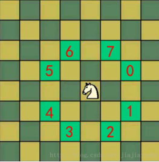

# 马踏棋盘算法

## 介绍

马踏棋盘算法也被称为骑士周游问题，将马随机放在国际象棋的8×8棋盘`Board[0～7][0～7]`的某个方格中，马按走棋规则(马走日字)进行移动。要求每个方格只进入一次，走遍棋盘上全部64个方格



用一个二维数组来存放棋盘，假设马儿的坐标为(x，y)，那么可供选择的下一个位置共有8种可能。我们所要做的，就是从0号位置开始，依次判断新的马儿位置是否可用，不可用的话（即马儿已经走过该位置），则遍历下一个可能的1号位置，直到7号位置停止，如果没有可用位置，则进行回溯，如果回溯到了起始位置，则表示此路不通，即无法从该位置开始遍历整个棋盘。如果在遍历0-7号位置的过程中，发现有可用位置，则将该位置坐标赋予(x，y)。之后，利用递归，再次寻找马儿的新的跳跃位置。直到马儿跳了64次时停止，此时，马儿就已经将整个棋盘走过了。

## 解决步骤和思路

1. 创建棋盘 `chessBoard` , 是一个二维数组
2. 将当前位置设置为已经访问，然后根据当前位置，计算马儿还能走哪些位置，并放入到一个集合中`（ArrayList）`，最多有8个位置， 每走一步，就使用step+1
3. 遍历`ArrayList`中存放的所有位置，看看哪个可以走通，如果走通，就继续；走不通，就**回溯**
4. 判断马儿是否完成了任务，使用 step 和应该走的步数比较 ， 如果没有达到数量，则表示没有完成任务，将整个棋盘置0

```java
package com.stanlong;

import java.awt.*;
import java.util.ArrayList;
import java.util.Comparator;
import java.util.List;

/**
 * 马踏棋盘算法
 */
public class DataStructure {

    public static void main(String[] args) {
        int x = 8;
        int y = 8;
        int row = 1;
        int col = 1;
        ChessBoard chessBoard = new ChessBoard(x, y);
        int[][] array = new int[x][y];
        long start = System.currentTimeMillis();
        travelChessBoard(chessBoard, array, row - 1, col - 1, 1);
        long end = System.currentTimeMillis();
        System.out.println("花费时间" + (end - start) + "毫秒");
        for (int[] rows : array) {
            for (int step : rows) {
                System.out.printf("%2s\t", step);
            }
            System.out.println();
        }
    }

    /**
     * 根据当前的位置，计算马儿还能走哪些位置，并放入到一个集合中（List），最多有8个位置
     * @param chessBoard
     * @param chessPoint
     * @return
     */
    public static List<Point> getAround(ChessBoard chessBoard, Point chessPoint) {
        int X = chessBoard.x;
        int Y = chessBoard.y;
        int left = chessPoint.x - 2;
        int right = chessPoint.x + 2;
        int top = chessPoint.y + 2;
        int bottom = chessPoint.y - 2;
        List<Point> result = new ArrayList<>();
        if (left > 0) {
            if (top - 1 <= X) {
                result.add(new Point(left, top - 1));
            }
            if (bottom + 1 > 0) {
                result.add(new Point(left, bottom + 1));
            }
        }
        if (left + 1 > 0) {
            if (top <= X) {
                result.add(new Point(left + 1, top));
            }
            if (bottom > 0) {
                result.add(new Point(left + 1, bottom));
            }
        }
        if (right - 1 <= Y) {
            if (top <= X) {
                result.add(new Point(right - 1, top));
            }
            if (bottom > 0) {
                result.add(new Point(right - 1, bottom));
            }
        }
        if (right <= Y) {
            if (top - 1 <= X) {
                result.add(new Point(right, top - 1));
            }
            if (bottom + 1 > 0) {
                result.add(new Point(right, bottom + 1));
            }
        }
        return result;
    }

    /**
     * 算法核心，不断回溯
     * 需要注意：Point和数组下标的关系是，比如8x8的棋盘，Point就是[1,8]，数组就是[0,7]
     * @param chessBoard 棋盘对象
     * @param array 棋盘数组
     * @param row 按照数组索引的行索引
     * @param col 按照数组索引的列索引
     * @param step 步数
     */
    public static void travelChessBoard(ChessBoard chessBoard, int[][] array, int row, int col, int step) {
        // 标记位置已经转换
        array[row][col] = step;
        chessBoard.visited[row][col] = true;
        List<Point> around = getAround(chessBoard, new Point(col + 1, row + 1));
        // 对around进行排序
        sort(chessBoard, around);
        while (!around.isEmpty()) {
            // 取出一个可以走的位置
            Point remove = around.remove(0);
            int tempCol = remove.x - 1;
            int tempRow = remove.y - 1;
            // 判断该点是否已经访问过
            if (!chessBoard.visited[tempRow][tempCol]) {
                // 说明没有访问过
                travelChessBoard(chessBoard, array, tempRow, tempCol, step + 1);
            }
        }

        if (step < chessBoard.x * chessBoard.y && !chessBoard.finish) {
            array[row][col] = 0;
            chessBoard.visited[row][col] = false;
        } else {
            chessBoard.finish = true;
        }
    }

    /**
     * 贪心的思想：根据当前这个所有的下一步选择位置，进行递减排序，减少回溯可能
     * @param chessBoard
     * @param pointList
     */
    public static void sort(ChessBoard chessBoard, List<Point> pointList) {
        pointList.sort(new Comparator<Point>() {
            @Override
            public int compare(Point o1, Point o2) {
                // 获取到o1的下一步的所有位置个数
                int count1 = getAround(chessBoard, o1).size();
                // 获取到o2的下一步的所有位置个数
                int count2 = getAround(chessBoard, o2).size();
                return count1 - count2;
            }
        });
    }


}

class ChessBoard {

    // 棋盘的行数
    int y;

    // 棋盘的列数
    int x;

    // 标记每个数组是否被访问过
    boolean[][] visited;

    // 标记是否所有点都被访问过了
    boolean finish;

    public ChessBoard(int x, int y) {
        this.x = x;
        this.y = y;
        this.visited = new boolean[x][y];
        this.finish = false;
    }
}
```


