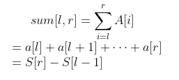

# 前缀和

https://blog.csdn.net/weixin_44052055/article/details/123353396?spm=1001.2014.3001.5502

一个非递减有序整数数组` A[L, R]`，其某个下标区间 [l, r] 内的数的和定义为

公式推导

因为：

$S[l-1]=a[1] + a[2] + a[3] +... + a[l-1]$

$S[r]=a[1]+a[2]+a[3]+...+a[l-1] + a[l]+ ...+a[r]$

所以：

$S[r]-S[l-1] = a[l] + ... + a[r] =sum[l, r]$

