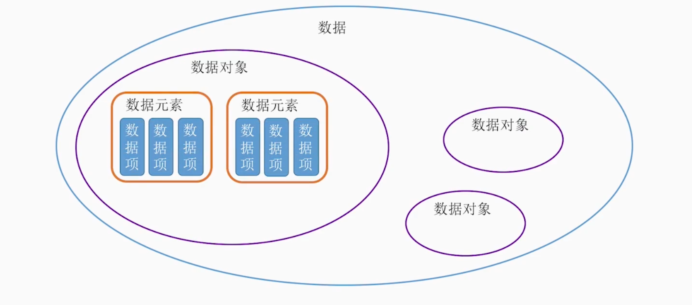

# 绪论

## 数据结构的研究内容

将具体问题的抽象成数学模型

- 分析问题
- 提取操作对象
- 找出操作对象之间的关系
- 用数学语言描述 => 数据结构

## 基本概念

- **数据**

  能够输入计算机且能被计算机处理的各种符号的集合

- **数据元素**

  数据的基本单位，在计算机程序中通常作为一个整体进行考虑和处理

- **数据项**

  构成数据元素的不可分割的最小单位

- **数据对象**

  相同性质的数据元素的集合，是数据的一个子集

> 数据、数据元素、数据项三者之间的关系：

数据 > 数据元素 > 数据项

例如: 学生表 > 个人记录 >  学号、姓名...

