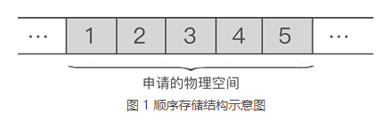
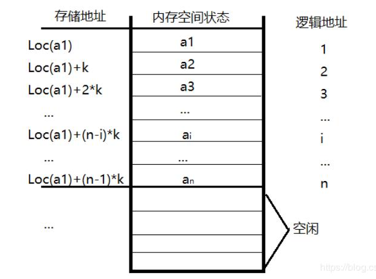

# 线性表

## 线性表的定义和特点

线性表是具有相同特性的n(n>=0)个数据元素组成的一个有限队列。如 $(a_1, a_2, a_3, ... a_n)$  数据元素的个数0定义为表的长度， 当n=0时称为空表。

非空线性表的逻辑特征：

- 有且只有一个开始节点 $a_1$ , 没有直接前驱， 而仅有一个直接后继 $a_2$
- 有且只有一个终端节点 $a_n$ , 没有直接后继， 而仅有一个直接前驱 $ a_{n-1}$
- 其余的内部节点 $a_i$ (2<=` i` <=n-1) 都有且只有一个直接前驱  $a_{i-1}$  和一个直接后继  $a_{i+1}$

## 线性的类型定义

抽象数据类型线性表的定义如下

```c
ADT List {
    数据对象: D={a|a是集合Element里的一个元素}
    数据关系: R={<m, n>|m,n属于D}
    基本操作：
        InitList(&L);
        DestoryList(&L);
        ListInsert(&L,i,e);
        ListDelete(&L,i&e);
    ... 等等
} ADT List
```

## 线性表的表示和实现

在计算机内，线性表有两种基本的存储结构：顺序存储结构和链式存储结构

### 线性表的顺序表示和实现

顺序存储：把逻辑上相邻的数据元素存储在物理上相邻的存储单元中

例如，使用顺序表存储集合 `{1,2,3,4,5}`，数据最终的存储状态如图 1 所示



线性表顺序存储结构示意图



特点：以物理位置相邻表示逻辑关系，任一元素都可以随机存取

### 线性表的链式表示和实现

