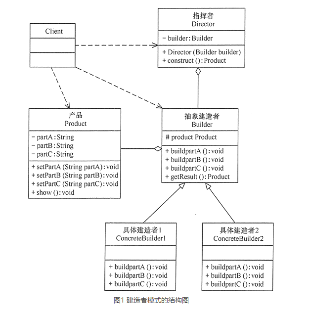

# 建造者模式

## 建造者（Builder）模式的定义

建造者（Builder）模式的定义：指将一个复杂对象的构造与它的表示分离，使同样的构建过程可以创建不同的表示，这样的设计模式被称为建造者模式。它是将一个复杂的对象分解为多个简单的对象，然后一步一步构建而成。它将变与不变相分离，即产品的组成部分是不变的，但每一部分是可以灵活选择的。

该模式的主要优点如下：

1. 封装性好，构建和表示分离。
2. 扩展性好，各个具体的建造者相互独立，有利于系统的解耦。
3. 客户端不必知道产品内部组成的细节，建造者可以对创建过程逐步细化，而不对其它模块产生任何影响，便于控制细节风险。

其缺点如下：

1. 产品的组成部分必须相同，这限制了其使用范围。
2. 如果产品的内部变化复杂，如果产品内部发生变化，则建造者也要同步修改，后期维护成本较大。

## 模式的结构与实现

建造者（Builder）模式由产品、抽象建造者、具体建造者、指挥者等 4 个要素构成，现在我们来分析其基本结构和实现方法。

#### 1. 模式的结构

建造者（Builder）模式的主要角色如下。

1. 产品角色（Product）：它是包含多个组成部件的复杂对象，由具体建造者来创建其各个零部件。
2. 抽象建造者（Builder）：它是一个包含创建产品各个子部件的抽象方法的接口，通常还包含一个返回复杂产品的方法 getResult()。
3. 具体建造者(Concrete Builder）：实现 Builder 接口，完成复杂产品的各个部件的具体创建方法。
4. 指挥者（Director）：它调用建造者对象中的部件构造与装配方法完成复杂对象的创建，在指挥者中不涉及具体产品的信息。

其结构图如图 1 所示。



#### 2. 模式的实现

图 1 给出了建造者（Builder）模式的主要结构，其相关类的代码如下。

```java
package com.stanlong;

import lombok.Setter;

public class DesignPattern {
    public static void main(String[] args) {
        Builder builder = new ConcreteBuilder();
        Director director = new Director(builder);
        Product product = director.construct();
        product.show();
    }
}

/**
 * 1. 产品角色：包含多个组成部件的复杂对象。
 */
@Setter
class Product {
    private String partA;
    private String partB;
    private String partC;

    public void show() {
        System.out.println("产品由A，B，C三部分组成");
    }
}

/**
 * 2. 抽象建造者：包含创建产品各个子部件的抽象方法。
 */
abstract class Builder {
    //创建产品对象
    protected Product product = new Product();
    public abstract void buildPartA();
    public abstract void buildPartB();
    public abstract void buildPartC();
    //返回产品对象
    public Product getResult() {
        return product;
    }
}

/**
 * 3.  具体建造者：实现了抽象建造者接口。
 */
class ConcreteBuilder extends Builder {
    public void buildPartA() {
        product.setPartA("建造 PartA");
    }
    public void buildPartB() {
        product.setPartB("建造 PartB");
    }
    public void buildPartC() {
        product.setPartC("建造 PartC");
    }
}

/**
 *  指挥者：调用建造者中的方法完成复杂对象的创建
 */
class Director {
    private Builder builder;
    public Director(Builder builder) {
        this.builder = builder;
    }
    //产品构建与组装方法
    public Product construct() {
        builder.buildPartA();
        builder.buildPartB();
        builder.buildPartC();
        return builder.getResult();
    }
}
```

## 建造者模式的另一种写法

```java
package com.stanlong;

import lombok.RequiredArgsConstructor;

public class DesignPattern {
    public static void main(String[] args) {
        new Product.Builder().partA("CPU").partB("内存").partC("主板").builder().show();
    }
}

@RequiredArgsConstructor
class Product {
    private final String partA;
    private final String partB;
    private final String partC;

    // 静态内部类，高内聚
    static class Builder{ //  具体建造者
        private String partA;
        private String partB;
        private String partC;

        public Builder partA(String partA){
            this.partA = partA;
            return this;
        }

        public Builder partB(String partB){
            this.partB = partB;
            return this;
        }

        public Builder partC(String partC){
            this.partC = partC;
            return this;
        }

        Product builder(){
            return new Product(partA, partB, partC);
        }
    }

    public void show() {
        System.out.println("产品由"+ partA + "、" + partB + "、" +partC+ "三部分组成");
    }
}
```

