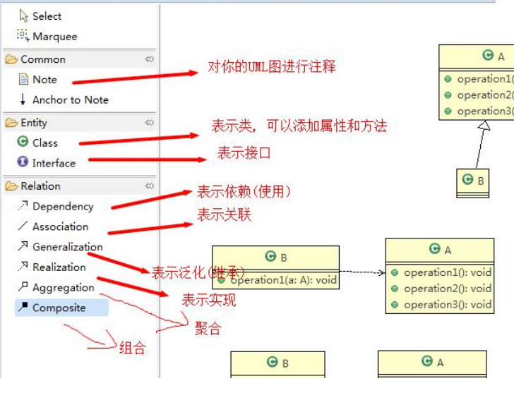
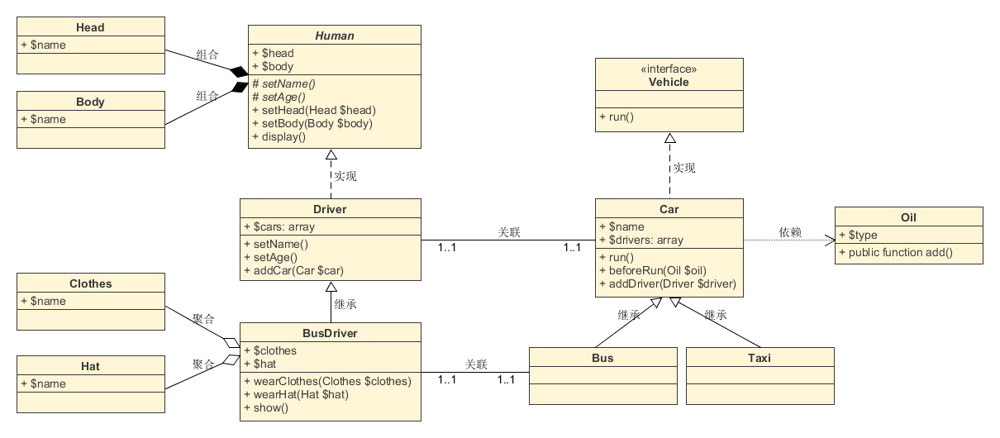

# UML类图

Unified modeling language UML (统一建模语言)

是一种用于软件系统分析和设计的语言工具，它用于帮助软件开发人员进行思考和记录思路的结果

UML 本身是==一套符号的规定==，就像数学符号和化学符号一样，这些符号用于描述软件模型中的各个元素和他们之间的关系。

类之间的关系：依赖、泛化(继承)、实现、关联、聚合与组合

- 依赖关系(Dependence)：只要是在类中用到了对方，那么他们之间就存在依赖关系
- 泛化关系(generalization)：泛化关系实际上就是继承关系，他是依赖关系的特例
- 实现关系(Implementation)：实现关系实际上就是 A 类实现 B 接口，他是依赖关系的特例
- 关联关系(Association)：类之间的联系
- 聚合关系(Aggregation)：表示的是整体和部分的关系，==整体与部分可以分开==。聚合关系是关联关系的特例，所以他具有关联的导航性与多重性。如一台电脑由键盘(keyboard)、显示器(monitor)、鼠标等组成；组成电脑的各个配件是可以从电脑上分离出来的，使用带空心菱形的实线来表示
- 组合关系(Composition)：也是整体与部分的关系，但是==整体与部分不可以分开==。Person 与 IDCard、 Head： Head 和 Person 就是 组合；IDCard 和 Person 就是聚合

