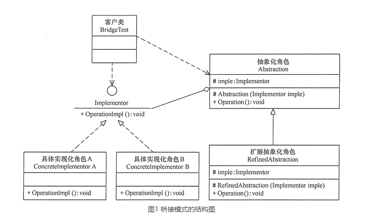

# 桥接模式

在现实生活中，某些类具有两个或多个维度的变化，如图形既可按形状分，又可按颜色分。如何设计类似于 Photoshop 这样的软件，能画不同形状和不同颜色的图形呢？如果用继承方式，m 种形状和 n 种颜色的图形就有 m×n 种，不但对应的子类很多，而且扩展困难。如果用桥接模式就能很好地解决这些问题。

## 定义

桥接（Bridge）模式的定义如下：将抽象与实现分离，使它们可以独立变化。它是用组合关系代替继承关系来实现，从而降低了抽象和实现这两个可变维度的耦合度。

通过上面的讲解，我们能很好的感觉到桥接模式遵循了里氏替换原则和依赖倒置原则，最终实现了开闭原则，对修改关闭，对扩展开放。这里将桥接模式的优缺点总结如下。

桥接（Bridge）模式的优点是：

- 抽象与实现分离，扩展能力强
- 符合开闭原则
- 符合合成复用原则
- 其实现细节对客户透明

缺点是：由于聚合关系建立在抽象层，要求开发者针对抽象化进行设计与编程，能正确地识别出系统中两个独立变化的维度，这增加了系统的理解与设计难度。

## 模式的结构

可以将抽象化部分与实现化部分分开，取消二者的继承关系，改用组合关系。

桥接（Bridge）模式包含以下主要角色。

1. 抽象化（Abstraction）角色：定义抽象类，并包含一个对实现化对象的引用。
2. 扩展抽象化（Refined Abstraction）角色：是抽象化角色的子类，实现父类中的业务方法，并通过组合关系调用实现化角色中的业务方法。
3. 实现化（Implementor）角色：定义实现化角色的接口，供扩展抽象化角色调用。
4. 具体实现化（Concrete Implementor）角色：给出实现化角色接口的具体实现。



```java
package com.stanlong;

import java.math.BigDecimal;

/**
 * 实现支付功能
 * 其中有不同的支付方式，不同的认证方式
 * 如果不使用桥接模式，其代码如下
 */
public class DesignPattern {
    public static void main(String[] args) {
        PayController pay = new PayController();

        System.out.println("\r\n模拟测试场景；微信支付、人脸方式。");
        pay.doPay("weixin_1092033111", "100000109893", new BigDecimal(100), 1, 2);

        System.out.println("\r\n模拟测试场景；支付宝支付、指纹方式。");
        pay.doPay("jlu19dlxo111","100000109894",new BigDecimal(100), 2, 3);
    }
}
class PayController {

    public boolean doPay(String uId, String tradeId, BigDecimal amount, int channelType, int modeType) {
        // 微信支付
        if (1 == channelType) {
            System.out.printf("模拟微信渠道支付划账开始。uId：{%s} tradeId：{%s} amount：{%s}", uId, tradeId, amount);
            if (1 == modeType) {
                System.out.println("密码支付，风控校验环境安全");
            } else if (2 == modeType) {
                System.out.println("人脸支付，风控校验脸部识别");
            } else if (3 == modeType) {
                System.out.println("指纹支付，风控校验指纹信息");
            }
        }
        // 支付宝支付
        else if (2 == channelType) {
            System.out.printf("模拟支付宝渠道支付划账开始。uId：{%s} tradeId：{%s} amount：{%s}", uId, tradeId, amount);
            if (1 == modeType) {
                System.out.println("密码支付，风控校验环境安全");
            } else if (2 == modeType) {
                System.out.println("人脸支付，风控校验脸部识别");
            } else if (3 == modeType) {
                System.out.println("指纹支付，风控校验指纹信息");
            }
        }
        return true;
    }
}
```

```java
package com.stanlong;

import java.math.BigDecimal;

/**
 * 桥接模式-实现支付功能
 */
public class DesignPattern {
    public static void main(String[] args) {

        System.out.println("\r\n模拟测试场景；微信支付、人脸方式。");
        Pay wxPay = new WxPay(new PayFaceMode());
        wxPay.transfer("weixin_1092033111", "100000109893", new BigDecimal(100));

        System.out.println("\r\n模拟测试场景；支付宝支付、指纹方式。");
        Pay zfbPay = new ZfbPay(new PayFingerprintMode());
        zfbPay.transfer("jlu19dlxo111", "100000109894", new BigDecimal(100));
    }
}

/**
 * 抽象化角色
 * 定义抽象类，并包含一个对实现化对象的引用
 */
abstract class Pay {

    protected IPayMode payMode; // 包含一个对实现化对象的引用

    public Pay(IPayMode payMode) {
        this.payMode = payMode;
    }

    public abstract String transfer(String uId, String tradeId, BigDecimal amount);

}

/**
 * 扩展抽象化角色
 * 是抽象化角色的子类，实现父类中的业务方法。
 * 并通过组合关系调用实现化角色中的业务方法。
 */
class WxPay extends Pay {

    // 通过组合关系调用实现化角色中的业务方法。
    public WxPay(IPayMode payMode) {
        super(payMode);
    }

    // 实现父类中的业务方法
    public String transfer(String uId, String tradeId, BigDecimal amount) {
        System.out.printf("模拟微信渠道支付划账开始。uId：{%s} tradeId：{%s} amount：{%s}", uId, tradeId, amount);
        boolean security = payMode.security(uId);
        System.out.printf("模拟微信渠道支付风控校验。uId：{%s} tradeId：{%s} security：{%s}", uId, tradeId, security);
        if (!security) {
            System.out.printf("模拟微信渠道支付划账拦截。uId：{%s} tradeId：{%s} amount：{%s}", uId, tradeId, amount);
            return "0001";
        }
        System.out.printf("模拟微信渠道支付划账成功。uId：{%s} tradeId：{%s} amount：{%s}", uId, tradeId, amount);
        return "0000";
    }
}

/**
 * 扩展抽象化角色
 * 是抽象化角色的子类，实现父类中的业务方法。
 * 并通过组合关系调用实现化角色中的业务方法。
 */
class ZfbPay extends Pay {

    // 通过组合关系调用实现化角色中的业务方法。
    public ZfbPay(IPayMode payMode) {
        super(payMode);
    }

    // 实现父类中的业务方法
    public String transfer(String uId, String tradeId, BigDecimal amount) {
        System.out.printf("模拟支付宝渠道支付划账开始。uId：{%s} tradeId：{%s} amount：{%s}", uId, tradeId, amount);
        boolean security = payMode.security(uId);
        System.out.printf("模拟支付宝渠道支付风控校验。uId：{%s} tradeId：{%s} security：{%s}", uId, tradeId, security);
        if (!security) {
            System.out.printf("模拟支付宝渠道支付划账拦截。uId：{%s} tradeId：{%s} amount：{%s}", uId, tradeId, amount);
            return "0001";
        }
        System.out.printf("模拟支付宝渠道支付划账成功。uId：{%s} tradeId：{%s} amount：{%s}", uId, tradeId, amount);
        return "0000";
    }
}

/**
 * 实现化（Implementor）角色
 * 定义实现化角色的接口，供扩展抽象化角色调用。
 */
interface IPayMode {
    boolean security(String uId);
}

/**
 * 具体实现化（Concrete Implementor）角色
 * 给出实现化角色接口的具体实现。
 */
class PayCypher implements IPayMode{
    public boolean security(String uId) {
        System.out.println("密码支付，风控校验环境安全");
        return true;
    }
}

/**
 * 具体实现化（Concrete Implementor）角色
 * 给出实现化角色接口的具体实现。
 */
class PayFaceMode implements IPayMode{
    public boolean security(String uId) {
        System.out.println("人脸支付，风控校验脸部识别");
        return true;
    }
}

/**
 * 具体实现化（Concrete Implementor）角色
 * 给出实现化角色接口的具体实现。
 */
class PayFingerprintMode implements IPayMode{
    public boolean security(String uId) {
        System.out.println("指纹支付，风控校验指纹信息");
        return true;
    }
}
```

