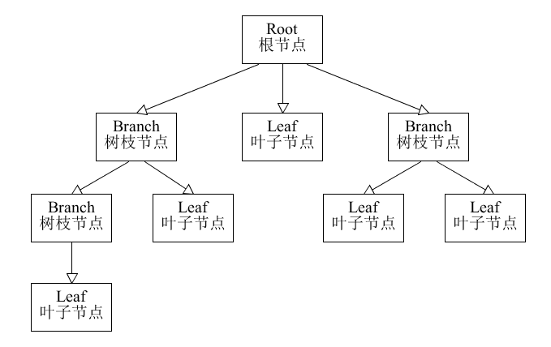

# 组合模式

在现实生活中，存在很多“部分-整体”的关系，例如，大学中的部门与学院、总公司中的部门与分公司、学习用品中的书与书包、生活用品中的衣服与衣柜、以及厨房中的锅碗瓢盆等。在软件开发中也是这样，例如，文件系统中的文件与文件夹、窗体程序中的简单控件与容器控件等。对这些简单对象与复合对象的处理，如果用组合模式来实现会很方便。

## 组合模式的定义与特点

组合（Composite Pattern）模式的定义：有时又叫作整体-部分（Part-Whole）模式，它是一种将对象组合成树状的层次结构的模式，用来表示“整体-部分”的关系，使用户对单个对象和组合对象具有一致的访问性，属于结构型设计模式。

组合模式一般用来描述整体与部分的关系，它将对象组织到树形结构中，顶层的节点被称为根节点，根节点下面可以包含树枝节点和叶子节点，树枝节点下面又可以包含树枝节点和叶子节点，树形结构图如下。



由上图可以看出，其实根节点和树枝节点本质上属于同一种数据类型，可以作为容器使用；而叶子节点与树枝节点在语义上不属于用一种类型。但是在组合模式中，会把树枝节点和叶子节点看作属于同一种数据类型（用统一接口定义），让它们具备一致行为。

这样，在组合模式中，整个树形结构中的对象都属于同一种类型，带来的好处就是用户不需要辨别是树枝节点还是叶子节点，可以直接进行操作，给用户的使用带来极大的便利。

组合模式的主要优点有：

1. 组合模式使得客户端代码可以一致地处理单个对象和组合对象，无须关心自己处理的是单个对象，还是组合对象，这简化了客户端代码；
2. 更容易在组合体内加入新的对象，客户端不会因为加入了新的对象而更改源代码，满足“开闭原则”；


其主要缺点是：

1. 设计较复杂，客户端需要花更多时间理清类之间的层次关系；
2. 不容易限制容器中的构件；
3. 不容易用继承的方法来增加构件的新功能；

## 组合模式的结构与实现

组合模式的结构不是很复杂，下面对它的结构和实现进行分析。

### 1. 模式的结构

组合模式包含以下主要角色。

1. 抽象构件（Component）角色：它的主要作用是为树叶构件和树枝构件声明公共接口，并实现它们的默认行为。在透明式的组合模式中抽象构件还声明访问和管理子类的接口；在安全式的组合模式中不声明访问和管理子类的接口，管理工作由树枝构件完成。（总的抽象类或接口，定义一些通用的方法，比如新增、删除）
2. 树叶构件（Leaf）角色：是组合中的叶节点对象，它没有子节点，用于继承或实现抽象构件。
3. 树枝构件（Composite）角色 / 中间构件：是组合中的分支节点对象，它有子节点，用于继承和实现抽象构件。它的主要作用是存储和管理子部件，通常包含 Add()、Remove()、GetChild() 等方法。


组合模式分为透明式的组合模式和安全式的组合模式。

#### (1) 透明方式

在该方式中，由于抽象构件声明了所有子类中的全部方法，所以客户端无须区别树叶对象和树枝对象，对客户端来说是透明的。但其缺点是：树叶构件本来没有 Add()、Remove() 及 GetChild() 方法，却要实现它们（空实现或抛异常），这样会带来一些安全性问题。其结构图如图 1 所示。


#### (2) 安全方式

在该方式中，将管理子构件的方法移到树枝构件中，抽象构件和树叶构件没有对子对象的管理方法，这样就避免了上一种方式的安全性问题，但由于叶子和分支有不同的接口，客户端在调用时要知道树叶对象和树枝对象的存在，所以失去了透明性。其结构图如图 2 所示。


### 2. 模式的实现

假如要访问集合 c0={leaf1,{leaf2,leaf3}} 中的元素，其对应的树状图如图 3 所示。


#### 透明组合模式

下面为透明式的组合模式的实现代码。

```java
package com.stanlong;

import java.util.ArrayList;

/**
 * 组合模式
 * 按照树来理解
 */
public class DesignPattern {
    public static void main(String[] args) {
        Component c0 = new Composite();
        Component c1 = new Composite();
        Component leaf1 = new Leaf("1");
        Component leaf2 = new Leaf("2");
        Component leaf3 = new Leaf("3");
        c0.add(leaf1);
        c0.add(c1);
        c1.add(leaf2);
        c1.add(leaf3);
        c0.operation();
    }
}

/**
 * 抽象构件角色， 可以是接口也可以是抽象类
 * 主要作用是为树叶构件和树枝构件声明公共接口
 */
interface Component {
    public void add(Component c);
    public void remove(Component c);
    public Component getChild(int i);
    public void operation();
}

/**
 * 树枝构件
 * 是组合中的分支节点对象，它有子节点，用于继承和实现抽象构件
 */
class Composite implements Component {
    private ArrayList<Component> children = new ArrayList<Component>();
    public void add(Component c) {
        children.add(c);
    }
    public void remove(Component c) {
        children.remove(c);
    }
    public Component getChild(int i) {
        return children.get(i);
    }
    public void operation() {
        for (Object obj : children) {
            ((Component) obj).operation();
        }
    }
}

/**
 * 树叶构件
 * 是组合中的叶节点对象，它没有子节点，用于继承或实现抽象构件
 */
class Leaf implements Component {
    private String name;
    public Leaf(String name) {
        this.name = name;
    }
    public void add(Component c) {
    }
    public void remove(Component c) {
    }
    public Component getChild(int i) {
        return null;
    }
    public void operation() {
        System.out.println("树叶" + name + "：被访问！");
    }
}
```

#### 安全组合模式

安全式的组合模式与透明式组合模式的实现代码类似，只要对其做简单修改就可以了，代码如下。

首先修改 Component 代码，只保留层次的公共行为。

```java
interface Component {
    public void operation();
}
```

然后修改客户端代码，将树枝构件类型更改为 Composite 类型，以便获取管理子类操作的方法。

```java
public class CompositePattern {
    public static void main(String[] args) {
        Composite c0 = new Composite();
        Composite c1 = new Composite();
        Component leaf1 = new Leaf("1");
        Component leaf2 = new Leaf("2");
        Component leaf3 = new Leaf("3");
        c0.add(leaf1);
        c0.add(c1);
        c1.add(leaf2);
        c1.add(leaf3);
        c0.operation();
    }
}
```

学习

```java
package com.stanlong;

import java.util.ArrayList;

/**
 * 组合模式
 * 可以按照三级菜单来理解
 * 比如：
 * 安徽新华学院
 *     电子通信工程学院
 *         通信工程
 *         测试技术与仪器
 *     信息工程学院
 *         软件工程
 *         网络工程
 */
public class DesignPattern {
    public static void main(String[] args) {
        // 节点准备
        Component c0 = new Composite("安徽新华学院");
        Component c1 = new Composite("电子通信工程学院");
        Component c2 = new Composite("信息工程学院");
        Component leaf1 = new Leaf("通信工程");
        Component leaf2 = new Leaf("测试技术与仪器");
        Component leaf3 = new Leaf("软件工程");
        Component leaf4 = new Leaf("网络工程");

        // 开始组合
        c0.add(c1);
        c0.add(c2);
        c1.add(leaf1);
        c1.add(leaf2);
        c2.add(leaf3);
        c2.add(leaf4);
        c0.operation();
    }
}

/**
 * 抽象构件角色
 * 主要作用是为树叶构件和树枝构件声明公共接口
 */
abstract class Component {
    private String name;
    public String getName(){
        return this.name;
    }
    public Component(String name){
        this.name = name;
    }
    public void add(Component c){};
    public void remove(Component c){};
    public Component getChild(int i){return null;};
    public void operation(){};
}

/**
 * 树枝构件
 * 是组合中的分支节点对象，它有子节点，用于继承和实现抽象构件
 */
class Composite extends Component {
    private String name;
    public Composite(String name){
        super(name);
    }
    private ArrayList<Component> children = new ArrayList<Component>();
    public void add(Component c) {
        children.add(c);
    }
    public void remove(Component c) {
        children.remove(c);
    }
    public Component getChild(int i) {
        return children.get(i);
    }
    public void operation() {
        for (Object obj : children) {
            ((Component) obj).operation();
        }
    }
}

/**
 * 树叶构件
 * 是组合中的叶节点对象，它没有子节点，用于继承或实现抽象构件
 */
class Leaf extends Component {
    public Leaf(String name){
        super(name);
    }
    public void add(Component c) {
    }
    public void remove(Component c) {
    }
    public Component getChild(int i) {
        return null;
    }
    public void operation() {
        System.out.println("节点：" + getName() + "：被访问！");
    }
}
```

