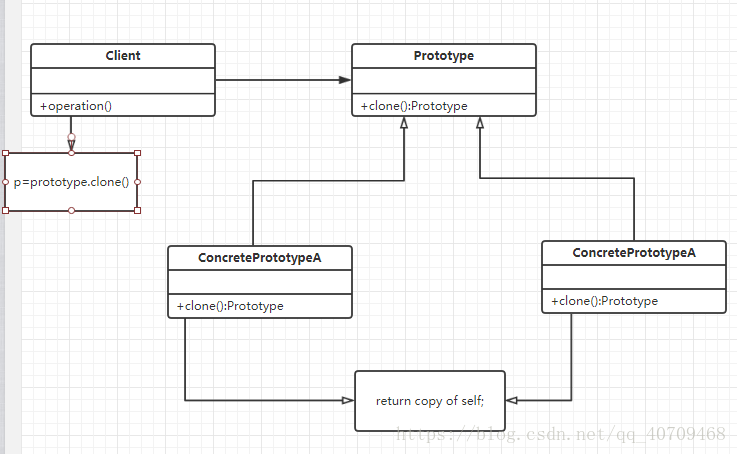
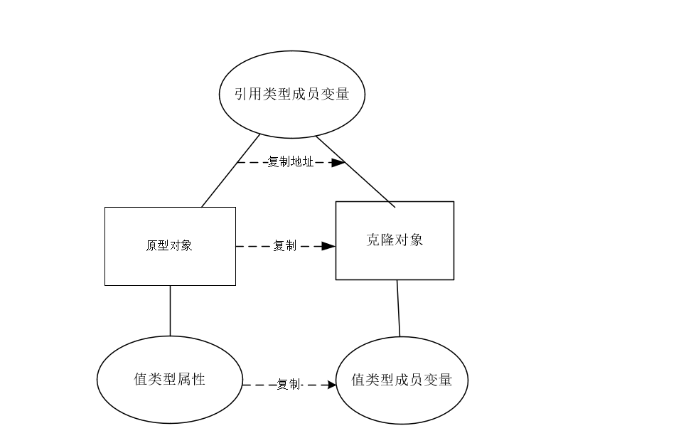
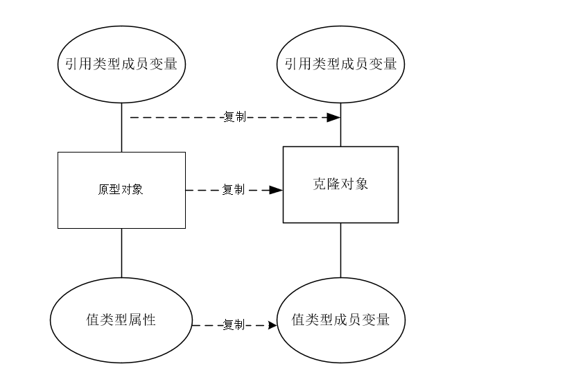

# 原型模式

原型模式(Prototype 模式)：用一个已经创建的实例作为原型，通过复制该原型对象来创建一个和原型相同或相似的新对象。说的直接点就是实现`Object`类中的`clone`方法。


工作原理：对象.clone()



在原型模式中有两个概念我们需要了解一下，就是浅拷贝和深拷贝的概念。

在浅拷贝中，创建一个新对象，新对象的属性和原来对象完全相同，对于非基本类型属性，仍指向原有属性所指向的对象的内存地址。



深拷贝，创建一个新对象，属性中引用的其他对象也会被克隆，不再指向原有对象地址。



**原型模式的优点：**

- Java 自带的原型模式基于内存二进制流的复制，在性能上比直接 new 一个对象更加优良。
- 可以使用深克隆方式保存对象的状态，使用原型模式将对象复制一份，并将其状态保存起来，简化了创建对象的过程，以便在需要的时候使用（例如恢复到历史某一状态），可辅助实现撤销操作。

**原型模式的缺点：**

- 需要为每一个类都配置一个 clone 方法
- clone 方法位于类的内部，当对已有类进行改造的时候，需要修改代码，违背了开闭原则。
- 当实现深克隆时，需要编写较为复杂的代码，而且当对象之间存在多重嵌套引用时，为了实现深克隆，每一层对象对应的类都必须支持深克隆，实现起来会比较麻烦。因此，深克隆、浅克隆需要运用得当。

**克隆羊问题**

```java
package com.stanlong;

import lombok.*;

public class DesignPattern {
    public static void main(String[] args) {
        System.out.println("----原型模式，浅拷贝-----");

        Sheep sheep = new Sheep("喜羊羊", 10);
        sheep.setFriend(new Sheep("美羊羊", 8));
        Sheep sheep1 = (Sheep) sheep.clone();
        Sheep sheep2 = (Sheep) sheep.clone();

        System.out.println("sheep = " + sheep + ": " + sheep.getFriend().hashCode());
        System.out.println("sheep1 = " + sheep1 + ": " + sheep1.getFriend().hashCode());
        System.out.println("sheep2 = " + sheep2 + ": " + sheep2.getFriend().hashCode());

        System.out.println("sheep == sheep1?: " + (sheep == sheep1));
        System.out.println("sheep == sheep2?: " + (sheep == sheep2));
        System.out.println("sheep1 == sheep2?: " + (sheep1 == sheep2));
    }
}

@Getter
@Setter
@ToString(exclude = "friend")
@RequiredArgsConstructor
class Sheep implements Cloneable { // 原型类需要声明一个克隆自己的接口
    @NonNull
    private String name;
    @NonNull
    private int age;

    private Sheep friend; // 对象


    //克隆该实例，使用默认的clone方法来完成
    @Override
    protected Object clone()  {

        Sheep sheep = null;
        try {
            sheep = (Sheep)super.clone();
        } catch (Exception e) {
            // TODO: handle exception
            System.out.println(e.getMessage());
        }
        // TODO Auto-generated method stub
        return sheep;
    }
}
```

```
----原型模式，浅拷贝-----
sheep = Sheep(name=喜羊羊, age=10): 1956725890 // hashcode值一样，说明原型对象和克隆对象中的引用类型的成员对象并没有复制.
sheep1 = Sheep(name=喜羊羊, age=10): 1956725890
sheep2 = Sheep(name=喜羊羊, age=10): 1956725890
sheep == sheep1?: false
sheep == sheep2?: false
sheep1 == sheep2?: false
```

深拷贝需要考虑引用类型，实现方法：

1. 重写 clone 方法来实现深拷贝
2. 通过对象序列化实现深拷贝

总结：

- 创建新的对象比较复杂时，可以利用原型模式简化对象的创建过程，同时也能够提高效率
- 不用重新初始化对象，而是动态地获得对象运行时的状态