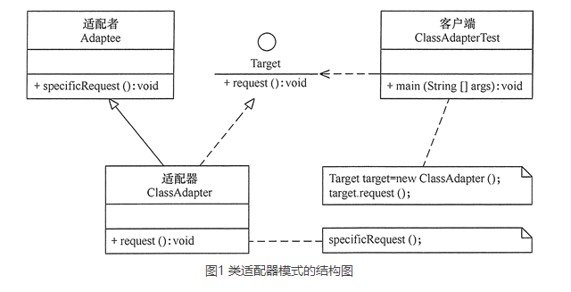
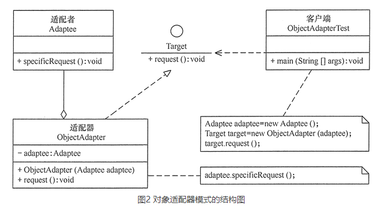
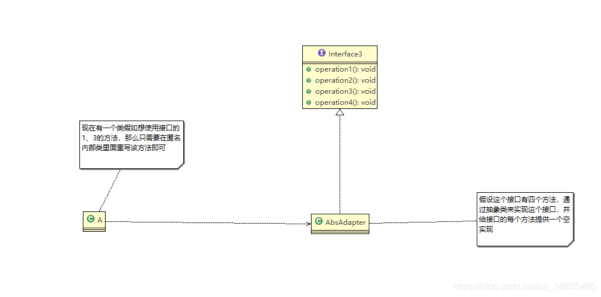

# 适配器模式

在现实生活中，经常出现两个对象因接口不兼容而不能在一起工作的实例，这时需要第三者进行适配。例如，讲中文的人同讲英文的人对话时需要一个翻译，用直流电的笔记本电脑接交流电源时需要一个电源适配器，用计算机访问照相机的 SD 内存卡时需要一个读卡器等。

在软件设计中也可能出现：需要开发的具有某种业务功能的组件在现有的组件库中已经存在，但它们与当前系统的接口规范不兼容，如果重新开发这些组件成本又很高，这时用适配器模式能很好地解决这些问题。

## 定义

适配器模式（Adapter）的定义如下：将一个类的接口转换成客户希望的另外一个接口，使得原本由于接口不兼容而不能一起工作的那些类能一起工作。适配器模式分为**类结构型模式**和**对象结构型模式**两种，前者类之间的耦合度比后者高，且要求程序员了解现有组件库中的相关组件的内部结构，所以应用相对较少些。

该模式的主要优点如下。

- 客户端通过适配器可以透明地调用目标接口。
- 复用了现存的类，程序员不需要修改原有代码而重用现有的适配者类。
- 将目标类和适配者类解耦，解决了目标类和适配者类接口不一致的问题。
- 在很多业务场景中符合开闭原则。

其缺点是：

- 适配器编写过程需要结合业务场景全面考虑，可能会增加系统的复杂性。
- 增加代码阅读难度，降低代码可读性，过多使用适配器会使系统代码变得凌乱。

适配器模式（Adapter）包含以下主要角色。

1. 目标（Target）接口：当前系统业务所期待的接口，它可以是抽象类或接口。
2. 适配者（Adaptee）类：它是被访问和适配的现存组件库中的组件接口。
3. 适配器（Adapter）类：它是一个转换器，通过继承或引用适配者的对象，把适配者接口转换成目标接口，让客户按目标接口的格式访问适配者。

## 结构与实现

**类适配器模式**可采用多重继承方式实现，如 C++ 可定义一个适配器类来同时继承当前系统的业务接口和现有组件库中已经存在的组件接口；Java 不支持多继承，但可以定义一个适配器类来实现当前系统的业务接口，同时又继承现有组件库中已经存在的组件。



**对象适配器模式**可釆用将现有组件库中已经实现的组件聚合到适配器类中，该类同时实现当前系统的业务接口



```java
package com.stanlong;

/**
 * 类模式适配器
 */
public class DesignPattern {
    public static void main(String[] args) {
        System.out.println("类适配器模式测试：把中文翻译成俄语");
        Russia russia = new Translator();
        russia.speakRussian();
    }
}

//目标接口
interface Russia{
    public void speakRussian();
}

//适配者接口
class China{
    public String speakChinese() {
        return "你好";
    }
}
//适配器类
class Translator extends China implements Russia{
    public void speakRussian() {
        String chinese = speakChinese();
        if(chinese.equals("你好")){
            System.out.println("Здравствыйте");
        }
    }
}
```

```java
package com.stanlong;

import com.sun.corba.se.spi.oa.ObjectAdapter;

/**
 * 对象模式适配器
 */
public class DesignPattern {
    public static void main(String[] args) {
        System.out.println("对象适配器模式测试：把中文翻译成俄语");
        China china = new China();
        Russia russia = new Translator(china);
        russia.speakRussian();
    }
}

//目标接口
interface Russia{
    public void speakRussian();
}

//适配者接口
class China{
    public String speakChinese() {
        return "你好";
    }
}

//对象适配器类
class Translator implements Russia{
    private China china; // 把适配者接口聚合到适配器类中
    public Translator(China china)    {
        this.china = china;
    }
    public void speakRussian()    {
        String chinese = china.speakChinese();
        if(chinese.equals("你好")){
            System.out.println("Здравствыйте");
        }
    }
}
```


**接口适配器介绍：**
1、当不需要全部实现接口提供的方法时，可先设计一个抽象类实现接口，并未该抽象类实现的每一个方法给一个空实现，这样子类在继承抽象类的时候就可以由选择性的覆盖想实现的方法
2、适用于一个接口不想使用其所有方法的情况

类图：



```java
package com.stanlong;

/**
 * 接口适配器
 */
public class DesignPattern {
    public static void main(String[] args) {
        AbsAdapter absAdapter = new AbsAdapter() {
            @Override
            public void operation1() {
                System.out.println("使得匿名内部类实现 operation1");
            }

            @Override
            public void operation2() {
                System.out.println("使得匿名内部类实现 operation2");
            }
        };
        absAdapter.operation1();
        absAdapter.operation2();
        absAdapter.operation3();
        absAdapter.operation4();
    }
}

interface Interface{
    public void operation1();
    public void operation2();
    public void operation3();
    public void operation4();
}

abstract class AbsAdapter implements Interface{
    @Override
    public void operation1(){
        System.out.println("默认实现方法1");
    }
    @Override
    public void operation2(){
        System.out.println("默认实现方法2");
    }
    @Override
    public void operation3(){
        System.out.println("默认实现方法3");
    }
    @Override
    public void operation4(){
        System.out.println("默认实现方法4");
    }
}
```

```
使得匿名内部类实现 operation1
使得匿名内部类实现 operation2
默认实现方法3
默认实现方法4
```

