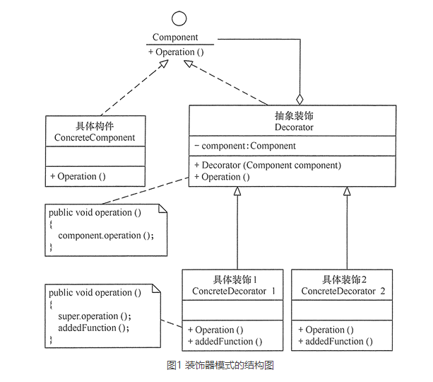

# 装饰器模式

## 定义

装饰器（Decorator）模式的定义：指在不改变现有对象结构的情况下，动态地给该对象增加一些职责（即增加其额外功能）的模式，它属于对象结构型模式。

装饰器模式的主要优点有：

- 装饰器是继承的有力补充，比继承灵活，在不改变原有对象的情况下，动态的给一个对象扩展功能，即插即用
- 通过使用不用装饰类及这些装饰类的排列组合，可以实现不同效果
- 装饰器模式完全遵守开闭原则


其主要缺点是：装饰器模式会增加许多子类，过度使用会增加程序得复杂性。

## 模式的结构与实现

通常情况下，扩展一个类的功能会使用继承方式来实现。但继承具有静态特征，耦合度高，并且随着扩展功能的增多，子类会很膨胀。如果使用组合关系来创建一个包装对象（即装饰对象）来包裹真实对象，并在保持真实对象的类结构不变的前提下，为其提供额外的功能，这就是装饰器模式的目标。下面来分析其基本结构和实现方法。

### 1. 模式的结构

装饰器模式主要包含以下角色。

1. 抽象构件（Component）角色：定义一个抽象接口以规范准备接收附加责任的对象。
2. 具体构件（ConcreteComponent）角色：实现抽象构件，通过装饰角色为其添加一些职责。
3. 抽象装饰（Decorator）角色：继承抽象构件，并包含具体构件的实例，可以通过其子类扩展具体构件的功能。
4. 具体装饰（ConcreteDecorator）角色：实现抽象装饰的相关方法，并给具体构件对象添加附加的责任。



### 2. 模式的实现

```java
package com.stanlong;

/**
 * 装饰器模式
 * 给只能拍照的相机加上美颜的滤镜
 */
public class DesignPattern {
    public static void main(String[] args) {
        Component p = new ConcreteComponent();
        p.operation();
        System.out.println("---------------------------------");
        Component d1 = new ConcreteDecorator1(p);
        d1.operation();
        System.out.println("---------------------------------");
        Component d2 = new ConcreteDecorator2(new ConcreteDecorator1(new ConcreteComponent()));
        d2.operation();
    }
}

//抽象构件角色
interface Component {
    public void operation();
}

//具体构件角色
class ConcreteComponent implements Component {
    public void operation() {
        System.out.println("拍照");
    }
}

//抽象装饰角色
abstract class Decorator implements Component {
    private Component component;

    public Decorator(Component component) {
        this.component = component;
    }

    public void operation() {
        component.operation();
    }
}

//具体装饰角色 - 给相机加个美颜效果
class ConcreteDecorator1 extends Decorator {
    public ConcreteDecorator1(Component component) {
        super(component);
    }

    public void operation() {
        super.operation();
        System.out.println("给能拍照的相机再添加一个美颜效果");
    }
}

//具体装饰角色 - 给相机加个美颜效果
class ConcreteDecorator2 extends Decorator {
    public ConcreteDecorator2(Component component) {
        super(component);
    }

    public void operation() {
        super.operation();
        System.out.println("给能拍照的相机再添加一个滤镜效果");
    }
}
```

```
拍照
---------------------------------
拍照
给能拍照的相机再添加一个美颜效果
---------------------------------
拍照
给能拍照的相机再添加一个美颜效果
给能拍照的相机再添加一个滤镜效果
```


