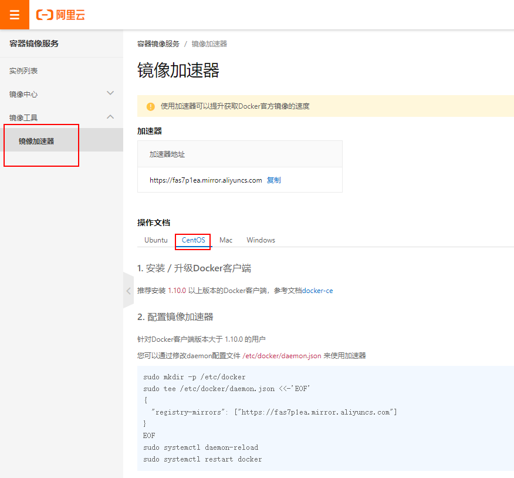

# docker

## 定义

Docker是一种新兴的虚拟化技术，能够一定程度上的代替传统虚拟机。

## 架构


## 基本组成

+ **镜像**

  docker镜像就好比一个模板，通过这个模板来创建容器服务，一个镜像可以启动多个容器，每个容器都是独立的，互不干扰。

+ **容器**

  独立运行一个或者一组应用

+ **仓库**

  存放镜像的地方

## 工作过程

docker是一个client-server结构的系统，docker的守护进程运行在主机上，通过socket从客户端访问。DockerServer接收到DockerClient的指令后执行这个命令。

## 节点规划

|        |        |
| ------ | ------ |
| node01 | docker |

## 安装

### 卸载旧版本

```shell
[root@node01 ~]# yum remove docker \
>                   docker-client \
>                   docker-client-latest \
>                   docker-common \
>                   docker-latest \
>                   docker-latest-logrotate \
>                   docker-logrotate \
>                   docker-engine
Loaded plugins: fastestmirror
No Match for argument: docker
No Match for argument: docker-client
No Match for argument: docker-client-latest
No Match for argument: docker-common
No Match for argument: docker-latest
No Match for argument: docker-latest-logrotate
No Match for argument: docker-logrotate
No Match for argument: docker-engine
No Packages marked for removal
```

官网地址： https://docs.docker.com/install/linux/docker-ce/centos/

### 使用存储库安装

+ 设置存储库

  yum install -y yum-utils device-mapper-persistent-data lvm2

+ 安装阿里云镜像仓库地址

  yum-config-manager --add-repo http://mirrors.aliyun.com/docker-ce/linux/centos/docker-ce.repo

+ 安装最新版本的Docker Engine-Community和containerd
	
	yum install docker-ce docker-ce-cli containerd.io
+ 配置docker阿里云加速器

  https://cr.console.aliyun.com/cn-hangzhou/instances/mirrors

  

  

  ```
  针对Docker客户端版本大于 1.10.0 的用户
  您可以通过修改daemon配置文件/etc/docker/daemon.json来使用加速器
    sudo mkdir -p /etc/docker
    sudo tee /etc/docker/daemon.json <<-'EOF'
    {
      "registry-mirrors": ["https://fas7p1ea.mirror.aliyuncs.com"] -- 这个要先注册账号之后才会有
    }
    EOF
    sudo systemctl daemon-reload
    sudo systemctl restart docker
  ```
    ```
  # 新建文件夹
  [root@node01 ~]# mkdir -p /etc/docker
  # 配置加速器
  [root@node01 ~]# tee /etc/docker/daemon.json <<-'EOF'
  > {
  >   "registry-mirrors": ["https://fas7p1ea.mirror.aliyuncs.com"]
  > }
  > EOF
  {
      "registry-mirrors": ["https://fas7p1ea.mirror.aliyuncs.com"]
  }
  # 重启
  [root@node01 ~]# systemctl daemon-reload
  [root@node01 ~]# systemctl restart docker
    ```
### 启动

启动docker

```shell
sudo systemctl start docker
```

通过运行hello-world 映像来验证是否正确安装了Docker
```
[root@changgou docker]# docker run hello-world
Unable to find image 'hello-world:latest' locally
latest: Pulling from library/hello-world
1b930d010525: Pull complete 
Digest: sha256:9572f7cdcee8591948c2963463447a53466950b3fc15a247fcad1917ca215a2f
Status: Downloaded newer image for hello-world:latest

Hello from Docker!
This message shows that your installation appears to be working correctly.
```

## 卸载

```shell
yum remove docker-ce docker-ce-cli containerd.io
rm -rf /var/lib/docker
```

## 帮助命令

```shell
docker version # 显示docker的版本信息
docker info    # 显示docker的系统信息，包括镜像和容器的数量
docker --help    # 帮助命令
```

## 镜像命令
**docker images**    

列出本地主机镜像

```shell
[root@node01 ~]# docker images
REPOSITORY          TAG                 IMAGE ID            CREATED             SIZE
hello-world         latest              fce289e99eb9        13 months ago       1.84kB
---------------------------------------------------------------------------------------
解释
REPOSITORY : 表示镜像仓库源
TAG ： 镜像标签
IMAGE ID ： 镜像ID
CREATED ：镜像创建时间
SIZE ： 镜像大小
---------------------------------------------------------------------------------------
可选项
-a:列出本地所有镜像（含中间映像层）
-q:只显示镜像id
--digests：只显示镜像的摘要信息
--no-trunc:显示完整的镜像信息
```
**docker search**

搜索镜像

```shell
可选项
--filters=STARS=3000 # 搜索出STARS大于3000的
--no-trunc:显示完整的镜像描述
--automated:只列出automated build类型的镜像
```

**docker pull**

下载镜像

```shell
默认下载最新版本，可配置tag下载指定版本，如
docker pull mysql:5.7
```

**docker rmi** 

删除镜像

```shell
docker rmi -f 容器id # 删除单个镜像
docker rmi -f 容器id 容器id 容器id # 删除多个镜像
docker rmi -f $(docker images -aq) # 删除所有镜像
```

## 容器命令

有了镜像，才可以创建容器。先下载一个镜像

```shell
docker pull centos
```

**新建并启动容器**

```shell
docker run [可选参数] image

可选参数
--name='Name' # 指定容器名字
-d            # 后台运行
-it           # 使用交互方式运行
-p            # 指定容器的端口
	-p:主机端口:容器端口
	-p:容器端口
-P            # 随机指定端口
```

```
[root@node01 ~]# docker images
REPOSITORY          TAG                 IMAGE ID            CREATED             SIZE
centos              latest              470671670cac        2 weeks ago         237MB
hello-world         latest              fce289e99eb9        13 months ago       1.84kB
[root@node01 ~]# docker run -it centos /bin/bash
[root@800d4a6c6eb7 /]#
```
**docker ps** 

列出当前所有正在运行的容器

```shell
可选参数
-a:列出当前所有正在运行的容器+历史上运行过的
-l:显示最近创建的容器
-n=?:显示最近n个创建的容器
-q:静默模式，只显示容器编号
--no-trunc:不截断输出
```

```
[root@node01 ~]#docker ps
CONTAINER ID        IMAGE               COMMAND             CREATED             STATUS              PORTS               NAMES
800d4a6c6eb7        470671670cac        "/bin/bash"         2 minutes ago       Up 2 minutes                            funny_carson
```
**exit**

退出容器

```shell
exit # 停止容器并退出
ctrl+P+Q # 容器不停止退出
```

```
[root@800d4a6c6eb7 /]# exit
exit
[root@node01 ~]#
```
**docker rm**

删除容器

```shell
docker rm 容器id： 删除指定的容器
docker rm -f $(docker ps -aq) # 删除所有的容器
docker pa -a -q | xargs docker rm # 删除所有容器
```

**启动停止容器**

```shell
docker start 容器id或容器名: 启动容器
docker restart 容器id或容器名: 重启容器
docker stop 容器id或容器名: 停止容器
docker kill 容器id或容器名: 强制停止容器
```

**查看容器日志**

```shell
docker log 容器名称/容器id
```


## 设置容器开机启动
```
[root@changgou conf]# docker ps -a
CONTAINER ID        IMAGE                COMMAND                  CREATED             STATUS                    PORTS                               NAMES
7270c5f37bfc        redis                "docker-entrypoint.s…"   9 hours ago         Up 35 minutes             0.0.0.0:6379->6379/tcp              changgou_redis
fbe113d979f0        mysql                "docker-entrypoint.s…"   6 days ago          Up 34 minutes             0.0.0.0:3306->3306/tcp, 33060/tcp   mysql_changgou
a47cb2124f55        morunchang/fastdfs   "sh storage.sh"          6 days ago          Exited (137) 6 days ago                                       storage
17adfa82fe26        morunchang/fastdfs   "sh tracker.sh"          6 days ago          Exited (137) 6 days ago                                       tracker
[root@changgou conf]# docker update --restart=always 7270c5f37bfc 开机启动redis
7270c5f37bfc
```

设置docker 开机启动

[root@changgou ~]# systemctl enable docker
Created symlink from /etc/systemd/system/multi-user.target.wants/docker.service to /usr/lib/systemd/system/docker.service.