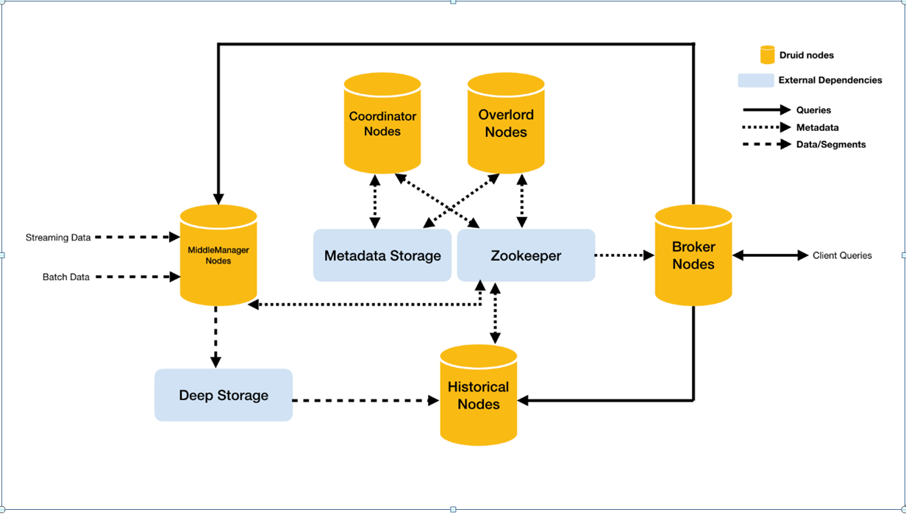
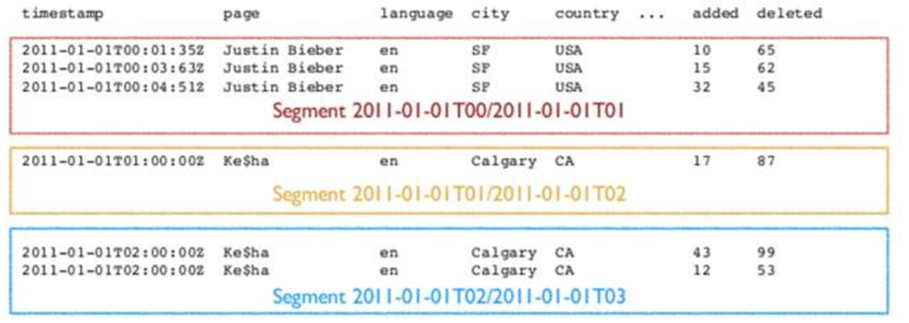

# Druid

## 定义

Druid 是一个快速的列分布式的支持实时分析的数据存储系统（Data Store）

## 应用场景

- 适用于清洗好的记录实时录入，但不需要更新操作
- 适用于支持宽表，不用join的方式
- 适用于可以总结出基础的统计指标，用一个字段表示
- 适用于实时性要求高的场景
- 适用于对数据质量的敏感度不高的场景

## 架构

Druid总体包含以下5类节点：

1. **中间管理节点**（middleManager node）：及时摄入实时数据，已生成Segment数据文件。

2. **历史节点**（historical node）：加载已生成好的数据文件，以供数据查询。historical 节点是整个集群查询性能的核心所在，因为historical会承担绝大部分的segment查询。

3. **查询节点**（broker node）：接收客户端查询请求，并将这些查询转发给Historicals和MiddleManagers。当Brokers从这些子查询中收到结果时，它们会合并这些结果并将它们返回给调用者。

4. **协调节点**（coordinator node）：主要负责历史节点的数据负载均衡，以及通过规则（Rule）管理数据的生命周期。协调节点告诉历史节点加载新数据、卸载过期数据、复制数据、和为了负载均衡移动数据。

5. **统治者**(overlord node） ：进程监视MiddleManager进程，并且是数据摄入Druid的控制器。他们负责将提取任务分配给MiddleManagers并协调Segement发布。

同时，Druid还包含3类外部依赖：

1. **数据文件存储库**（DeepStorage）：存放生成的Segment数据文件，并供历史服务器下载，对于单节点集群可以是本地磁盘，而对于分布式集群一般是HDFS。 

2. **元数据库**（Metastore），存储Druid集群的元数据信息，比如Segment的相关信息，一般用MySQL或PostgreSQL。

3. **Zookeeper**：为Druid集群提供以执行协调服务。如内部服务的监控，协调和领导者选举。

## 数据结构

与Druid架构相辅相成的是其基于DataSource与Segment的数据结构，它们共同成就了 Druid的高性能优势

**DataSource结构**

若与传统的关系型数据库管理系统（ RDBMS）做比较，Druid的DataSource可以理解为 RDBMS中的表（Table）。DataSource的结构包含以下几个方面。

1. 时间列（ TimeStamp）：表明每行数据的时间值，默认使用 UTC时间格式且精确到毫秒级别。这个列是数据聚合与范围查询的重要维度。

2. 维度列（Dimension）：维度来自于 OLAP的概念，用来标识数据行的各个类别信息。

指标列（ Metric）：指标对应于 OLAP概念中的 Fact，是用于聚合和计算的列。这些指标列通常是一些数字，计算操作通常包括 Count、Sum和 Mean等

无论是实时数据消费还是批量数据处理， Druid在基于DataSource结构存储数据时即可选择对任意的指标列进行聚合（ RollUp）操作。该聚合操作主要基于维度列与时间范围两方面的情况。

**Segment结构**

DataSource是一个逻辑概念， Segment却是数据的实际物理存储格式， Druid正是通过 Segment实现了对数据的横纵向切割（ Slice and Dice）操作。从数据按时间分布的角度来看，通过参数 segmentGranularity的设置，Druid将不同时间范围内的数据存储在不同的 Segment数据块中，这便是所谓的数据横向切割。

这种设计为 Druid带来一个显而易见的优点：按时间范围查询数据时，仅需要访问对应时间段内的这些 Segment数据块，而不需要进行全表数据范围查询，这使效率得到了极大的提高。

通过 Segment将数据按时间范围存储，同时，在 Segment中也面向列进行数据压缩存储，这便是所谓的数据纵向切割。而且在 Segment中使用了 Bitmap等技术对数据的访问进行了优化。