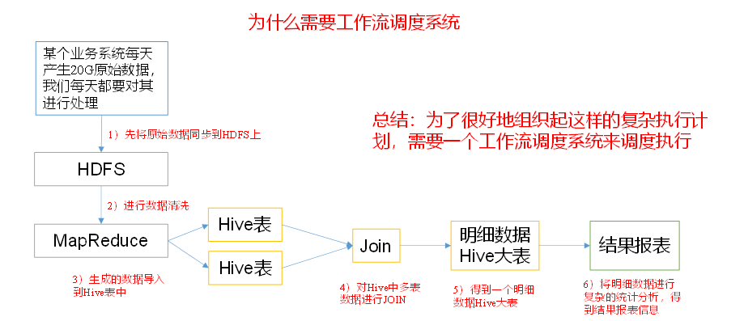

# Azkaban

## 定义

Azkaban是由Linkedin公司推出的一个批量工作流任务调度器，主要用于在一个工作流内以一个特定的顺序运行一组工作和流程，它的配置是通过简单的key:value对的方式，通过配置中的dependencies 来设置依赖关系。Azkaban使用job配置文件建立任务之间的依赖关系，并提供一个易于使用的web用户界面维护和跟踪你的工作流

## 特点

1)    兼容任何版本的hadoop

2)    易于使用的Web用户界面

3)    简单的工作流的上传

4)    方便设置任务之间的关系

5)    调度工作流

6)    模块化和可插拔的插件机制

7)    认证/授权(权限的工作)

8)    能够杀死并重新启动工作流

9)    有关失败和成功的电子邮件提醒

## 架构

1)    AzkabanWebServer：AzkabanWebServer是整个Azkaban工作流系统的主要管理者，它用户登录认证、负责project管理、定时执行工作流、跟踪工作流执行进度等一系列任务。

2)    AzkabanExecutorServer：负责具体的工作流的提交、执行，它们通过mysql数据库来协调任务的执行。

关系型数据库（MySQL）：存储大部分执行流状态，AzkabanWebServer和AzkabanExecutorServer都需要访问数据库。

## 节点规划

**版本**

azkaban-executor-server-2.5.0.tar.gz
azkaban-sql-script-2.5.0.tar.gz
azkaban-web-server-2.5.0.tar.gz

