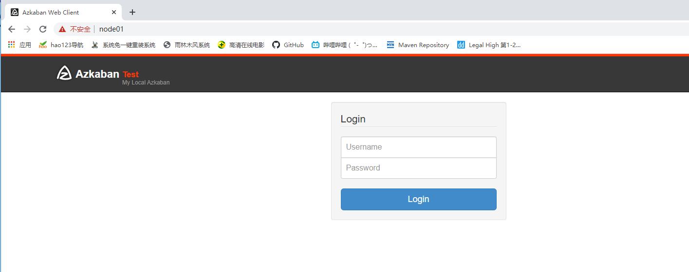

# Azkaban

## 定义

Azkaban是由Linkedin公司推出的一个**批量工作流任务调度器**，主要用于在一个工作流内以一个特定的顺序运行一组工作和流程，它的配置是通过简单的key:value对的方式，通过配置中的dependencies 来设置依赖关系。Azkaban使用job配置文件建立任务之间的依赖关系，并提供一个易于使用的web用户界面维护和跟踪你的工作流


## 特点

1)    兼容任何版本的hadoop

2)    易于使用的Web用户界面

3)    简单的工作流的上传

4)    方便设置任务之间的关系

5)    调度工作流

6)    模块化和可插拔的插件机制

7)    认证/授权(权限的工作)

8)    能够杀死并重新启动工作流

9)    有关失败和成功的电子邮件提醒

## 架构


1)    AzkabanWebServer：AzkabanWebServer是整个Azkaban工作流系统的主要管理者，它用户登录认证、负责project管理、定时执行工作流、跟踪工作流执行进度等一系列任务。

2)    AzkabanExecutorServer：负责具体的工作流的提交、执行，它们通过mysql数据库来协调任务的执行。

关系型数据库（MySQL）：存储大部分执行流状态，AzkabanWebServer和AzkabanExecutorServer都需要访问数据库。

## 节点规划

**版本**

azkaban-executor-server-2.5.0.tar.gz
azkaban-sql-script-2.5.0.tar.gz
azkaban-web-server-2.5.0.tar.gz

| node01  |
| ------- |
| azkaban |

## 安装

```shell
[root@node01 ~]# tar -zxf azkaban-executor-server-2.5.0.tar.gz -C /opt/stanlong/azkaban/
[root@node01 ~]# tar -zxf azkaban-sql-script-2.5.0.tar.gz -C /opt/stanlong/azkaban/
[root@node01 ~]# tar -zxf azkaban-web-server-2.5.0.tar.gz -C /opt/stanlong/azkaban/
```

### 执行脚本

```sql
mysql> CREATE DATABASE IF NOT EXISTS azkaban default charset utf8 COLLATE utf8_general_ci;
mysql> use azkaban;
mysql> source /opt/stanlong/azkaban/azkaban-2.5.0/create-all-sql-2.5.0.sql
mysql> show tables;
+------------------------+
| Tables_in_azkaban      |
+------------------------+
| active_executing_flows |
| active_sla             |
| execution_flows        |
| execution_jobs         |
| execution_logs         |
| project_events         |
| project_files          |
| project_flows          |
| project_permissions    |
| project_properties     |
| project_versions       |
| projects               |
| properties             |
| schedules              |
| triggers               |
+------------------------+
15 rows in set (0.00 sec)
```

### 生成密钥对和证书

**keytool**是java数据证书的管理工具，使用户能够管理自己的公/私钥对及相关证书。

- -keystore  指定密钥库的名称及位置(产生的各类信息将不在.keystore文件中)

- -genkey   在用户主目录中创建一个默认文件".keystore" 

- -alias  对我们生成的.keystore 进行指认别名；如果没有默认是mykey

- -keyalg 指定密钥的算法 RSA/DSA 默认是DSA

>  生成 keystore的密码及相应信息的密钥库

```shell
[root@node01 azkaban-web-2.5.0]# pwd
/opt/stanlong/azkaban/azkaban-web-2.5.0
```

```shell
[root@node01 azkaban-web-2.5.0]# pwd
/opt/stanlong/azkaban/azkaban-web-2.5.0
[root@node01 azkaban-web-2.5.0]# keytool -keystore keystore -alias jetty -genkey -keyalg RSA
Enter keystore password:  
Re-enter new password: 
They don't match. Try again
Enter keystore password:    # 测试用，密码123456，其他信息可不填
Re-enter new password: 
What is your first and last name?
  [Unknown]:  
What is the name of your organizational unit?
  [Unknown]:  
What is the name of your organization?
  [Unknown]:  
What is the name of your City or Locality?
  [Unknown]:  
What is the name of your State or Province?
  [Unknown]:  
What is the two-letter country code for this unit?
  [Unknown]:  
Is CN=Unknown, OU=Unknown, O=Unknown, L=Unknown, ST=Unknown, C=Unknown correct?
  [no]:  y  

Enter key password for <jetty>
	(RETURN if same as keystore password):  

Warning:
The JKS keystore uses a proprietary format. It is recommended to migrate to PKCS12 which is an industry standard format using "keytool -importkeystore -srckeystore keystore -destkeystore keystore -deststoretype pkcs12".
```

```shell
[root@node01 azkaban-web-2.5.0]# ll
total 12
-rw-r--r-- 1 root root  105 2014/04/22 11:40:29 azkaban.version
drwxr-xr-x 2 root root  112 2014/04/22 11:40:29 bin
drwxr-xr-x 2 root root   57 2021/02/27 06:33:44 conf
drwxr-xr-x 2 root root    6 2014/04/22 11:40:29 extlib
-rw-r--r-- 1 root root 2241 2021/02/27 06:56:52 keystore # 生成的keystore文件
drwxr-xr-x 2 root root 4096 2021/02/27 06:33:45 lib
drwxr-xr-x 2 root root    6 2014/04/22 11:40:29 plugins
drwxr-xr-x 6 root root   73 2021/02/27 06:33:45 web
```

```shell
# 查看keystore文件
[root@node01 azkaban-web-2.5.0]# keytool -keystore keystore -list
Enter keystore password:  
Keystore type: jks
Keystore provider: SUN

Your keystore contains 1 entry

jetty, Feb 27, 2021, PrivateKeyEntry, 
Certificate fingerprint (SHA1): 2F:32:F0:94:39:E0:17:96:BB:79:1A:1E:FF:42:80:0D:B0:E1:2C:AB

Warning:
The JKS keystore uses a proprietary format. It is recommended to migrate to PKCS12 which is an industry standard format using "keytool -importkeystore -srckeystore keystore -destkeystore keystore -deststoretype pkcs12".
```

### 时间同步配置

确保集群时间一致

### 配置WebServer

```shell
[root@node01 conf]# pwd
/opt/stanlong/azkaban/azkaban-web-2.5.0/conf
[root@node01 conf]# vi azkaban.properties
```

```properties
#Azkaban Personalization Settings
azkaban.name=Test
azkaban.label=My Local Azkaban
azkaban.color=#FF3601
azkaban.default.servlet.path=/index
#默认web server存放web文件的目录
web.resource.dir=/opt/stanlong/azkaban/azkaban-web-2.5.0/web
#默认时区,安装系统时已改为亚洲/上海 默认为美国
default.timezone.id=Asia/Shanghai


#Azkaban UserManager class
user.manager.class=azkaban.user.XmlUserManager
#用户权限管理默认类（绝对路径）
user.manager.xml.file=/opt/stanlong/azkaban/azkaban-web-2.5.0/conf/azkaban-users.xml


#Loader for projects
#global配置文件所在位置（绝对路径）
executor.global.properties=/opt/stanlong/azkaban/azkaban-executor-2.5.0/conf/global.properties
azkaban.project.dir=projects

# 数据库连接信息
database.type=mysql
mysql.port=3306
mysql.host=node01
mysql.database=azkaban
mysql.user=root
mysql.password=root
mysql.numconnections=100

# Velocity dev mode
velocity.dev.mode=false

# Azkaban Jetty server properties.
# 配置生成的密钥对和证书
jetty.maxThreads=25
jetty.ssl.port=8443
jetty.port=8081
#SSL文件名（绝对路径）
jetty.keystore=/opt/stanlong/azkaban/azkaban-web-2.5.0/keystore
jetty.password=123456
jetty.keypassword=123456
jetty.truststore=/opt/stanlong/azkaban/azkaban-web-2.5.0/keystore
jetty.trustpassword=123456

# Azkaban Executor settings
executor.port=12321

# mail settings
mail.sender=
mail.host=
job.failure.email=
job.success.email=

lockdown.create.projects=false

cache.directory=cache
```

```shell
[root@node01 conf]# vi azkaban-users.xml
```

```xml
<azkaban-users>
	<user username="azkaban" password="azkaban" roles="admin" groups="azkaban" />
	<user username="metrics" password="metrics" roles="metrics"/>
    <!-- 配置一个有admin权限的用户 -->
	<user username="admin" password="admin" roles="admin"/>
	<role name="admin" permissions="ADMIN" />
	<role name="metrics" permissions="METRICS"/>
</azkaban-users>
```

###  配置ExecutorServer

```shell
[root@node01 conf]# pwd
/opt/stanlong/azkaban/azkaban-executor-2.5.0/conf
[root@node01 conf]#  vi azkaban.properties
```

```properties
#Azkaban
#默认时区为美国,安装系统时已改为亚洲/上海
default.timezone.id=Asia/Shanghai

# Azkaban JobTypes Plugins
azkaban.jobtype.plugin.dir=plugins/jobtypes

#Loader for projects
#global配置文件所在位置（绝对路径）
executor.global.properties=/opt/stanlong/azkaban/azkaban-executor-2.5.0/conf/global.properties
azkaban.project.dir=projects

# 数据库配置
database.type=mysql
mysql.port=3306
mysql.host=node01
mysql.database=azkaban
mysql.user=root
mysql.password=root
mysql.numconnections=100

# Azkaban Executor settings
executor.maxThreads=50
executor.port=12321
executor.flow.threads=30
```

## 启动

```shell
[root@node01 azkaban]# pwd
/opt/stanlong/azkaban
```

```shell
[root@node01 azkaban]# ./azkaban-web-2.5.0/bin/azkaban-web-start.sh
2021/02/27 07:29:14.294 +0800 INFO [AzkabanWebServer] [Azkaban] Server running on ssl port 8443.

[root@node01 azkaban]# ./azkaban-executor-2.5.0/bin/azkaban-executor-start.sh
2021/02/27 07:30:12.696 +0800 INFO [AzkabanExecutorServer] [Azkaban] Azkaban Executor Server started on port 12321
```

## 页面访问

https://node01:8443/

