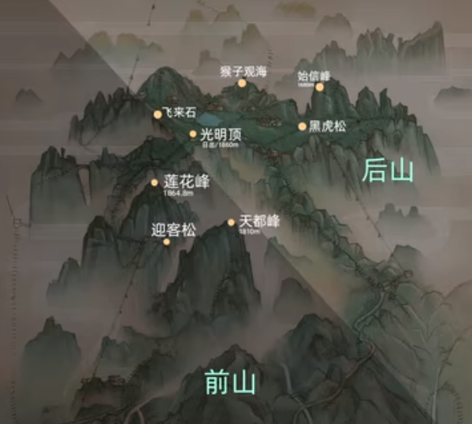
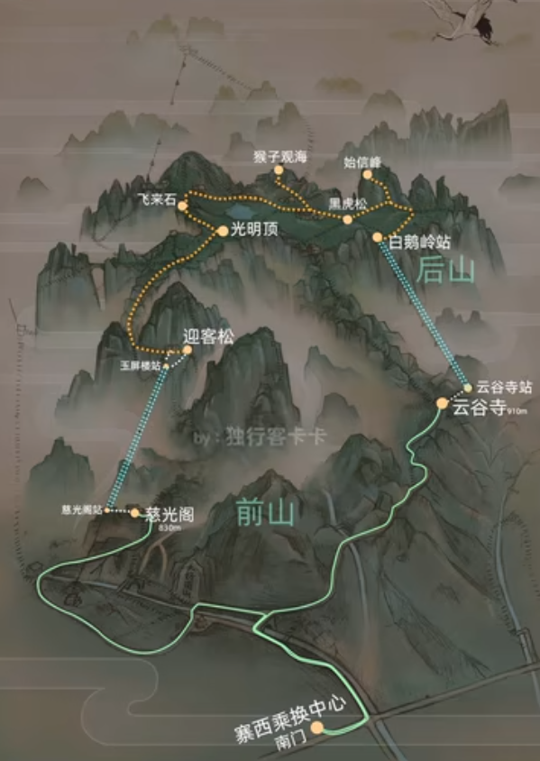

# 黄山旅游攻略

# 一、黄山地图

# 二、景区介绍

黄山主峰：光明顶、天都峰、莲花峰，海拔都在一千八百米以上

广义上黄山分为前山和后山

前山主要以险著称、最陡峭的莲花峰、天都峰、迎客松都在前山。

而后山主要以怪石闻名，山顶比较平坦

# 三、一日游路线规划

黄山共有三个景区入口，分别为南入口（汤口镇），北入口（耿城镇）三个入口中，通常情况下南入口客流量占85%，北入口占15%。

# 四、时间表

- 高铁车站大巴

| 旅游线路                  | 车辆类型等级 | 里程（公里） | 票价（元） | 发车时间                                                     | 途径站点                                         | 网络购票途径                                                 |
| ------------------------- | ------------ | ------------ | ---------- | ------------------------------------------------------------ | ------------------------------------------------ | ------------------------------------------------------------ |
| 黄山北站—黄山风景区南大门 | 中型高一     | 50           | 30         | 08:30 09:00 09:30 10:0010:30 11:00 11:30 12:0012:20 13:00 13:20 13:4014:00 14:30 14:40 15:0015:20 15:40 15:50 16:1016:30 16:50 17:20 17:5018:10 19:00 | 黄山景区南门（汤口）、风景区管委会、南大门换乘点 | 旅客可通过微信搜索“皖美出行”“出行365”小程序或在携程、飞猪、去哪儿APP在线查询班次信息购买车票。 |

- 前山玉屏索道（慈光阁--玉屏楼）

票价：单程/90元

营运时间：7:00--17:30 (周六、周日6：30）

- 后山云谷索道（云谷寺--白鹅岭）

票价：单程/80元

营运时间：7:00--17:00 (周六、周日6：30）